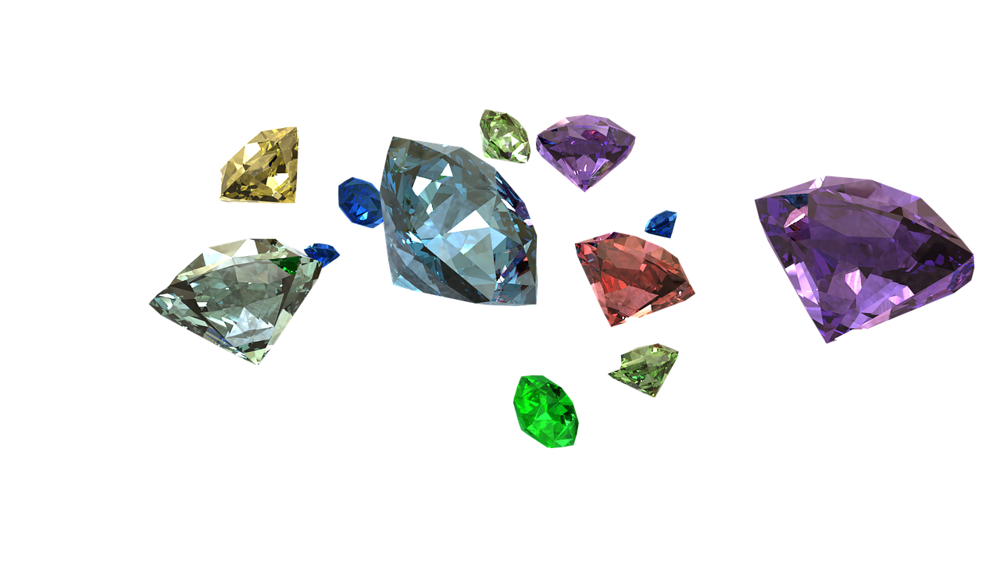

# Sarah Gets A Diamond
A repository of R code regarding ways to analyze data from the *Sarah Gets a Diamond* 
case (UVA-QA-0702) presented in the First Year Decision Analysis course at Darden. 
The basis for the data is a case regarding a hopeless romantic MBA student choosing 
the right diamond for his bride-to-be, Sarah.

## Table of Contents
 - [Following Along](#following-along)
 - [Installing R Packages](#installing-r-packages)
 - [The Data](#the-data)
 - [Source](#source)
 
### Following Along
The best way to learn R is to try it out for yourself. After downloading the R and 
RStudio software, open up RStudio and start running the code to see what it does. For this 
session: 
 - Open up RStudio, click File -> New File -> R Script
 - Go to [`script.R`](script.R) and copy/paste all the code into your new, blank script
 - Start running the code from the script to see what it does by clicking the "Run" 
 button in top right of script
 
If you need instructions on how to setup your computer go here:  
https://github.com/DardenDSC/intro-to-r-programming#installing-r-and-rstudio
 
### Installing R Packages
R uses "packages" of functions that people develop to perform very specific 
routines in R, like fitting a decision tree. These packages must be installed before 
referencing them, so in order to run code in this repository you must first open 
up RStudio, and copy-paste the following code into your Console. Don't be alarmed if 
red text pops up and text starts wizzing by on the screen. This means that the 
package installations are happening. Once they're done, your computer is setup 
to do some advanced machine learning!

```
# data manipulation packages
install.packages("tidyverse")
# modeling packages
install.packages("rpart")
install.packages("rpart.plot")
```

### The Data
The data contains 9,142 records on individual diamonds and their attributes. The 
attributes cover many common characteristics to consider when valuing and choosing 
diamonds, such as the 4 C's (Carat, Cut, Color, Clarity) along with price. The 
data are split into 6,000 records labeled as "Train" meant to be used when 
building models and the remaining 3,142 records are labeled as "Test" and meant 
to be used in assessing model accuracy

Variable | Data Type | Data Definition
---|---|---------
ID | integer | Uniquely identifies each observation (diamond)
Carat Weight | numeric | The weight of the diamond in metric carats. One carat is equal to 0.2 grams, roughly the same weight as a paperclip
Cut | character | One of five values indicating the cut of the diamond in the following order of desireability (`Signature-Ideal`, `Ideal`, `Very Good`, `Good`, `Fair`)
Color | character | One of six values indicating the diamond's color in the following order of desireability (`D`, `E`, `F` - Colorless, `G`, `H`, `I` - Near colorless)
Clarity | character | One of seven values indicating the diamond's clarity in the following order of desireability (`F` - Flawless, `IF` - Internally Flawless, `VVS1` or `VVS2` - Very, Very Slightly Included, or `VS1` or `VS2` - Very Slightly Included, `SI1` - Slightly Included)
Polish | character | One of four values indicating the diamond's polish (`ID` - Ideal, `EX` - Excellent, `VG` - Very Good, `G` - Good)
Symmetry | character | One of four values indicating the diamond's symmetry (`ID` - Ideal, `EX` - Excellent, `VG` - Very Good, `G` - Good)
Report | character | One of of two values `"AGSL"` or `"GIA"` indicating which grading agency reported the qualities of the diamond qualities
Price | numeric | The amount in USD that the diamond is valued
Dataset | character | One of two values `"Train"` or `"Test"` indicating whether the observation should be used to train the model or in a test of its accuracy

### Source
This case was prepared by Greg Mills (MBA ’07) under the supervision of Phillip E. 
Pfeifer, Alumni Research Professor of Business Administration. It was written as 
a basis for class discussion rather than to illustrate effective or ineffective 
handling of a romantic situation. Copyright (c) 2007 by the University of Virginia 
Darden School Foundation, Charlottesville, VA. All rights reserved. To order 
copies, send an e-mail to sales@dardenbusinesspublishing.com

[Top](#sarah-gets-a-diamond)
