Sarah Gets a Diamond
================
Dang Trinh
April 11, 2018

-   [Environment Setup](#environment-setup)
-   [Data Wrangling](#data-wrangling)
-   [Data Visualization](#data-visualization)
-   [Building Predictive Models](#building-predictive-models)
    -   [Tree-based models](#tree-based-models)
        -   [Single Tuned Tree](#single-tuned-tree)
        -   [Bagged Tree](#bagged-tree)
        -   [Random Forest](#random-forest)
        -   [Boosted Trees](#boosted-trees)
    -   [Regression Models](#regression-models)
        -   [Backward Step-Wise Linear Regression](#backward-step-wise-linear-regression)
        -   [Lasso Regression](#lasso-regression)
    -   [Ensemble Forecasts](#ensemble-forecasts)
-   [Summary of Analysis & Areas for Further Research](#summary-of-analysis-areas-for-further-research)

Environment Setup
=================

R is an open source programming language that allows users to extend R by writing "packages". These packages usually perform a very complex and specific set of functions that we would like to utilize in our script. For example, the **gbm** package allows us to fit boosted tree predictive models.

You can load a package by using the `library()` function as shown below, but you must first install the package. You can install a package by using the `install.packages()` function like so:

``` r
install.packages("gbm")
```

After installing all of the packages listed below, then load them up by running this block of code. It is always a good idea to load all the required packages at the beginning of your script so that others can know what packages they need to replicate your analysis.

``` r
options(scipen=999, digits=6)
library(here)
library(Lahman)
library(lubridate)
library(forecast)
library(dplyr)
library(tidyr)
library(zoo)
library(glmnet)
library(tseries)
library(rpart)
library(rpart.plot)
library(glmnet)
library(forecast)
library(MASS)
library(randomForest)
library(gbm)
#library(prophet)
#library(vars)
#library(tree)
```

``` r
# create a folder to save our analyses, underlying data
todays_date_formatted <- format(Sys.Date(), '%Y%m%d')
dir.create(here::here('output', todays_date_formatted), showWarnings = FALSE)
```

Data Wrangling
==============

Data is usually not in a format that is ready for analysis, so we go through a number of steps that shape the data into a format that R can use for running analysis. We first read in the data and explore the various variables. The dataset contains several key attributes of diamond: carat, cut, color, clarity, polish, and symmetry. The `summary()` gives a quick idea of what they data entails.

``` r
# read the data from github
data_url <- 'https://raw.githubusercontent.com/DardenDSC/sarah-gets-a-diamond/master/data/sarah-gets-a-diamond-raw-data.csv'
raw_diamond_dat <- read.csv(data_url)

# get a sense for what the data entails
summary(raw_diamond_dat)
```

    ##        ID        Carat.Weight               Cut       Color    Clarity    
    ##  Min.   :   1   Min.   :0.75   Fair           : 199   D:1007   FL  :   4  
    ##  1st Qu.:2286   1st Qu.:1.01   Good           :1081   E:1189   IF  : 311  
    ##  Median :4572   Median :1.13   Ideal          :3783   F:1535   SI1 :3110  
    ##  Mean   :4572   Mean   :1.34   Signature-Ideal: 375   G:2253   VS1 :1826  
    ##  3rd Qu.:6857   3rd Qu.:1.59   Very Good      :3704   H:1710   VS2 :2396  
    ##  Max.   :9142   Max.   :2.91                          I:1448   VVS1: 451  
    ##                                                                VVS2:1044  
    ##  Polish    Symmetry   Report         Price         Dataset    
    ##  EX:3704   EX:3146   AGSL:1119   Min.   :  2184   Test :3142  
    ##  G : 894   G :1404   GIA :8023   1st Qu.:  5195   Train:6000  
    ##  ID: 900   ID: 925               Median :  7868               
    ##  VG:3644   VG:3667               Mean   : 11799               
    ##                                  3rd Qu.: 15098               
    ##                                  Max.   :101561               
    ## 

To facilitate subsequent regressions, we will do a minor cleaning of the `cut` variable to remove the space and the hyphen in its values ("Signature-Ideal" and "Very Good"). We will also create a log transformation and a reciprocal of Carat Weight and several bins variables for Carat Weight. These bin values were determined based on a subsequent scatter plot between price and carat weight.

``` r
# create a new variable to keep the raw data separate
diamond <- raw_diamond_dat

diamond <- diamond %>%
  mutate(Clarity = as.factor(Clarity), 
         Dataset = as.factor(Dataset), 
         Cut = as.factor(ifelse(Cut == "Signature-Ideal",
                                "SignatureIdeal", 
                                as.character(Cut))),
         Cut = as.factor(ifelse(Cut == "Very Good", 
                                "VeryGood", 
                                as.character(Cut))),
         LPrice = log(Price),
         LCarat = log(Carat.Weight),
         recipCarat = 1 / Carat.Weight,
         Caratbelow1 = as.numeric(Carat.Weight < 1),
         Caratequal1 = as.numeric(Carat.Weight == 1),
         Caratbelow1.5 = as.numeric((Carat.Weight > 1) & (Carat.Weight < 1.5)),
         Caratequal1.5 = as.numeric(Carat.Weight == 1.5),
         Caratbelow2 = as.numeric((Carat.Weight > 1.5) & (Carat.Weight < 2)),
         Caratabove2 = as.numeric(Carat.Weight >= 2))

summary(diamond)
```

    ##        ID        Carat.Weight              Cut       Color    Clarity    
    ##  Min.   :   1   Min.   :0.75   Fair          : 199   D:1007   FL  :   4  
    ##  1st Qu.:2286   1st Qu.:1.01   Good          :1081   E:1189   IF  : 311  
    ##  Median :4572   Median :1.13   Ideal         :3783   F:1535   SI1 :3110  
    ##  Mean   :4572   Mean   :1.34   SignatureIdeal: 375   G:2253   VS1 :1826  
    ##  3rd Qu.:6857   3rd Qu.:1.59   VeryGood      :3704   H:1710   VS2 :2396  
    ##  Max.   :9142   Max.   :2.91                         I:1448   VVS1: 451  
    ##                                                               VVS2:1044  
    ##  Polish    Symmetry   Report         Price         Dataset    
    ##  EX:3704   EX:3146   AGSL:1119   Min.   :  2184   Test :3142  
    ##  G : 894   G :1404   GIA :8023   1st Qu.:  5195   Train:6000  
    ##  ID: 900   ID: 925               Median :  7868               
    ##  VG:3644   VG:3667               Mean   : 11799               
    ##                                  3rd Qu.: 15098               
    ##                                  Max.   :101561               
    ##                                                               
    ##      LPrice          LCarat           recipCarat     Caratbelow1   
    ##  Min.   : 7.69   Min.   :-0.28768   Min.   :0.344   Min.   :0.000  
    ##  1st Qu.: 8.56   1st Qu.: 0.00995   1st Qu.:0.629   1st Qu.:0.000  
    ##  Median : 8.97   Median : 0.12222   Median :0.885   Median :0.000  
    ##  Mean   : 9.10   Mean   : 0.23232   Mean   :0.834   Mean   :0.199  
    ##  3rd Qu.: 9.62   3rd Qu.: 0.46373   3rd Qu.:0.990   3rd Qu.:0.000  
    ##  Max.   :11.53   Max.   : 1.06815   Max.   :1.333   Max.   :1.000  
    ##                                                                    
    ##   Caratequal1    Caratbelow1.5   Caratequal1.5     Caratbelow2   
    ##  Min.   :0.000   Min.   :0.000   Min.   :0.0000   Min.   :0.000  
    ##  1st Qu.:0.000   1st Qu.:0.000   1st Qu.:0.0000   1st Qu.:0.000  
    ##  Median :0.000   Median :0.000   Median :0.0000   Median :0.000  
    ##  Mean   :0.049   Mean   :0.411   Mean   :0.0237   Mean   :0.103  
    ##  3rd Qu.:0.000   3rd Qu.:1.000   3rd Qu.:0.0000   3rd Qu.:0.000  
    ##  Max.   :1.000   Max.   :1.000   Max.   :1.0000   Max.   :1.000  
    ##                                                                  
    ##   Caratabove2   
    ##  Min.   :0.000  
    ##  1st Qu.:0.000  
    ##  Median :0.000  
    ##  Mean   :0.214  
    ##  3rd Qu.:0.000  
    ##  Max.   :1.000  
    ## 

Here we will create several dummy variables, interaction terms, and split the data into the training and test set. The process of creating additional variables for analysis is typically referred to as "feature engineering". Feature engineering helps to find more nuanced relationships and usually leads to improved accuracy in predictive models

``` r
dummies <- model.matrix(~ 0 + Cut + Color + Clarity + Polish + Symmetry + Report + 
                              Cut:Color + Cut:Clarity + Cut:Polish + Cut:Symmetry + Cut:Report +
                              Color:Clarity + Color:Polish + Color:Symmetry + Color:Report+
                              Polish:Symmetry + Polish:Report + Symmetry:Report, 
                        data = diamond)

diamond.full <- as.data.frame(cbind(diamond, dummies))

diamond.train <- diamond[diamond$Dataset == "Train",]
diamond.test <- diamond[diamond$Dataset == "Test",]

diamond.full.train <- diamond.full[diamond.full$Dataset == "Train",]
diamond.full.test <- diamond.full[diamond.full$Dataset == "Test",]
```

We will also split the data into a smaller training set and a validation set.

``` r
nTrain <- dim(diamond.train)[1]
(nSmallTrain <- round(nrow(diamond.train) * 0.75))
```

    ## [1] 4500

``` r
(nValid <- nTrain - nSmallTrain)
```

    ## [1] 1500

``` r
rowIndicesSmallerTrain <- sample(1:nTrain, size = nSmallTrain, replace = FALSE)

diamond.smaller.train <- diamond.train[rowIndicesSmallerTrain, ]
diamond.validation <- diamond.train[-rowIndicesSmallerTrain, ]

diamond.full.smaller.train <- diamond.full.train[rowIndicesSmallerTrain, ]
diamond.full.validation <- diamond.full.train[-rowIndicesSmallerTrain, ]
```

Data Visualization
==================

An initial scatterplot of the Price vs. Carat Weight shows that Carat Weight typically falls into distinct buckets, and that there are significant heteroskedasticity in the relationship.

``` r
plot(x=diamond$Carat.Weight, y=diamond$Price, 
     main="Price vs. Carat", 
     ylab="Price", xlab="Carat")
```

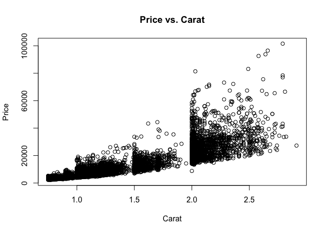

Our second scatterplot of the Log Price vs. Carat Weight shows a quadratic relationship. Furthermore, the heteroskedasticity issue is now fixed.

``` r
plot(x=diamond$Carat.Weight, y=diamond$LPrice, 
     main="Log Price vs. Carat", 
     ylab="Log Price", xlab="Carat")
```

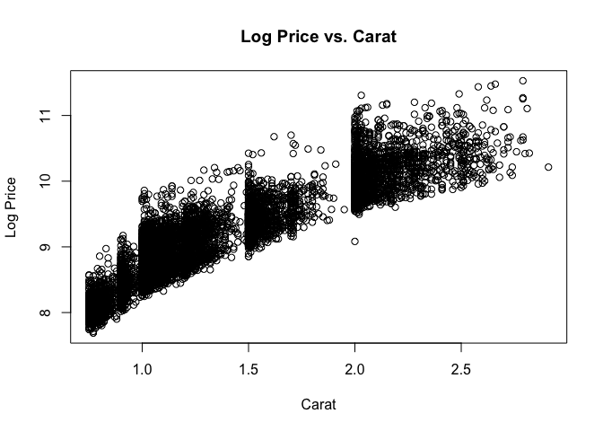

Finally, our last scatterplot of Log Price vs. Log Carat Weight shows a linear relationship with little heteroskedasticity. We will adopt this equation for our model. For more visualization, see the posted Tableau file.

Note that I currently encounter the IOPub data rate exceeded error below so the chart does not show up in the output. The tableau file does have the chart though.

``` r
plot(x=diamond$LCarat, y=diamond$LPrice, 
     main="Log Price vs. Log Carat", 
     ylab="Log Price", xlab="Log Carat")
```

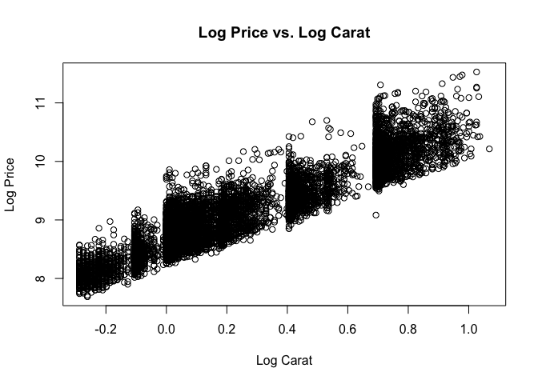

Building Predictive Models
==========================

Tree-based models
-----------------

Here we utilize several tree-based model to predict log price of the diamonds based on several characteristics present in the data.

### Single Tuned Tree

Our initial tuned tree (best cp is around 0.00000151859) yields a MAPE of 7.0% when applied to the validation set. The importance variable list shows that log carat size, inverse of carat size, as well as the bins of carat size are all quite significant variables in predicting price.

Note that throughout our modeling analysis we will utilize a common model specification that each process with start with when fitting.

``` r
model_formula <- "LPrice ~ LCarat +  recipCarat + Cut + Color + Clarity + Polish + Symmetry + 
                           Report + Caratbelow1 + Caratequal1 + Caratbelow1.5 +
                           Caratequal1.5 + Caratbelow2 + Caratabove2"
```

``` r
rt.auto.cv <- rpart(model_formula, data = diamond.train, 
                    control = rpart.control(cp = 0.000001, xval = 10))  # xval is number of folds in the K-fold cross-validation.
#printcp(rt.auto.cv)  # Print out the cp table of cross-validation errors.

#The R-squared for a regression tree is 1 minus rel error. 
#xerror (or relative cross-validation error where "x" stands for "cross") is a scaled 
#version of overall average of the 5 out-of-sample MSEs across the 5 folds. 
#For the scaling, the MSE's are divided by the "root node error" of 0.091868, 
#which is the variance in the y's. 
#xstd measures the variation in xerror between the folds. nsplit is the number of terminal nodes minus 1.

plotcp(rt.auto.cv)  # The horizontal line in this plot is one standard deviation above 
```

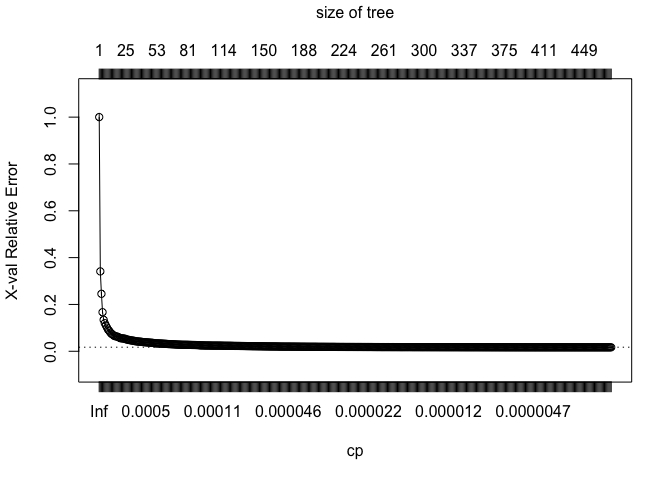

``` r
# the minimum xerror value in the cp table. Because simpler trees are better, 
# the convention is to choose the cp level to the left of the cp level with the 
# minimum xerror that is first above the line. 

# In this case, the minimum xerror is 0.3972833 at row 35 in the cp table.
rt.auto.cv.table <- as.data.frame(rt.auto.cv$cptable)
min(rt.auto.cv.table$xerror)
```

    ## [1] 0.016786

``` r
bestcp <- rt.auto.cv.table$CP[rt.auto.cv.table$xerror==min(rt.auto.cv.table$xerror)]

# According to this analysis using 5-fold cross-validation, setting cp = 0.002869198 is best. 
# Take a look at the resulting 18-terminal-node tree.
rt.tuned.opt.cv <- rpart(model_formula, data = diamond.train, 
                         control = rpart.control(cp = bestcp))
prp(rt.tuned.opt.cv, type = 1, extra = 1)
```

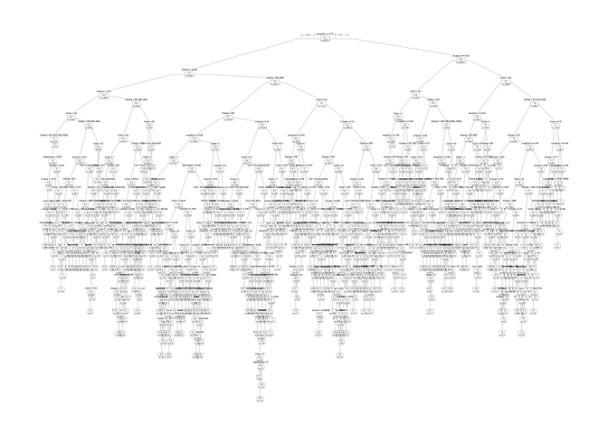

``` r
importance <- as.data.frame(rt.tuned.opt.cv$variable.importance)
importance
```

    ##               rt.tuned.opt.cv$variable.importance
    ## LCarat                                 2626.73467
    ## recipCarat                             2626.52726
    ## Caratabove2                            1455.00293
    ## Caratbelow2                             777.97927
    ## Caratbelow1.5                           748.01734
    ## Caratbelow1                             291.91523
    ## Clarity                                 220.10135
    ## Caratequal1.5                           182.81792
    ## Color                                   158.32919
    ## Cut                                      24.26178
    ## Symmetry                                 23.43585
    ## Polish                                   19.69632
    ## Report                                    7.32370
    ## Caratequal1                               1.37345

``` r
rt.tuned.opt.cv.pred <- predict(rt.tuned.opt.cv, diamond.test)
accuracy(exp(rt.tuned.opt.cv.pred), diamond.test$Price)
```

    ##               ME    RMSE     MAE       MPE    MAPE
    ## Test set 21.0808 1666.28 852.826 -0.124237 6.44278

To facilitate some intuition of the variables, here we generate a few simpler trees than the model above. These trees have much larger cp parameters and as such have much fewer layers, which aids with interpretability.

``` r
# fitting four simple trees using different complexity parameters
rt.simple.tree1 <- rpart(model_formula, data = diamond.train, 
                         control = rpart.control(cp = 0.005))
rt.simple.tree2 <- rpart(model_formula, data = diamond.train, 
                         control = rpart.control(cp = 0.001))
rt.simple.tree3 <- rpart(model_formula, data = diamond.train, 
                         control = rpart.control(cp = 0.0005))
rt.simple.tree4 <- rpart(model_formula, data = diamond.train, 
                         control = rpart.control(cp = 0.0001))
```

Plots of the trees and diagnostics are available in the `output` folder of this analysis.

### Bagged Tree

The second tree-based method is a bagged tree, which we implement with the `randomForest()` function and the `mtry` argument set equal to 5 - the number of explanatory variables feed into the model.

``` r
#bag with smaller train dataset#
bag.tree <- randomForest(as.formula(model_formula), 
                         data=diamond.smaller.train, mtry=5, ntree=100,
                         importance=TRUE)
bag.tree.pred.valid <- predict(bag.tree, newdata=diamond.validation)
accuracy(exp(bag.tree.pred.valid), diamond.validation$Price)
```

    ##               ME    RMSE     MAE       MPE    MAPE
    ## Test set 154.133 1305.73 681.383 -0.274955 5.57991

This bagged tree yields a MAPE of 5.57% on the validation set, already a great improvement from the 7.0% of the single tuned tree. Given the improvement of the bagged tree, we could estimate the bagged tree on the full training set by feeding that dataset to the `randomForest()` function like so:

``` r
bag.tree <- randomForest(as.formula(model_formula), 
                         data=diamond.train, mtry=5, ntree=100,
                         importance=TRUE)
```

### Random Forest

The third tree-based model we implement is a cross validated random forest, which decorrelates the tree and should provide additional improvements over the bagged tree method.

``` r
# k-folds cross validation automatically using rfcv
trainx <- diamond.smaller.train[,c("LCarat", "recipCarat", "Cut", "Color", "Clarity", "Polish", "Symmetry",
                                  "Report", "Caratbelow1", "Caratequal1", "Caratbelow1.5","Caratequal1.5", 
                                  "Caratbelow2", "Caratabove2")]
trainy <- diamond.smaller.train$LPrice
random.forest.cv <- rfcv(trainx, trainy,
                         cv.folds = 10, scale="unit", step=-1, ntree=100)
plot(x=1:14, y=rev(random.forest.cv$error.cv),
     xlab="mtry parameter", ylab="Cross Validation Error",
     main="Random Forest Cross Validation Results")
```

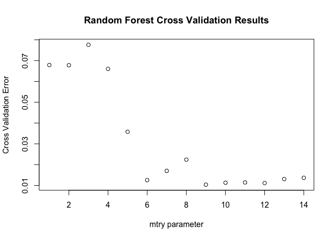

The cross validation results above shows that the best number of `mtry` for random forest should be 9 (vs. 14). We will use this value when estimating our random forest model.

``` r
random.forest.cv$error.cv[random.forest.cv$error.cv==min(random.forest.cv$error.cv)]
```

    ##         9 
    ## 0.0103964

``` r
random.forest.cv.1 <- randomForest(as.formula(model_formula), 
                                   data=diamond.smaller.train, mtry=9, ntree=100,
                                   importance=TRUE)
random.forest.cv.1.pred.valid <- predict(random.forest.cv.1, newdata=diamond.validation)
accuracy(exp(random.forest.cv.1.pred.valid), diamond.validation$Price)
```

    ##               ME    RMSE    MAE       MPE    MAPE
    ## Test set 76.0959 1149.84 648.61 -0.398527 5.40707

Finally, we can repeat the same procedures above on the full training set.

``` r
# perform cross validation to tune the model parameters
trainx <- diamond.train[,c("LCarat", "recipCarat", "Cut", "Color", "Clarity", "Polish", "Symmetry",
                           "Report", "Caratbelow1", "Caratequal1", "Caratbelow1.5","Caratequal1.5", 
                           "Caratbelow2", "Caratabove2")]
trainy <- diamond.train$LPrice
random.forest.cv <- rfcv(trainx, 
                         trainy,
                         cv.folds=10, scale="unit", step=-1, ntree=100)

# determine the best fitting model
random.forest.cv$error.cv
length(random.forest.cv$error.cv)
plot(x=1:14, y=rev(random.forest.cv$error.cv),
     xlab="mtry parameter", ylab="Cross Validation Error",
     main="Random Forest Cross Validation Results")
random.forest.cv$error.cv[random.forest.cv$error.cv==min(random.forest.cv$error.cv)]

# use the optimal parameters to fit the final model
random.forest.cv.1 <- randomForest(as.formula(model_formula), 
                                   data=diamond.train, mtry=9, ntree=100,
                                   importance=TRUE)
# measure the accuracy
random.forest.cv.1.pred <- predict(random.forest.cv.1, newdata=diamond.test)
accuracy(exp(random.forest.cv.1.pred), diamond.test$Price)
```

### Boosted Trees

The last tree-based model we will be using is a boosted tree model. We use cross validation to identify the best value for the parameter `n.trees`, which turns out to be 5,207.

``` r
boost <- gbm(as.formula(model_formula), data=diamond.smaller.train,
             distribution = "gaussian",
             n.trees=100, interaction.depth=6, cv.folds=10, shrinkage = 0.011)
plot(boost$cv.error)
```

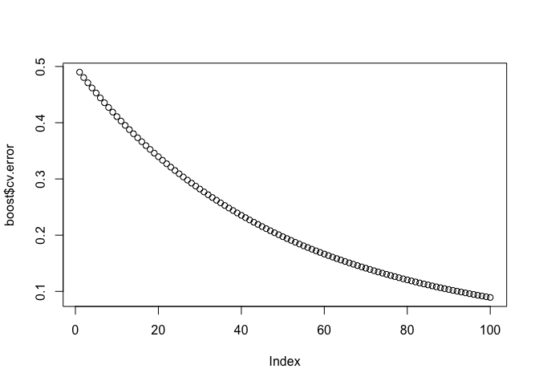

``` r
best_iteration <- which(boost$cv.error==min(boost$cv.error))
```

Using this `n.trees` parameter, we estimate the model on the smaller training set using 100 iterations, which yields a MAPE of 4.46% on the validation set, representing additional improvements over the random forest model. It looks like the model is continually getting better even at the 100th iteration. More iterations might help us find the true optimum number of trees to minimize prediction error.

``` r
boost.cv <- gbm(as.formula(model_formula), data=diamond.smaller.train,
                distribution = "gaussian",
                n.trees=best_iteration, interaction.depth=6, cv.folds=10, shrinkage = 0.011)
boost.cv.pred.valid <- predict(boost.cv, newdata=diamond.validation, n.trees=best_iteration)
accuracy(exp(boost.cv.pred.valid), diamond.validation$Price)
```

    ##               ME    RMSE     MAE      MPE    MAPE
    ## Test set 1738.55 5741.28 3028.09 -4.25467 23.4299

Finally, we repeat the same procedures above using the full dataset, including cross validation. Cross validation shows that 100 is the best value for `n.trees`, and using this parameter yields a MAPE of 4.23808% on the test set.

``` r
boost <- gbm(as.formula(model_formula), data=diamond.train,
             distribution = "gaussian",
             n.trees=100, interaction.depth=6, cv.folds=10, shrinkage = 0.011)
best_iteration <- which(boost$cv.error==min(boost$cv.error))
boost.cv <- gbm(as.formula(model_formula), data=diamond.train,
                distribution = "gaussian",
                n.trees=best_iteration, interaction.depth=6, cv.folds=10, shrinkage = 0.011)
boost.cv.pred <- predict(boost.cv, newdata=diamond.test, n.trees=best_iteration)
accuracy(exp(boost.cv.pred), diamond.test$Price)
```

Regression Models
-----------------

Another class of model we could use is linear regression model. In this section we will use several approaches to calibrate our linear regression model.

### Backward Step-Wise Linear Regression

We start by including all categorical variables & possible interactions in our linear model. This yields a MAPE of 5.34222% on the validation set.

``` r
lm_formula <- "LPrice ~ LCarat+recipCarat+Caratbelow1+Caratequal1+Caratbelow1.5+Caratequal1.5+Caratbelow2+Caratabove2+CutFair+CutGood+CutIdeal+CutSignatureIdeal+CutVeryGood+ColorE+ColorF+ColorG+ColorH+ColorI+ClarityIF+ClaritySI1+ClarityVS1+ClarityVS2+ClarityVVS1+ClarityVVS2+PolishG+PolishID+PolishVG+SymmetryG+SymmetryID+SymmetryVG+ReportGIA+CutGood:ColorE+CutIdeal:ColorE+CutSignatureIdeal:ColorE+CutVeryGood:ColorE+CutGood:ColorF+CutIdeal:ColorF+CutSignatureIdeal:ColorF+CutVeryGood:ColorF+CutGood:ColorG+CutIdeal:ColorG+CutSignatureIdeal:ColorG+CutVeryGood:ColorG+CutGood:ColorH+CutIdeal:ColorH+CutSignatureIdeal:ColorH+CutVeryGood:ColorH+CutGood:ColorI+CutIdeal:ColorI+CutSignatureIdeal:ColorI+CutVeryGood:ColorI+CutGood:ClarityIF+CutIdeal:ClarityIF+CutSignatureIdeal:ClarityIF+CutVeryGood:ClarityIF+CutGood:ClaritySI1+CutIdeal:ClaritySI1+CutSignatureIdeal:ClaritySI1+CutVeryGood:ClaritySI1+CutGood:ClarityVS1+CutIdeal:ClarityVS1+CutSignatureIdeal:ClarityVS1+CutVeryGood:ClarityVS1+CutGood:ClarityVS2+CutIdeal:ClarityVS2+CutSignatureIdeal:ClarityVS2+CutVeryGood:ClarityVS2+CutGood:ClarityVVS1+CutIdeal:ClarityVVS1+CutSignatureIdeal:ClarityVVS1+CutVeryGood:ClarityVVS1+CutGood:ClarityVVS2+CutIdeal:ClarityVVS2+CutSignatureIdeal:ClarityVVS2+CutVeryGood:ClarityVVS2+CutGood:PolishG+CutIdeal:PolishG+CutSignatureIdeal:PolishG+CutVeryGood:PolishG+CutGood:PolishID+CutIdeal:PolishID+CutSignatureIdeal:PolishID+CutVeryGood:PolishID+CutGood:PolishVG+CutIdeal:PolishVG+CutSignatureIdeal:PolishVG+CutVeryGood:PolishVG+CutGood:SymmetryG+CutIdeal:SymmetryG+CutSignatureIdeal:SymmetryG+CutVeryGood:SymmetryG+CutGood:SymmetryID+CutIdeal:SymmetryID+CutSignatureIdeal:SymmetryID+CutVeryGood:SymmetryID+CutGood:SymmetryVG+CutIdeal:SymmetryVG+CutSignatureIdeal:SymmetryVG+CutVeryGood:SymmetryVG+CutGood:ReportGIA+CutIdeal:ReportGIA+CutSignatureIdeal:ReportGIA+CutVeryGood:ReportGIA+ColorE:ClarityIF+ColorF:ClarityIF+ColorG:ClarityIF+ColorH:ClarityIF+ColorI:ClarityIF+ColorE:ClaritySI1+ColorF:ClaritySI1+ColorG:ClaritySI1+ColorH:ClaritySI1+ColorI:ClaritySI1+ColorE:ClarityVS1+ColorF:ClarityVS1+ColorG:ClarityVS1+ColorH:ClarityVS1+ColorI:ClarityVS1+ColorE:ClarityVS2+ColorF:ClarityVS2+ColorG:ClarityVS2+ColorH:ClarityVS2+ColorI:ClarityVS2+ColorE:ClarityVVS1+ColorF:ClarityVVS1+ColorG:ClarityVVS1+ColorH:ClarityVVS1+ColorI:ClarityVVS1+ColorE:ClarityVVS2+ColorF:ClarityVVS2+ColorG:ClarityVVS2+ColorH:ClarityVVS2+ColorI:ClarityVVS2+ColorE:PolishG+ColorF:PolishG+ColorG:PolishG+ColorH:PolishG+ColorI:PolishG+ColorE:PolishID+ColorF:PolishID+ColorG:PolishID+ColorH:PolishID+ColorI:PolishID+ColorE:PolishVG+ColorF:PolishVG+ColorG:PolishVG+ColorH:PolishVG+ColorI:PolishVG+ColorE:SymmetryG+ColorF:SymmetryG+ColorG:SymmetryG+ColorH:SymmetryG+ColorI:SymmetryG+ColorE:SymmetryID+ColorF:SymmetryID+ColorG:SymmetryID+ColorH:SymmetryID+ColorI:SymmetryID+ColorE:SymmetryVG+ColorF:SymmetryVG+ColorG:SymmetryVG+ColorH:SymmetryVG+ColorI:SymmetryVG+ColorE:ReportGIA+ColorF:ReportGIA+ColorG:ReportGIA+ColorH:ReportGIA+ColorI:ReportGIA+PolishG:SymmetryG+PolishID:SymmetryG+PolishVG:SymmetryG+PolishG:SymmetryID+PolishID:SymmetryID+PolishVG:SymmetryID+PolishG:SymmetryVG+PolishID:SymmetryVG+PolishVG:SymmetryVG+PolishG:ReportGIA+PolishID:ReportGIA+PolishVG:ReportGIA+SymmetryG:ReportGIA+SymmetryID:ReportGIA+SymmetryVG:ReportGIA
          + LCarat:Cut + LCarat:Color + LCarat:Calarity + LCarat:Polish + LCarat:Symmetry + LCarat:Report
          + Caratbelow1:Cut + Caratbelow1:Color + Caratbelow1:Calarity + 
            Caratbelow1:Polish + Caratbelow1:Symmetry + Caratbelow1:Report"
```

``` r
lm <- lm(as.formula(lm_formula), data = diamond.full.smaller.train)
summary(lm)
```

    ## 
    ## Call:
    ## lm(formula = as.formula(lm_formula), data = diamond.full.smaller.train)
    ## 
    ## Residuals:
    ##      Min       1Q   Median       3Q      Max 
    ## -0.74631 -0.04303 -0.00119  0.04119  0.42663 
    ## 
    ## Coefficients: (26 not defined because of singularities)
    ##                                 Estimate Std. Error t value
    ## (Intercept)                   10.8655590  0.0980612 110.804
    ## LCarat                         0.8351305  0.0507200  16.465
    ## recipCarat                    -1.0238051  0.0584259 -17.523
    ## Caratbelow1                   -0.3489892  0.0135394 -25.776
    ## Caratequal1                   -0.2604478  0.0131872 -19.750
    ## Caratbelow1.5                 -0.3024472  0.0114697 -26.369
    ## Caratequal1.5                 -0.2254955  0.0104495 -21.579
    ## Caratbelow2                   -0.2219400  0.0076067 -29.177
    ## Caratabove2                           NA         NA      NA
    ## CutFair                        0.0202809  0.0530545   0.382
    ## CutGood                       -0.0622608  0.0287534  -2.165
    ## CutIdeal                       0.0203315  0.0798551   0.255
    ## CutSignatureIdeal              0.2305907  0.0425615   5.418
    ## CutVeryGood                           NA         NA      NA
    ## ColorE                        -0.0523105  0.0593955  -0.881
    ## ColorF                        -0.1891978  0.0580192  -3.261
    ## ColorG                        -0.3330409  0.0579257  -5.749
    ## ColorH                        -0.5337221  0.0567669  -9.402
    ## ColorI                        -0.6193065  0.0601847 -10.290
    ## ClarityIF                      0.0020389  0.0908589   0.022
    ## ClaritySI1                    -0.9762597  0.0688067 -14.188
    ## ClarityVS1                    -0.7155176  0.0723355  -9.892
    ## ClarityVS2                    -0.8177066  0.0691154 -11.831
    ## ClarityVVS1                   -0.2546515  0.0596331  -4.270
    ## ClarityVVS2                   -0.4241325  0.0574438  -7.383
    ## PolishG                       -0.0910578  0.0470799  -1.934
    ## PolishID                       0.0825737  0.0843585   0.979
    ## PolishVG                      -0.0243705  0.0298757  -0.816
    ## SymmetryG                     -0.0770043  0.0396723  -1.941
    ## SymmetryID                     0.0080318  0.0854160   0.094
    ## SymmetryVG                    -0.0585867  0.0342242  -1.712
    ## ReportGIA                      0.0779037  0.0527068   1.478
    ## CutGood:ColorE                 0.0392831  0.0364727   1.077
    ## CutIdeal:ColorE                0.0315464  0.0357619   0.882
    ## CutSignatureIdeal:ColorE      -0.0035512  0.0442330  -0.080
    ## CutVeryGood:ColorE             0.0364012  0.0351502   1.036
    ## CutGood:ColorF                 0.0241971  0.0389294   0.622
    ## CutIdeal:ColorF                0.0287357  0.0381122   0.754
    ## CutSignatureIdeal:ColorF      -0.0171448  0.0456438  -0.376
    ## CutVeryGood:ColorF             0.0293738  0.0375618   0.782
    ## CutGood:ColorG                 0.0628889  0.0399958   1.572
    ## CutIdeal:ColorG                0.0414023  0.0393945   1.051
    ## CutSignatureIdeal:ColorG      -0.0036291  0.0458689  -0.079
    ## CutVeryGood:ColorG             0.0468568  0.0388741   1.205
    ## CutGood:ColorH                 0.0818769  0.0385186   2.126
    ## CutIdeal:ColorH                0.0731451  0.0377812   1.936
    ## CutSignatureIdeal:ColorH       0.0438032  0.0452115   0.969
    ## CutVeryGood:ColorH             0.0738717  0.0372394   1.984
    ## CutGood:ColorI                -0.0019963  0.0412084  -0.048
    ## CutIdeal:ColorI               -0.0356776  0.0405920  -0.879
    ## CutSignatureIdeal:ColorI      -0.0651230  0.0474816  -1.372
    ## CutVeryGood:ColorI            -0.0207863  0.0399651  -0.520
    ## CutGood:ClarityIF              0.0108352  0.0739743   0.146
    ## CutIdeal:ClarityIF             0.0061866  0.1030868   0.060
    ## CutSignatureIdeal:ClarityIF   -0.0740820  0.0777328  -0.953
    ## CutVeryGood:ClarityIF         -0.0274904  0.0702934  -0.391
    ## CutGood:ClaritySI1             0.0336482  0.0411050   0.819
    ## CutIdeal:ClaritySI1            0.0189643  0.0851220   0.223
    ## CutSignatureIdeal:ClaritySI1   0.0007003  0.0428411   0.016
    ## CutVeryGood:ClaritySI1         0.0013850  0.0390805   0.035
    ## CutGood:ClarityVS1             0.0834733  0.0471883   1.769
    ## CutIdeal:ClarityVS1            0.0938302  0.0878981   1.067
    ## CutSignatureIdeal:ClarityVS1   0.0558192  0.0476801   1.171
    ## CutVeryGood:ClarityVS1         0.0734765  0.0449613   1.634
    ## CutGood:ClarityVS2             0.0395171  0.0419231   0.943
    ## CutIdeal:ClarityVS2            0.0451698  0.0853779   0.529
    ## CutSignatureIdeal:ClarityVS2   0.0198754  0.0432865   0.459
    ## CutVeryGood:ClarityVS2         0.0246924  0.0398227   0.620
    ## CutGood:ClarityVVS1           -0.0189765  0.0342842  -0.554
    ## CutIdeal:ClarityVVS1           0.0005402  0.0767547   0.007
    ## CutSignatureIdeal:ClarityVVS1 -0.0281100  0.0262738  -1.070
    ## CutVeryGood:ClarityVVS1               NA         NA      NA
    ## CutGood:ClarityVVS2                   NA         NA      NA
    ## CutIdeal:ClarityVVS2           0.0234357  0.0758484   0.309
    ## CutSignatureIdeal:ClarityVVS2         NA         NA      NA
    ## CutVeryGood:ClarityVVS2               NA         NA      NA
    ## CutGood:PolishG                0.0330801  0.0278699   1.187
    ## CutIdeal:PolishG              -0.0190586  0.0299881  -0.636
    ## CutSignatureIdeal:PolishG             NA         NA      NA
    ## CutVeryGood:PolishG            0.0033709  0.0269098   0.125
    ## CutGood:PolishID                      NA         NA      NA
    ## CutIdeal:PolishID              0.0562382  0.0670207   0.839
    ## CutSignatureIdeal:PolishID    -0.0065754  0.0378993  -0.173
    ## CutVeryGood:PolishID                  NA         NA      NA
    ## CutGood:PolishVG               0.0095665  0.0218698   0.437
    ## CutIdeal:PolishVG             -0.0076598  0.0212572  -0.360
    ## CutSignatureIdeal:PolishVG            NA         NA      NA
    ## CutVeryGood:PolishVG          -0.0003595  0.0209466  -0.017
    ## CutGood:SymmetryG              0.0078009  0.0308538   0.253
    ## CutIdeal:SymmetryG             0.0393989  0.0311091   1.266
    ## CutSignatureIdeal:SymmetryG           NA         NA      NA
    ## CutVeryGood:SymmetryG          0.0255379  0.0287914   0.887
    ## CutGood:SymmetryID            -0.0121378  0.0833795  -0.146
    ## CutIdeal:SymmetryID           -0.0477363  0.0693373  -0.688
    ## CutSignatureIdeal:SymmetryID          NA         NA      NA
    ## CutVeryGood:SymmetryID                NA         NA      NA
    ## CutGood:SymmetryVG            -0.0088170  0.0301987  -0.292
    ## CutIdeal:SymmetryVG            0.0036635  0.0282153   0.130
    ## CutSignatureIdeal:SymmetryVG          NA         NA      NA
    ## CutVeryGood:SymmetryVG         0.0177055  0.0281748   0.628
    ## CutGood:ReportGIA              0.0236163  0.0361656   0.653
    ## CutIdeal:ReportGIA             0.0272885  0.0384694   0.709
    ## CutSignatureIdeal:ReportGIA           NA         NA      NA
    ## CutVeryGood:ReportGIA          0.0206604  0.0323810   0.638
    ## ColorE:ClarityIF              -0.1588139  0.0269057  -5.903
    ## ColorF:ClarityIF              -0.1873876  0.0230519  -8.129
    ## ColorG:ClarityIF              -0.3143946  0.0190301 -16.521
    ## ColorH:ClarityIF              -0.3011539  0.0262590 -11.469
    ## ColorI:ClarityIF              -0.3396678  0.0252712 -13.441
    ## ColorE:ClaritySI1              0.0575091  0.0148255   3.879
    ## ColorF:ClaritySI1              0.0932205  0.0141341   6.595
    ## ColorG:ClaritySI1              0.1752436  0.0132845  13.192
    ## ColorH:ClaritySI1              0.3284261  0.0145254  22.610
    ## ColorI:ClaritySI1              0.3571339  0.0162687  21.952
    ## ColorE:ClarityVS1              0.0377511  0.0174330   2.166
    ## ColorF:ClarityVS1              0.0811499  0.0162016   5.009
    ## ColorG:ClarityVS1              0.1154731  0.0149129   7.743
    ## ColorH:ClarityVS1              0.1593728  0.0164882   9.666
    ## ColorI:ClarityVS1              0.1532027  0.0180141   8.505
    ## ColorE:ClarityVS2              0.0768033  0.0160460   4.786
    ## ColorF:ClarityVS2              0.1322410  0.0150549   8.784
    ## ColorG:ClarityVS2              0.1899883  0.0138529  13.715
    ## ColorH:ClarityVS2              0.2546965  0.0154144  16.523
    ## ColorI:ClarityVS2              0.2467475  0.0170246  14.494
    ## ColorE:ClarityVVS1            -0.0142941  0.0250600  -0.570
    ## ColorF:ClarityVVS1            -0.0469289  0.0231930  -2.023
    ## ColorG:ClarityVVS1            -0.1029790  0.0213035  -4.834
    ## ColorH:ClarityVVS1            -0.1026783  0.0243161  -4.223
    ## ColorI:ClarityVVS1            -0.0967651  0.0280331  -3.452
    ## ColorE:ClarityVVS2                    NA         NA      NA
    ## ColorF:ClarityVVS2                    NA         NA      NA
    ## ColorG:ClarityVVS2                    NA         NA      NA
    ## ColorH:ClarityVVS2                    NA         NA      NA
    ## ColorI:ClarityVVS2                    NA         NA      NA
    ## ColorE:PolishG                -0.0128534  0.0177674  -0.723
    ## ColorF:PolishG                -0.0204235  0.0169001  -1.208
    ## ColorG:PolishG                -0.0032700  0.0164877  -0.198
    ## ColorH:PolishG                 0.0085675  0.0173562   0.494
    ## ColorI:PolishG                 0.0051852  0.0175001   0.296
    ## ColorE:PolishID               -0.1523420  0.1222093  -1.247
    ## ColorF:PolishID               -0.0640203  0.0822802  -0.778
    ## ColorG:PolishID               -0.0721611  0.0845047  -0.854
    ## ColorH:PolishID               -0.0786020  0.0799806  -0.983
    ## ColorI:PolishID               -0.0628388  0.0919282  -0.684
    ## ColorE:PolishVG                0.0001190  0.0110446   0.011
    ## ColorF:PolishVG               -0.0128382  0.0106159  -1.209
    ## ColorG:PolishVG                0.0010826  0.0098505   0.110
    ## ColorH:PolishVG               -0.0046653  0.0104302  -0.447
    ## ColorI:PolishVG                0.0038927  0.0110129   0.353
    ## ColorE:SymmetryG              -0.0086822  0.0159796  -0.543
    ## ColorF:SymmetryG               0.0017816  0.0159098   0.112
    ## ColorG:SymmetryG               0.0012565  0.0149571   0.084
    ## ColorH:SymmetryG               0.0141701  0.0155856   0.909
    ## ColorI:SymmetryG               0.0075375  0.0164451   0.458
    ## ColorE:SymmetryID              0.0619593  0.1314593   0.471
    ## ColorF:SymmetryID              0.0320174  0.0928084   0.345
    ## ColorG:SymmetryID              0.0266490  0.0944560   0.282
    ## ColorH:SymmetryID             -0.0093973  0.0912887  -0.103
    ## ColorI:SymmetryID              0.0221361  0.1013422   0.218
    ## ColorE:SymmetryVG              0.0086507  0.0115386   0.750
    ## ColorF:SymmetryVG              0.0220604  0.0111655   1.976
    ## ColorG:SymmetryVG              0.0164440  0.0102778   1.600
    ## ColorH:SymmetryVG              0.0319165  0.0109119   2.925
    ## ColorI:SymmetryVG              0.0159474  0.0115790   1.377
    ## ColorE:ReportGIA              -0.0974689  0.0532428  -1.831
    ## ColorF:ReportGIA              -0.0298037  0.0490084  -0.608
    ## ColorG:ReportGIA              -0.0465743  0.0480351  -0.970
    ## ColorH:ReportGIA              -0.0956322  0.0489295  -1.954
    ## ColorI:ReportGIA              -0.0586886  0.0485829  -1.208
    ## PolishG:SymmetryG              0.0381405  0.0182753   2.087
    ## PolishID:SymmetryG                    NA         NA      NA
    ## PolishVG:SymmetryG             0.0170066  0.0109906   1.547
    ## PolishG:SymmetryID                    NA         NA      NA
    ## PolishID:SymmetryID           -0.0243087  0.0438049  -0.555
    ## PolishVG:SymmetryID                   NA         NA      NA
    ## PolishG:SymmetryVG             0.0329921  0.0164350   2.007
    ## PolishID:SymmetryVG                   NA         NA      NA
    ## PolishVG:SymmetryVG            0.0232712  0.0062726   3.710
    ## PolishG:ReportGIA              0.0305191  0.0349096   0.874
    ## PolishID:ReportGIA                    NA         NA      NA
    ## PolishVG:ReportGIA            -0.0047860  0.0222122  -0.215
    ## SymmetryG:ReportGIA            0.0141380  0.0270330   0.523
    ## SymmetryID:ReportGIA                  NA         NA      NA
    ## SymmetryVG:ReportGIA           0.0013887  0.0214707   0.065
    ##                                           Pr(>|t|)    
    ## (Intercept)                   < 0.0000000000000002 ***
    ## LCarat                        < 0.0000000000000002 ***
    ## recipCarat                    < 0.0000000000000002 ***
    ## Caratbelow1                   < 0.0000000000000002 ***
    ## Caratequal1                   < 0.0000000000000002 ***
    ## Caratbelow1.5                 < 0.0000000000000002 ***
    ## Caratequal1.5                 < 0.0000000000000002 ***
    ## Caratbelow2                   < 0.0000000000000002 ***
    ## Caratabove2                                     NA    
    ## CutFair                                   0.702283    
    ## CutGood                                   0.030416 *  
    ## CutIdeal                                  0.799041    
    ## CutSignatureIdeal              0.00000006359526618 ***
    ## CutVeryGood                                     NA    
    ## ColorE                                    0.378521    
    ## ColorF                                    0.001119 ** 
    ## ColorG                         0.00000000956769078 ***
    ## ColorH                        < 0.0000000000000002 ***
    ## ColorI                        < 0.0000000000000002 ***
    ## ClarityIF                                 0.982097    
    ## ClaritySI1                    < 0.0000000000000002 ***
    ## ClarityVS1                    < 0.0000000000000002 ***
    ## ClarityVS2                    < 0.0000000000000002 ***
    ## ClarityVVS1                    0.00001993797156283 ***
    ## ClarityVVS2                    0.00000000000018393 ***
    ## PolishG                                   0.053164 .  
    ## PolishID                                  0.327712    
    ## PolishVG                                  0.414700    
    ## SymmetryG                                 0.052322 .  
    ## SymmetryID                                0.925089    
    ## SymmetryVG                                0.086995 .  
    ## ReportGIA                                 0.139465    
    ## CutGood:ColorE                            0.281515    
    ## CutIdeal:ColorE                           0.377759    
    ## CutSignatureIdeal:ColorE                  0.936015    
    ## CutVeryGood:ColorE                        0.300452    
    ## CutGood:ColorF                            0.534261    
    ## CutIdeal:ColorF                           0.450903    
    ## CutSignatureIdeal:ColorF                  0.707216    
    ## CutVeryGood:ColorF                        0.434250    
    ## CutGood:ColorG                            0.115934    
    ## CutIdeal:ColorG                           0.293332    
    ## CutSignatureIdeal:ColorG                  0.936941    
    ## CutVeryGood:ColorG                        0.228135    
    ## CutGood:ColorH                            0.033589 *  
    ## CutIdeal:ColorH                           0.052930 .  
    ## CutSignatureIdeal:ColorH                  0.332674    
    ## CutVeryGood:ColorH                        0.047353 *  
    ## CutGood:ColorI                            0.961364    
    ## CutIdeal:ColorI                           0.379488    
    ## CutSignatureIdeal:ColorI                  0.170276    
    ## CutVeryGood:ColorI                        0.603012    
    ## CutGood:ClarityIF                         0.883555    
    ## CutIdeal:ClarityIF                        0.952148    
    ## CutSignatureIdeal:ClarityIF               0.340626    
    ## CutVeryGood:ClarityIF                     0.695757    
    ## CutGood:ClaritySI1                        0.413064    
    ## CutIdeal:ClaritySI1                       0.823709    
    ## CutSignatureIdeal:ClaritySI1              0.986959    
    ## CutVeryGood:ClaritySI1                    0.971730    
    ## CutGood:ClarityVS1                        0.076974 .  
    ## CutIdeal:ClarityVS1                       0.285810    
    ## CutSignatureIdeal:ClarityVS1              0.241783    
    ## CutVeryGood:ClarityVS1                    0.102286    
    ## CutGood:ClarityVS2                        0.345933    
    ## CutIdeal:ClarityVS2                       0.596793    
    ## CutSignatureIdeal:ClarityVS2              0.646142    
    ## CutVeryGood:ClarityVS2                    0.535252    
    ## CutGood:ClarityVVS1                       0.579946    
    ## CutIdeal:ClarityVVS1                      0.994385    
    ## CutSignatureIdeal:ClarityVVS1             0.284730    
    ## CutVeryGood:ClarityVVS1                         NA    
    ## CutGood:ClarityVVS2                             NA    
    ## CutIdeal:ClarityVVS2                      0.757351    
    ## CutSignatureIdeal:ClarityVVS2                   NA    
    ## CutVeryGood:ClarityVVS2                         NA    
    ## CutGood:PolishG                           0.235314    
    ## CutIdeal:PolishG                          0.525112    
    ## CutSignatureIdeal:PolishG                       NA    
    ## CutVeryGood:PolishG                       0.900317    
    ## CutGood:PolishID                                NA    
    ## CutIdeal:PolishID                         0.401450    
    ## CutSignatureIdeal:PolishID                0.862269    
    ## CutVeryGood:PolishID                            NA    
    ## CutGood:PolishVG                          0.661822    
    ## CutIdeal:PolishVG                         0.718610    
    ## CutSignatureIdeal:PolishVG                      NA    
    ## CutVeryGood:PolishVG                      0.986306    
    ## CutGood:SymmetryG                         0.800408    
    ## CutIdeal:SymmetryG                        0.205410    
    ## CutSignatureIdeal:SymmetryG                     NA    
    ## CutVeryGood:SymmetryG                     0.375129    
    ## CutGood:SymmetryID                        0.884265    
    ## CutIdeal:SymmetryID                       0.491197    
    ## CutSignatureIdeal:SymmetryID                    NA    
    ## CutVeryGood:SymmetryID                          NA    
    ## CutGood:SymmetryVG                        0.770326    
    ## CutIdeal:SymmetryVG                       0.896699    
    ## CutSignatureIdeal:SymmetryVG                    NA    
    ## CutVeryGood:SymmetryVG                    0.529765    
    ## CutGood:ReportGIA                         0.513789    
    ## CutIdeal:ReportGIA                        0.478141    
    ## CutSignatureIdeal:ReportGIA                     NA    
    ## CutVeryGood:ReportGIA                     0.523480    
    ## ColorE:ClarityIF               0.00000000385063930 ***
    ## ColorF:ClarityIF               0.00000000000000056 ***
    ## ColorG:ClarityIF              < 0.0000000000000002 ***
    ## ColorH:ClarityIF              < 0.0000000000000002 ***
    ## ColorI:ClarityIF              < 0.0000000000000002 ***
    ## ColorE:ClaritySI1                         0.000106 ***
    ## ColorF:ClaritySI1              0.00000000004748691 ***
    ## ColorG:ClaritySI1             < 0.0000000000000002 ***
    ## ColorH:ClaritySI1             < 0.0000000000000002 ***
    ## ColorI:ClaritySI1             < 0.0000000000000002 ***
    ## ColorE:ClarityVS1                         0.030404 *  
    ## ColorF:ClarityVS1              0.00000056957729604 ***
    ## ColorG:ClarityVS1              0.00000000000001198 ***
    ## ColorH:ClarityVS1             < 0.0000000000000002 ***
    ## ColorI:ClarityVS1             < 0.0000000000000002 ***
    ## ColorE:ClarityVS2              0.00000175410524323 ***
    ## ColorF:ClarityVS2             < 0.0000000000000002 ***
    ## ColorG:ClarityVS2             < 0.0000000000000002 ***
    ## ColorH:ClarityVS2             < 0.0000000000000002 ***
    ## ColorI:ClarityVS2             < 0.0000000000000002 ***
    ## ColorE:ClarityVVS1                        0.568439    
    ## ColorF:ClarityVVS1                        0.043092 *  
    ## ColorG:ClarityVVS1             0.00000138512738513 ***
    ## ColorH:ClarityVVS1             0.00002464034211583 ***
    ## ColorI:ClarityVVS1                        0.000562 ***
    ## ColorE:ClarityVVS2                              NA    
    ## ColorF:ClarityVVS2                              NA    
    ## ColorG:ClarityVVS2                              NA    
    ## ColorH:ClarityVVS2                              NA    
    ## ColorI:ClarityVVS2                              NA    
    ## ColorE:PolishG                            0.469457    
    ## ColorF:PolishG                            0.226928    
    ## ColorG:PolishG                            0.842798    
    ## ColorH:PolishG                            0.621595    
    ## ColorI:PolishG                            0.767017    
    ## ColorE:PolishID                           0.212624    
    ## ColorF:PolishID                           0.436567    
    ## ColorG:PolishID                           0.393191    
    ## ColorH:PolishID                           0.325778    
    ## ColorI:PolishID                           0.494287    
    ## ColorE:PolishVG                           0.991403    
    ## ColorF:PolishVG                           0.226601    
    ## ColorG:PolishVG                           0.912495    
    ## ColorH:PolishVG                           0.654691    
    ## ColorI:PolishVG                           0.723752    
    ## ColorE:SymmetryG                          0.586929    
    ## ColorF:SymmetryG                          0.910845    
    ## ColorG:SymmetryG                          0.933054    
    ## ColorH:SymmetryG                          0.363304    
    ## ColorI:SymmetryG                          0.646728    
    ## ColorE:SymmetryID                         0.637437    
    ## ColorF:SymmetryID                         0.730123    
    ## ColorG:SymmetryID                         0.777856    
    ## ColorH:SymmetryID                         0.918015    
    ## ColorI:SymmetryID                         0.827105    
    ## ColorE:SymmetryVG                         0.453465    
    ## ColorF:SymmetryVG                         0.048244 *  
    ## ColorG:SymmetryVG                         0.109682    
    ## ColorH:SymmetryVG                         0.003463 ** 
    ## ColorI:SymmetryVG                         0.168499    
    ## ColorE:ReportGIA                          0.067221 .  
    ## ColorF:ReportGIA                          0.543129    
    ## ColorG:ReportGIA                          0.332305    
    ## ColorH:ReportGIA                          0.050707 .  
    ## ColorI:ReportGIA                          0.227109    
    ## PolishG:SymmetryG                         0.036947 *  
    ## PolishID:SymmetryG                              NA    
    ## PolishVG:SymmetryG                        0.121847    
    ## PolishG:SymmetryID                              NA    
    ## PolishID:SymmetryID                       0.578970    
    ## PolishVG:SymmetryID                             NA    
    ## PolishG:SymmetryVG                        0.044765 *  
    ## PolishID:SymmetryVG                             NA    
    ## PolishVG:SymmetryVG                       0.000210 ***
    ## PolishG:ReportGIA                         0.382040    
    ## PolishID:ReportGIA                              NA    
    ## PolishVG:ReportGIA                        0.829412    
    ## SymmetryG:ReportGIA                       0.601008    
    ## SymmetryID:ReportGIA                            NA    
    ## SymmetryVG:ReportGIA                      0.948434    
    ## ---
    ## Signif. codes:  0 '***' 0.001 '**' 0.01 '*' 0.05 '.' 0.1 ' ' 1
    ## 
    ## Residual standard error: 0.07102 on 4342 degrees of freedom
    ## Multiple R-squared:  0.9905, Adjusted R-squared:  0.9901 
    ## F-statistic:  2870 on 157 and 4342 DF,  p-value: < 0.00000000000000022

``` r
lm.pred.valid <- predict(lm, diamond.full.validation)
accuracy(exp(lm.pred.valid), diamond.full.validation$Price)
```

    ##                ME     RMSE      MAE        MPE     MAPE
    ## Test set 40.44794 1148.506 661.4527 -0.5542636 5.512112

Here we will perform the step-wise backward regression by doing at most 10 steps to weed out the variables that are not considered significant. More steps may be needed to find the optimum model. The argument `trace=0` means that the diagnostics of each step are not printed to the screen.

``` r
lm.step <- step(lm, direction = "backward", trace=0, step=10)
lm.step.pred <- predict(lm.step, diamond.full.test)
accuracy(exp(lm.step.pred), diamond.full.test$Price)
```

    ##                ME     RMSE      MAE        MPE     MAPE
    ## Test set 86.65465 1223.329 668.9127 -0.1223765 5.367779

### Lasso Regression

Another method we could use to choose which variable to include is the Lasso regression. Here we use cross-validation to determine the best lambda parameter used in Lasso regression to "regularize" the coefficients of the variables included.

``` r
#smaller train dataset
xtrain <- as.matrix(diamond.full.smaller.train[, -c(1:11)])
ytrain <- as.vector(diamond.full.smaller.train$LPrice)
xtest <- as.matrix(diamond.full.validation[, -c(1:11)])
lm.regularized.cv <- cv.glmnet(xtrain, ytrain, 
                               nfolds = 10, family = "gaussian", alpha=1)
```

``` r
lm.regularized.cv$lambda.min
```

    ## [1] 0.0002032383

``` r
(minLogLambda <- log(lm.regularized.cv$lambda.min))
```

    ## [1] -8.501132

``` r
coef(lm.regularized.cv, s = "lambda.min")  
```

    ## 184 x 1 sparse Matrix of class "dgCMatrix"
    ##                                           1
    ## (Intercept)                   10.1296499779
    ## LCarat                         0.9214650900
    ## recipCarat                    -0.9397805888
    ## Caratbelow1                   -0.0890530060
    ## Caratequal1                    .           
    ## Caratbelow1.5                 -0.0415595887
    ## Caratequal1.5                  0.0289034530
    ## Caratbelow2                    0.0321461729
    ## Caratabove2                    0.2424561741
    ## CutFair                       -0.0805880114
    ## CutGood                       -0.0411617051
    ## CutIdeal                       0.0487787086
    ## CutSignatureIdeal              0.2412910556
    ## CutVeryGood                    .           
    ## ColorE                        -0.0383020520
    ## ColorF                        -0.0936333664
    ## ColorG                        -0.1544565355
    ## ColorH                        -0.2814109171
    ## ColorI                        -0.4335001162
    ## ClarityIF                      0.3908236345
    ## ClaritySI1                    -0.5154675428
    ## ClarityVS1                    -0.2149127091
    ## ClarityVS2                    -0.3490084217
    ## ClarityVVS1                    0.1188945345
    ## ClarityVVS2                    .           
    ## PolishG                       -0.0206835108
    ## PolishID                       .           
    ## PolishVG                      -0.0216565437
    ## SymmetryG                     -0.0188618494
    ## SymmetryID                     0.0072880898
    ## SymmetryVG                    -0.0226769724
    ## ReportGIA                      0.0444939536
    ## CutGood:ColorE                -0.0003584597
    ## CutIdeal:ColorE               -0.0051809477
    ## CutSignatureIdeal:ColorE      -0.0593350453
    ## CutVeryGood:ColorE             .           
    ## CutGood:ColorF                -0.0087265497
    ## CutIdeal:ColorF               -0.0019737895
    ## CutSignatureIdeal:ColorF      -0.0664279125
    ## CutVeryGood:ColorF             .           
    ## CutGood:ColorG                 0.0098333287
    ## CutIdeal:ColorG               -0.0068115325
    ## CutSignatureIdeal:ColorG      -0.0654090260
    ## CutVeryGood:ColorG             .           
    ## CutGood:ColorH                 0.0082834413
    ## CutIdeal:ColorH                .           
    ## CutSignatureIdeal:ColorH      -0.0447474595
    ## CutVeryGood:ColorH             0.0049675116
    ## CutGood:ColorI                 .           
    ## CutIdeal:ColorI               -0.0300909237
    ## CutSignatureIdeal:ColorI      -0.0742447057
    ## CutVeryGood:ColorI            -0.0128689827
    ## CutGood:ClarityIF              0.0213824589
    ## CutIdeal:ClarityIF             0.0105348559
    ## CutSignatureIdeal:ClarityIF   -0.0498189869
    ## CutVeryGood:ClarityIF          .           
    ## CutGood:ClaritySI1            -0.0012088780
    ## CutIdeal:ClaritySI1           -0.0233626424
    ## CutSignatureIdeal:ClaritySI1  -0.0291583877
    ## CutVeryGood:ClaritySI1        -0.0196997949
    ## CutGood:ClarityVS1            -0.0029688404
    ## CutIdeal:ClarityVS1            .           
    ## CutSignatureIdeal:ClarityVS1  -0.0248875257
    ## CutVeryGood:ClarityVS1         .           
    ## CutGood:ClarityVS2             .           
    ## CutIdeal:ClarityVS2           -0.0008169613
    ## CutSignatureIdeal:ClarityVS2  -0.0150840547
    ## CutVeryGood:ClarityVS2         .           
    ## CutGood:ClarityVVS1            .           
    ## CutIdeal:ClarityVVS1           0.0079828378
    ## CutSignatureIdeal:ClarityVVS1 -0.0036761998
    ## CutVeryGood:ClarityVVS1        0.0268077675
    ## CutGood:ClarityVVS2           -0.0142219946
    ## CutIdeal:ClarityVVS2           0.0006979062
    ## CutSignatureIdeal:ClarityVVS2 -0.0075528107
    ## CutVeryGood:ClarityVVS2       -0.0006009588
    ## CutGood:PolishG                0.0130646016
    ## CutIdeal:PolishG              -0.0298790805
    ## CutSignatureIdeal:PolishG      .           
    ## CutVeryGood:PolishG           -0.0090119910
    ## CutGood:PolishID               .           
    ## CutIdeal:PolishID              .           
    ## CutSignatureIdeal:PolishID     0.0033665491
    ## CutVeryGood:PolishID           .           
    ## CutGood:PolishVG               0.0007961749
    ## CutIdeal:PolishVG             -0.0113223588
    ## CutSignatureIdeal:PolishVG     .           
    ## CutVeryGood:PolishVG          -0.0020541060
    ## CutGood:SymmetryG             -0.0098122013
    ## CutIdeal:SymmetryG             0.0092758234
    ## CutSignatureIdeal:SymmetryG    .           
    ## CutVeryGood:SymmetryG          .           
    ## CutGood:SymmetryID             .           
    ## CutIdeal:SymmetryID            .           
    ## CutSignatureIdeal:SymmetryID   .           
    ## CutVeryGood:SymmetryID         .           
    ## CutGood:SymmetryVG            -0.0202833631
    ## CutIdeal:SymmetryVG           -0.0139026694
    ## CutSignatureIdeal:SymmetryVG   .           
    ## CutVeryGood:SymmetryVG         .           
    ## CutGood:ReportGIA              .           
    ## CutIdeal:ReportGIA             0.0025624743
    ## CutSignatureIdeal:ReportGIA    0.0065179955
    ## CutVeryGood:ReportGIA          .           
    ## ColorE:ClarityIF              -0.1922409640
    ## ColorF:ClarityIF              -0.2542910002
    ## ColorG:ClarityIF              -0.4621961127
    ## ColorH:ClarityIF              -0.5231291060
    ## ColorI:ClarityIF              -0.5581577511
    ## ColorE:ClaritySI1              .           
    ## ColorF:ClaritySI1              .           
    ## ColorG:ClaritySI1              .           
    ## ColorH:ClaritySI1              0.0766830832
    ## ColorI:ClaritySI1              0.1130198413
    ## ColorE:ClarityVS1             -0.0086781518
    ## ColorF:ClarityVS1             -0.0015706919
    ## ColorG:ClarityVS1             -0.0481612215
    ## ColorH:ClarityVS1             -0.0772251437
    ## ColorI:ClarityVS1             -0.0787575580
    ## ColorE:ClarityVS2              0.0130823884
    ## ColorF:ClarityVS2              0.0330873826
    ## ColorG:ClarityVS2              0.0089180409
    ## ColorH:ClarityVS2              .           
    ## ColorI:ClarityVS2              .           
    ## ColorE:ClarityVVS1            -0.0338626704
    ## ColorF:ClarityVVS1            -0.1007152364
    ## ColorG:ClarityVVS1            -0.2399942331
    ## ColorH:ClarityVVS1            -0.3133946772
    ## ColorI:ClarityVVS1            -0.2997482990
    ## ColorE:ClarityVVS2            -0.0416028567
    ## ColorF:ClarityVVS2            -0.0757254689
    ## ColorG:ClarityVVS2            -0.1586946148
    ## ColorH:ClarityVVS2            -0.2331569338
    ## ColorI:ClarityVVS2            -0.2250931887
    ## ColorE:PolishG                -0.0121515196
    ## ColorF:PolishG                -0.0160507805
    ## ColorG:PolishG                 .           
    ## ColorH:PolishG                 0.0087705706
    ## ColorI:PolishG                 0.0035895055
    ## ColorE:PolishID               -0.0019605561
    ## ColorF:PolishID                .           
    ## ColorG:PolishID                0.0015667862
    ## ColorH:PolishID               -0.0124884948
    ## ColorI:PolishID                0.0104582771
    ## ColorE:PolishVG                .           
    ## ColorF:PolishVG               -0.0095774807
    ## ColorG:PolishVG                0.0007964316
    ## ColorH:PolishVG               -0.0027502053
    ## ColorI:PolishVG                0.0030273334
    ## ColorE:SymmetryG              -0.0146892070
    ## ColorF:SymmetryG              -0.0097497317
    ## ColorG:SymmetryG              -0.0083133881
    ## ColorH:SymmetryG               .           
    ## ColorI:SymmetryG               .           
    ## ColorE:SymmetryID              .           
    ## ColorF:SymmetryID              .           
    ## ColorG:SymmetryID              .           
    ## ColorH:SymmetryID              .           
    ## ColorI:SymmetryID              0.0020176332
    ## ColorE:SymmetryVG             -0.0028950534
    ## ColorF:SymmetryVG              0.0045055483
    ## ColorG:SymmetryVG              0.0009504404
    ## ColorH:SymmetryVG              0.0143215935
    ## ColorI:SymmetryVG              0.0002928970
    ## ColorE:ReportGIA              -0.0167499666
    ## ColorF:ReportGIA               .           
    ## ColorG:ReportGIA               .           
    ## ColorH:ReportGIA              -0.0242910660
    ## ColorI:ReportGIA              -0.0044417898
    ## PolishG:SymmetryG              .           
    ## PolishID:SymmetryG             .           
    ## PolishVG:SymmetryG             0.0025283720
    ## PolishG:SymmetryID             .           
    ## PolishID:SymmetryID            0.0070312401
    ## PolishVG:SymmetryID            .           
    ## PolishG:SymmetryVG             0.0018016725
    ## PolishID:SymmetryVG            .           
    ## PolishVG:SymmetryVG            0.0164193946
    ## PolishG:ReportGIA              .           
    ## PolishID:ReportGIA             .           
    ## PolishVG:ReportGIA             .           
    ## SymmetryG:ReportGIA            .           
    ## SymmetryID:ReportGIA           .           
    ## SymmetryVG:ReportGIA           .

``` r
plot(lm.regularized.cv, label = TRUE)
abline(v = minLogLambda)
```

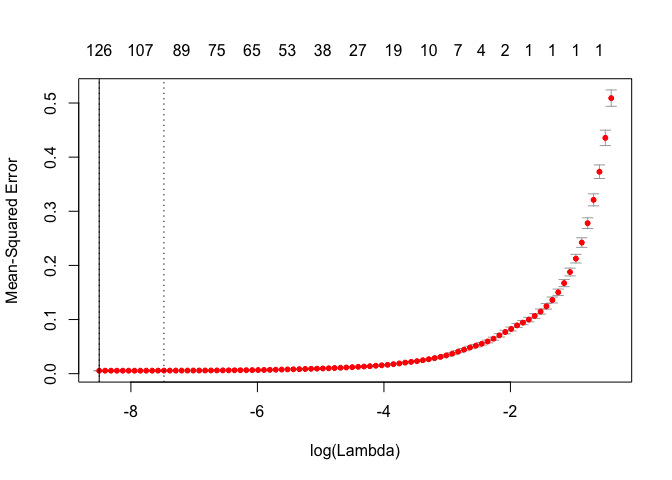

``` r
lm.regularized <- glmnet(xtrain, ytrain, family = "gaussian", 
                         lambda=lm.regularized.cv$lambda.min)
plot(lm.regularized, xvar = "lambda", label = TRUE)
```

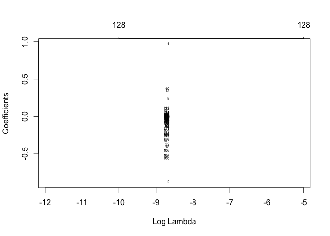

``` r
lm.regularized.cv.pred.valid <- predict(lm.regularized.cv, newx = xtest, s = "lambda.min") 
lm.regularized.pred.valid <- predict(lm.regularized, newx = xtest, s = "lambda.min") 
```

``` r
accuracy(exp(as.ts(lm.regularized.cv.pred.valid)), as.ts(diamond.full.validation$Price))
```

    ##                ME     RMSE      MAE       MPE     MAPE       ACF1
    ## Test set 37.53947 1142.082 659.9324 -0.595341 5.503973 0.02535147
    ##           Theil's U
    ## Test set 0.09129714

``` r
accuracy(exp(as.ts(lm.regularized.pred.valid)), as.ts(diamond.full.validation$Price))
```

    ##                ME     RMSE      MAE        MPE     MAPE       ACF1
    ## Test set 38.65402 1136.629 657.0175 -0.5803963 5.493791 0.02744016
    ##           Theil's U
    ## Test set 0.09111464

``` r
#full dataset
xtrain <- as.matrix(diamond.full.train[, -c(1:11)])
ytrain <- as.vector(diamond.full.train$LPrice)
xtest <- as.matrix(diamond.full.test[, -c(1:11)])
lm.regularized.cv <- cv.glmnet(xtrain, ytrain, 
                               nfolds = 10, family = "gaussian", alpha=1)  # Fits the Lasso.
```

``` r
lm.regularized.cv$lambda.min
```

    ## [1] 0.0002021391

``` r
(minLogLambda <- log(lm.regularized.cv$lambda.min))
```

    ## [1] -8.506555

``` r
coef(lm.regularized.cv, s = "lambda.min")  
```

    ## 184 x 1 sparse Matrix of class "dgCMatrix"
    ##                                            1
    ## (Intercept)                   10.06621229047
    ## LCarat                         0.91488872603
    ## recipCarat                    -0.94363157436
    ## Caratbelow1                   -0.08813392854
    ## Caratequal1                    .            
    ## Caratbelow1.5                 -0.03943500201
    ## Caratequal1.5                  0.03692688501
    ## Caratbelow2                    0.03493642390
    ## Caratabove2                    0.24752448329
    ## CutFair                       -0.08560336045
    ## CutGood                       -0.03866032968
    ## CutIdeal                       0.05486207543
    ## CutSignatureIdeal              0.26286587208
    ## CutVeryGood                    .            
    ## ColorE                        -0.02312633590
    ## ColorF                        -0.08855707612
    ## ColorG                        -0.15430372044
    ## ColorH                        -0.27910862058
    ## ColorI                        -0.42414031326
    ## ClarityIF                      0.46138327661
    ## ClaritySI1                    -0.44588449226
    ## ClarityVS1                    -0.15481312368
    ## ClarityVS2                    -0.28833597272
    ## ClarityVVS1                    0.16321523644
    ## ClarityVVS2                    0.05438779750
    ## PolishG                       -0.02655939978
    ## PolishID                       0.00737721258
    ## PolishVG                      -0.02385847664
    ## SymmetryG                     -0.02743691826
    ## SymmetryID                     0.00974045106
    ## SymmetryVG                    -0.02416679761
    ## ReportGIA                      0.04374013806
    ## CutGood:ColorE                -0.00251971711
    ## CutIdeal:ColorE               -0.00370973070
    ## CutSignatureIdeal:ColorE      -0.05257879998
    ## CutVeryGood:ColorE             .            
    ## CutGood:ColorF                -0.01046266517
    ## CutIdeal:ColorF               -0.00179156605
    ## CutSignatureIdeal:ColorF      -0.06271931036
    ## CutVeryGood:ColorF             .            
    ## CutGood:ColorG                 0.00359119867
    ## CutIdeal:ColorG               -0.01237646604
    ## CutSignatureIdeal:ColorG      -0.06328838185
    ## CutVeryGood:ColorG             .            
    ## CutGood:ColorH                 0.00075139703
    ## CutIdeal:ColorH               -0.01140406118
    ## CutSignatureIdeal:ColorH      -0.05789719744
    ## CutVeryGood:ColorH             0.00280655062
    ## CutGood:ColorI                 .            
    ## CutIdeal:ColorI               -0.03249422451
    ## CutSignatureIdeal:ColorI      -0.06373461716
    ## CutVeryGood:ColorI            -0.01024241905
    ## CutGood:ClarityIF              0.00194732113
    ## CutIdeal:ClarityIF             0.00538756638
    ## CutSignatureIdeal:ClarityIF   -0.07251094675
    ## CutVeryGood:ClarityIF          .            
    ## CutGood:ClaritySI1            -0.01157560205
    ## CutIdeal:ClaritySI1           -0.03440465229
    ## CutSignatureIdeal:ClaritySI1  -0.04667192874
    ## CutVeryGood:ClaritySI1        -0.02630817676
    ## CutGood:ClarityVS1            -0.00380571101
    ## CutIdeal:ClarityVS1            .            
    ## CutSignatureIdeal:ClarityVS1  -0.04472830898
    ## CutVeryGood:ClarityVS1         .            
    ## CutGood:ClarityVS2             .            
    ## CutIdeal:ClarityVS2           -0.00045800853
    ## CutSignatureIdeal:ClarityVS2  -0.03339764277
    ## CutVeryGood:ClarityVS2         .            
    ## CutGood:ClarityVVS1           -0.01452652989
    ## CutIdeal:ClarityVVS1           0.01704999048
    ## CutSignatureIdeal:ClarityVVS1 -0.01503007442
    ## CutVeryGood:ClarityVVS1        0.03968879431
    ## CutGood:ClarityVVS2           -0.01405060895
    ## CutIdeal:ClarityVVS2           0.00406904522
    ## CutSignatureIdeal:ClarityVVS2 -0.03038980006
    ## CutVeryGood:ClarityVVS2        .            
    ## CutGood:PolishG                0.02124424288
    ## CutIdeal:PolishG              -0.01166110492
    ## CutSignatureIdeal:PolishG      .            
    ## CutVeryGood:PolishG            .            
    ## CutGood:PolishID               .            
    ## CutIdeal:PolishID              .            
    ## CutSignatureIdeal:PolishID     0.00148752257
    ## CutVeryGood:PolishID           .            
    ## CutGood:PolishVG               .            
    ## CutIdeal:PolishVG             -0.01228519879
    ## CutSignatureIdeal:PolishVG     .            
    ## CutVeryGood:PolishVG           .            
    ## CutGood:SymmetryG             -0.00339005525
    ## CutIdeal:SymmetryG             0.00601209526
    ## CutSignatureIdeal:SymmetryG    .            
    ## CutVeryGood:SymmetryG          .            
    ## CutGood:SymmetryID             .            
    ## CutIdeal:SymmetryID            .            
    ## CutSignatureIdeal:SymmetryID   .            
    ## CutVeryGood:SymmetryID         0.00278351320
    ## CutGood:SymmetryVG            -0.01179722522
    ## CutIdeal:SymmetryVG           -0.00984060846
    ## CutSignatureIdeal:SymmetryVG   .            
    ## CutVeryGood:SymmetryVG         .            
    ## CutGood:ReportGIA              .            
    ## CutIdeal:ReportGIA             0.00289359558
    ## CutSignatureIdeal:ReportGIA    .            
    ## CutVeryGood:ReportGIA          .            
    ## ColorE:ClarityIF              -0.20988177565
    ## ColorF:ClarityIF              -0.27334496266
    ## ColorG:ClarityIF              -0.45859576346
    ## ColorH:ClarityIF              -0.53621515294
    ## ColorI:ClarityIF              -0.56912017062
    ## ColorE:ClaritySI1              .            
    ## ColorF:ClaritySI1              .            
    ## ColorG:ClaritySI1              .            
    ## ColorH:ClaritySI1              0.07957892140
    ## ColorI:ClaritySI1              0.11399053086
    ## ColorE:ClarityVS1             -0.00673957709
    ## ColorF:ClarityVS1             -0.00439814669
    ## ColorG:ClarityVS1             -0.04366933812
    ## ColorH:ClarityVS1             -0.07404192343
    ## ColorI:ClarityVS1             -0.07889427139
    ## ColorE:ClarityVS2              0.01649734268
    ## ColorF:ClarityVS2              0.02742209520
    ## ColorG:ClarityVS2              0.01776452661
    ## ColorH:ClarityVS2              .            
    ## ColorI:ClarityVS2              .            
    ## ColorE:ClarityVVS1            -0.03589998734
    ## ColorF:ClarityVVS1            -0.11116323733
    ## ColorG:ClarityVVS1            -0.23319354180
    ## ColorH:ClarityVVS1            -0.30166180150
    ## ColorI:ClarityVVS1            -0.29029132040
    ## ColorE:ClarityVVS2            -0.04117982290
    ## ColorF:ClarityVVS2            -0.07138983545
    ## ColorG:ClarityVVS2            -0.15357142083
    ## ColorH:ClarityVVS2            -0.22592308170
    ## ColorI:ClarityVVS2            -0.21781515004
    ## ColorE:PolishG                -0.01422145715
    ## ColorF:PolishG                -0.02130143888
    ## ColorG:PolishG                 .            
    ## ColorH:PolishG                 0.00367535141
    ## ColorI:PolishG                 0.00361951022
    ## ColorE:PolishID               -0.02076484052
    ## ColorF:PolishID                .            
    ## ColorG:PolishID               -0.00209812756
    ## ColorH:PolishID               -0.00490163172
    ## ColorI:PolishID                .            
    ## ColorE:PolishVG                .            
    ## ColorF:PolishVG               -0.01021185485
    ## ColorG:PolishVG                0.00095928242
    ## ColorH:PolishVG               -0.00004254773
    ## ColorI:PolishVG                .            
    ## ColorE:SymmetryG              -0.00859236584
    ## ColorF:SymmetryG              -0.00273181250
    ## ColorG:SymmetryG              -0.00196051661
    ## ColorH:SymmetryG               0.00419956127
    ## ColorI:SymmetryG               0.00374149438
    ## ColorE:SymmetryID              .            
    ## ColorF:SymmetryID              .            
    ## ColorG:SymmetryID              .            
    ## ColorH:SymmetryID              .            
    ## ColorI:SymmetryID              0.00188950929
    ## ColorE:SymmetryVG             -0.00704871807
    ## ColorF:SymmetryVG              0.00271561382
    ## ColorG:SymmetryVG              .            
    ## ColorH:SymmetryVG              0.00658322836
    ## ColorI:SymmetryVG              .            
    ## ColorE:ReportGIA              -0.02750811771
    ## ColorF:ReportGIA               .            
    ## ColorG:ReportGIA               .            
    ## ColorH:ReportGIA              -0.01777601662
    ## ColorI:ReportGIA              -0.01080513485
    ## PolishG:SymmetryG              .            
    ## PolishID:SymmetryG             .            
    ## PolishVG:SymmetryG             0.00482020675
    ## PolishG:SymmetryID             .            
    ## PolishID:SymmetryID            0.00020568851
    ## PolishVG:SymmetryID            .            
    ## PolishG:SymmetryVG             0.00032485164
    ## PolishID:SymmetryVG            .            
    ## PolishVG:SymmetryVG            0.01873860365
    ## PolishG:ReportGIA              .            
    ## PolishID:ReportGIA             .            
    ## PolishVG:ReportGIA             .            
    ## SymmetryG:ReportGIA            .            
    ## SymmetryID:ReportGIA           .            
    ## SymmetryVG:ReportGIA           .

``` r
plot(lm.regularized.cv, label = TRUE)
abline(v = minLogLambda)
```

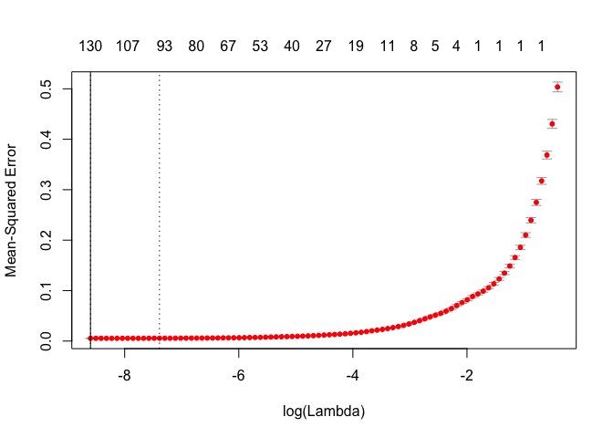

``` r
lm.regularized <- glmnet(xtrain, ytrain, family = "gaussian", 
                         lambda=lm.regularized.cv$lambda.min)
plot(lm.regularized, xvar = "lambda", label = TRUE)
```

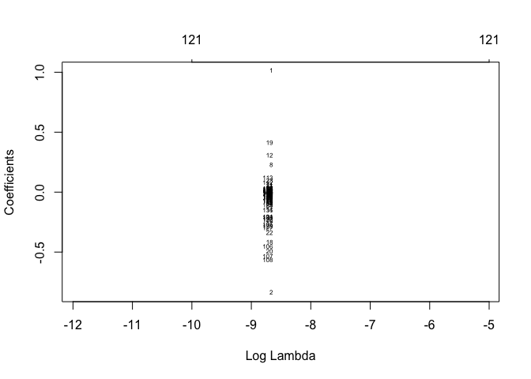

``` r
lm.regularized.cv.pred <- predict(lm.regularized.cv, newx = xtest, s = "lambda.min") 
lm.regularized.pred <- predict(lm.regularized, newx = xtest, s = "lambda.min") 
head(lm.regularized.cv.pred)
```

    ##              1
    ## 6001  9.834224
    ## 6002 10.705224
    ## 6003  8.193697
    ## 6004 10.101849
    ## 6005  9.631637
    ## 6006  8.983151

``` r
head(lm.regularized.pred)
```

    ##              1
    ## 6001  9.835411
    ## 6002 10.708400
    ## 6003  8.197621
    ## 6004 10.099376
    ## 6005  9.633752
    ## 6006  8.982895

``` r
head(as.numeric(exp(lm.regularized.cv.pred)))
```

    ## [1] 18661.613 44588.191  3618.075 24388.059 15239.364  7967.701

``` r
head(as.numeric(diamond.full.validation$Price))
```

    ## [1]  5169 18609  7666  6224 22241  4238

``` r
accuracy(as.numeric(exp(lm.regularized.cv.pred)), as.numeric(diamond.full.test$Price))
```

    ##                ME     RMSE    MAE        MPE     MAPE
    ## Test set 89.49563 1228.317 666.07 -0.0610813 5.328995

``` r
accuracy(as.numeric(exp(lm.regularized.pred)), as.numeric(diamond.full.test$Price))
```

    ##                ME     RMSE     MAE         MPE     MAPE
    ## Test set 86.61591 1217.089 663.344 -0.06074661 5.328578

Ensemble Forecasts
------------------

Among the methods above, we have identified a few models that yield MAPE less than 11% on the validation set.

``` r
accuracy((exp(bag.tree.pred.valid)), diamond.full.validation$Price)
```

    ##                ME     RMSE      MAE        MPE     MAPE
    ## Test set 154.1329 1305.731 681.3833 -0.2749545 5.579907

``` r
accuracy((exp(random.forest.cv.1.pred.valid)), diamond.full.validation$Price)
```

    ##                ME     RMSE    MAE        MPE     MAPE
    ## Test set 76.09589 1149.842 648.61 -0.3985271 5.407072

``` r
accuracy((exp(boost.cv.pred.valid)), diamond.full.validation$Price)
```

    ##                ME     RMSE      MAE       MPE     MAPE
    ## Test set 1738.549 5741.276 3028.095 -4.254665 23.42987

``` r
accuracy((exp(lm.pred.valid)), diamond.full.validation$Price)
```

    ##                ME     RMSE      MAE        MPE     MAPE
    ## Test set 40.44794 1148.506 661.4527 -0.5542636 5.512112

``` r
accuracy((exp(lm.step.pred)), diamond.full.validation$Price)
```

    ##                 ME     RMSE      MAE       MPE    MAPE
    ## Test set -227.3012 13648.32 9440.324 -66.66743 112.395

``` r
accuracy(as.numeric((exp(lm.regularized.pred.valid))), diamond.full.validation$Price)
```

    ##                ME     RMSE      MAE        MPE     MAPE
    ## Test set 38.65402 1136.629 657.0175 -0.5803963 5.493791

``` r
accuracy(((exp(bag.tree.pred.valid))+exp(random.forest.cv.1.pred.valid))/2, diamond.full.validation$Price)
```

    ##                ME     RMSE      MAE        MPE     MAPE
    ## Test set 115.1144 1190.702 649.2518 -0.3367408 5.391522

``` r
accuracy(((exp(bag.tree.pred.valid))+exp(boost.cv.pred.valid))/2, diamond.full.validation$Price)
```

    ##                ME     RMSE      MAE      MPE     MAPE
    ## Test set 946.3408 3294.884 1701.028 -2.26481 13.25728

``` r
accuracy(((exp(bag.tree.pred.valid))+exp(lm.pred.valid))/2, diamond.full.validation$Price)
```

    ##               ME     RMSE      MAE        MPE     MAPE
    ## Test set 97.2904 1091.382 613.3998 -0.4146091 5.015828

``` r
accuracy(((exp(bag.tree.pred.valid))+exp(lm.step.pred))/2, diamond.full.validation$Price)
```

    ##                 ME     RMSE      MAE       MPE     MAPE
    ## Test set -36.58418 7047.496 4826.144 -33.47119 56.90047

``` r
accuracy(((exp(bag.tree.pred.valid))+as.numeric(exp(lm.regularized.pred.valid)))/2, diamond.full.validation$Price)
```

    ##                ME     RMSE      MAE        MPE     MAPE
    ## Test set 96.39343 1097.692 613.0092 -0.4276754 5.021788

``` r
accuracy(((exp(random.forest.cv.1.pred.valid))+exp(boost.cv.pred.valid))/2, diamond.full.validation$Price)
```

    ##                ME     RMSE      MAE       MPE     MAPE
    ## Test set 907.3224 3134.891 1645.565 -2.326596 12.92705

``` r
accuracy(((exp(random.forest.cv.1.pred.valid))+exp(lm.pred.valid))/2, diamond.full.validation$Price)
```

    ##                ME     RMSE      MAE        MPE    MAPE
    ## Test set 58.27192 1028.711 595.6248 -0.4763953 4.98239

``` r
accuracy(((exp(random.forest.cv.1.pred.valid))+exp(lm.step.pred))/2, diamond.full.validation$Price)
```

    ##                 ME     RMSE      MAE       MPE     MAPE
    ## Test set -75.60266 6951.264 4789.609 -33.53298 56.76241

``` r
accuracy(((exp(random.forest.cv.1.pred.valid))+as.numeric(exp(lm.regularized.pred.valid)))/2, diamond.full.validation$Price)
```

    ##                ME     RMSE      MAE        MPE     MAPE
    ## Test set 57.37495 1029.443 593.2592 -0.4894617 4.977059

``` r
accuracy(((exp(boost.cv.pred.valid))+exp(lm.pred.valid))/2, diamond.full.validation$Price)
```

    ##                ME    RMSE      MAE       MPE     MAPE
    ## Test set 889.4984 3138.58 1611.443 -2.404464 12.40941

``` r
accuracy(((exp(boost.cv.pred.valid))+exp(lm.step.pred))/2, diamond.full.validation$Price)
```

    ##                ME     RMSE      MAE       MPE     MAPE
    ## Test set 755.6238 8985.518 5938.499 -35.46105 64.95293

``` r
accuracy(((exp(boost.cv.pred.valid))+as.numeric(exp(lm.regularized.pred.valid)))/2, diamond.full.validation$Price)
```

    ##                ME     RMSE      MAE       MPE     MAPE
    ## Test set 888.6014 3143.679 1611.092 -2.417531 12.41692

``` r
accuracy(((exp(lm.pred.valid))+exp(lm.step.pred))/2, diamond.full.validation$Price)
```

    ##                 ME     RMSE      MAE       MPE    MAPE
    ## Test set -93.42663 6968.844 4781.664 -33.61085 56.5179

``` r
accuracy(((exp(lm.pred.valid))+as.numeric(exp(lm.regularized.pred.valid)))/2, diamond.full.validation$Price)
```

    ##                ME     RMSE      MAE        MPE     MAPE
    ## Test set 39.55098 1140.458 658.2261 -0.5673299 5.493493

``` r
accuracy(((exp(lm.step.pred))+as.numeric(exp(lm.regularized.pred.valid)))/2, diamond.full.validation$Price)
```

    ##                ME     RMSE    MAE       MPE     MAPE
    ## Test set -94.3236 6971.408 4781.5 -33.62391 56.52424

``` r
accuracy(((exp(bag.tree.pred.valid))+exp(random.forest.cv.1.pred.valid)+exp(boost.cv.pred.valid))/3, diamond.full.validation$Price)
```

    ##                ME     RMSE      MAE       MPE     MAPE
    ## Test set 656.2592 2413.318 1247.172 -1.642716 9.878076

``` r
accuracy(((exp(bag.tree.pred.valid))+exp(random.forest.cv.1.pred.valid)+exp(lm.pred.valid))/3, diamond.full.validation$Price)
```

    ##                ME    RMSE      MAE        MPE     MAPE
    ## Test set 90.22556 1070.95 606.7842 -0.4092484 5.022235

``` r
accuracy(((exp(bag.tree.pred.valid))+exp(random.forest.cv.1.pred.valid)+exp(lm.step.pred))/3, diamond.full.validation$Price)
```

    ##                 ME     RMSE      MAE       MPE     MAPE
    ## Test set 0.9758435 4811.057 3272.868 -22.44697 38.42672

``` r
accuracy(((exp(bag.tree.pred.valid))+exp(random.forest.cv.1.pred.valid)+as.numeric(exp(lm.regularized.pred.valid)))/3, diamond.full.validation$Price)
```

    ##                ME     RMSE      MAE        MPE     MAPE
    ## Test set 89.62759 1075.526 606.5169 -0.4179593 5.023997

``` r
accuracy(((exp(bag.tree.pred.valid))+exp(boost.cv.pred.valid)+exp(lm.pred.valid))/3, diamond.full.validation$Price)
```

    ##                ME     RMSE      MAE       MPE     MAPE
    ## Test set 644.3765 2394.577 1224.034 -1.694628 9.512041

``` r
accuracy(((exp(bag.tree.pred.valid))+exp(boost.cv.pred.valid)+exp(lm.step.pred))/3, diamond.full.validation$Price)
```

    ##                ME     RMSE      MAE       MPE     MAPE
    ## Test set 555.1268 6183.384 4040.906 -23.73235 43.92068

``` r
accuracy(((exp(bag.tree.pred.valid))+exp(boost.cv.pred.valid)+as.numeric(exp(lm.regularized.pred.valid)))/3, diamond.full.validation$Price)
```

    ##                ME     RMSE     MAE       MPE     MAPE
    ## Test set 643.7786 2399.456 1224.06 -1.703339 9.520296

``` r
accuracy(((exp(bag.tree.pred.valid))+exp(lm.pred.valid)+exp(lm.step.pred))/3, diamond.full.validation$Price)
```

    ##                 ME     RMSE     MAE       MPE     MAPE
    ## Test set -10.90681 4811.927 3265.39 -22.49888 38.23124

``` r
accuracy(((exp(bag.tree.pred.valid))+exp(lm.pred.valid)+as.numeric(exp(lm.regularized.pred.valid)))/3, diamond.full.validation$Price)
```

    ##                ME     RMSE      MAE        MPE     MAPE
    ## Test set 77.74494 1078.622 613.2296 -0.4698715 5.044681

``` r
accuracy(((exp(bag.tree.pred.valid))+exp(lm.step.pred)+as.numeric(exp(lm.regularized.pred.valid)))/3, diamond.full.validation$Price)
```

    ##                 ME     RMSE      MAE       MPE     MAPE
    ## Test set -11.50478 4814.528 3265.447 -22.50759 38.23708

``` r
accuracy(((exp(random.forest.cv.1.pred.valid))+exp(boost.cv.pred.valid)+exp(lm.pred.valid))/3, diamond.full.validation$Price)
```

    ##                ME     RMSE      MAE       MPE     MAPE
    ## Test set 618.3642 2293.528 1186.422 -1.735819 9.304075

``` r
accuracy(((exp(random.forest.cv.1.pred.valid))+exp(boost.cv.pred.valid)+exp(lm.step.pred))/3, diamond.full.validation$Price)
```

    ##                ME     RMSE      MAE       MPE     MAPE
    ## Test set 529.1145 6100.888 4012.174 -23.77354 43.78121

``` r
accuracy(((exp(random.forest.cv.1.pred.valid))+exp(boost.cv.pred.valid)+as.numeric(exp(lm.regularized.pred.valid)))/3, diamond.full.validation$Price)
```

    ##                ME     RMSE      MAE      MPE     MAPE
    ## Test set 617.7662 2297.432 1186.384 -1.74453 9.311662

``` r
accuracy(((exp(random.forest.cv.1.pred.valid))+exp(lm.pred.valid)+exp(lm.step.pred))/3, diamond.full.validation$Price)
```

    ##                 ME     RMSE      MAE       MPE     MAPE
    ## Test set -36.91913 4747.567 3240.831 -22.54007 38.14256

``` r
accuracy(((exp(random.forest.cv.1.pred.valid))+exp(lm.pred.valid)+as.numeric(exp(lm.regularized.pred.valid)))/3, diamond.full.validation$Price)
```

    ##                ME     RMSE      MAE        MPE    MAPE
    ## Test set 51.73262 1040.377 601.7679 -0.5110623 5.03768

``` r
accuracy(((exp(random.forest.cv.1.pred.valid))+exp(lm.step.pred)+as.numeric(exp(lm.regularized.pred.valid)))/3, diamond.full.validation$Price)
```

    ##                ME     RMSE      MAE       MPE     MAPE
    ## Test set -37.5171 4749.628 3240.792 -22.54879 38.14757

``` r
accuracy(((exp(boost.cv.pred.valid))+exp(lm.pred.valid)+exp(lm.step.pred))/3, diamond.full.validation$Price)
```

    ##                ME     RMSE     MAE       MPE   MAPE
    ## Test set 517.2319 6110.665 4001.51 -23.82545 43.537

``` r
accuracy(((exp(boost.cv.pred.valid))+exp(lm.pred.valid)+as.numeric(exp(lm.regularized.pred.valid)))/3, diamond.full.validation$Price)
```

    ##                ME     RMSE     MAE       MPE     MAPE
    ## Test set 605.8836 2322.904 1178.13 -1.796442 9.098394

``` r
accuracy(((exp(boost.cv.pred.valid))+exp(lm.step.pred)+as.numeric(exp(lm.regularized.pred.valid)))/3, diamond.full.validation$Price)
```

    ##                ME     RMSE      MAE       MPE     MAPE
    ## Test set 516.6339 6113.376 4001.656 -23.83417 43.54503

``` r
accuracy(((exp(lm.pred.valid))+exp(lm.step.pred)+as.numeric(exp(lm.regularized.pred.valid)))/3, diamond.full.validation$Price)
```

    ##                 ME    RMSE     MAE      MPE     MAPE
    ## Test set -49.39975 4772.33 3238.91 -22.6007 38.01339

``` r
head(((exp(random.forest.cv.1.pred.valid))+exp(boost.cv.pred.valid)+exp(lm.pred.valid))/3)
```

    ##         1         9        10        11        16        19 
    ##  5792.066 17933.941  7833.305  5458.646 20888.165  4823.899

``` r
head((exp(random.forest.cv.1.pred.valid)))
```

    ##         1         9        10        11        16        19 
    ##  5359.065 18310.982  7724.423  5467.087 22774.790  4095.040

``` r
accuracy(((exp(bag.tree.pred.valid))+exp(random.forest.cv.1.pred.valid)+exp(boost.cv.pred.valid)+exp(lm.pred.valid))/4, diamond.full.validation$Price)
```

    ##                ME     RMSE     MAE       MPE     MAPE
    ## Test set 502.3064 1971.511 1018.56 -1.370603 8.045597

``` r
accuracy(((exp(bag.tree.pred.valid))+exp(random.forest.cv.1.pred.valid)+exp(boost.cv.pred.valid)+exp(lm.step.pred))/4, diamond.full.validation$Price)
```

    ##                ME     RMSE      MAE      MPE     MAPE
    ## Test set 435.3691 4735.382 3077.472 -17.8989 33.36664

``` r
accuracy(((exp(bag.tree.pred.valid))+exp(random.forest.cv.1.pred.valid)+exp(boost.cv.pred.valid)+as.numeric(exp(lm.regularized.pred.valid)))/4, diamond.full.validation$Price)
```

    ##                ME    RMSE      MAE       MPE     MAPE
    ## Test set 501.8579 1975.37 1018.673 -1.377136 8.052988

``` r
accuracy(((exp(bag.tree.pred.valid))+exp(random.forest.cv.1.pred.valid)+exp(lm.pred.valid)+exp(lm.step.pred))/4, diamond.full.validation$Price)
```

    ##                ME    RMSE      MAE       MPE     MAPE
    ## Test set 10.84387 3704.99 2496.415 -16.97379 29.11191

``` r
accuracy(((exp(bag.tree.pred.valid))+exp(random.forest.cv.1.pred.valid)+exp(lm.pred.valid)+as.numeric(exp(lm.regularized.pred.valid)))/4, diamond.full.validation$Price)
```

    ##                ME     RMSE      MAE        MPE     MAPE
    ## Test set 77.33268 1050.408 599.4384 -0.4520354 4.968122

``` r
accuracy(((exp(bag.tree.pred.valid))+exp(random.forest.cv.1.pred.valid)+exp(lm.step.pred)+as.numeric(exp(lm.regularized.pred.valid)))/4, diamond.full.validation$Price)
```

    ##                ME    RMSE     MAE       MPE     MAPE
    ## Test set 10.39539 3707.17 2496.58 -16.98033 29.11868

``` r
accuracy(((exp(bag.tree.pred.valid))+exp(boost.cv.pred.valid)+exp(lm.pred.valid)+exp(lm.step.pred))/4, diamond.full.validation$Price)
```

    ##                ME    RMSE      MAE       MPE     MAPE
    ## Test set 426.4571 4736.51 3067.367 -17.93783 33.16568

``` r
accuracy(((exp(bag.tree.pred.valid))+exp(boost.cv.pred.valid)+exp(lm.pred.valid)+as.numeric(exp(lm.regularized.pred.valid)))/4, diamond.full.validation$Price)
```

    ##                ME     RMSE      MAE      MPE     MAPE
    ## Test set 492.9459 1977.831 1011.159 -1.41607 7.874433

``` r
accuracy(((exp(bag.tree.pred.valid))+exp(boost.cv.pred.valid)+exp(lm.step.pred)+as.numeric(exp(lm.regularized.pred.valid)))/4, diamond.full.validation$Price)
```

    ##                ME     RMSE     MAE       MPE     MAPE
    ## Test set 426.0086 4739.021 3067.45 -17.94436 33.17164

``` r
accuracy(((exp(bag.tree.pred.valid))+exp(lm.pred.valid)+exp(lm.step.pred)+as.numeric(exp(lm.regularized.pred.valid)))/4, diamond.full.validation$Price)
```

    ##              ME     RMSE      MAE       MPE     MAPE
    ## Test set 1.4834 3715.943 2493.635 -17.01926 29.00156

``` r
accuracy(((exp(random.forest.cv.1.pred.valid))+exp(boost.cv.pred.valid)+exp(lm.pred.valid)+exp(lm.step.pred))/4, diamond.full.validation$Price)
```

    ##                ME     RMSE      MAE       MPE     MAPE
    ## Test set 406.9479 4674.954 3045.303 -17.96872 33.05778

``` r
accuracy(((exp(random.forest.cv.1.pred.valid))+exp(boost.cv.pred.valid)+exp(lm.pred.valid)+as.numeric(exp(lm.regularized.pred.valid)))/4, diamond.full.validation$Price)
```

    ##                ME     RMSE     MAE       MPE    MAPE
    ## Test set 473.4367 1906.036 984.779 -1.446963 7.73848

``` r
accuracy(((exp(random.forest.cv.1.pred.valid))+exp(boost.cv.pred.valid)+exp(lm.step.pred)+as.numeric(exp(lm.regularized.pred.valid)))/4, diamond.full.validation$Price)
```

    ##                ME     RMSE      MAE       MPE    MAPE
    ## Test set 406.4994 4677.169 3045.272 -17.97526 33.0629

``` r
accuracy(((exp(random.forest.cv.1.pred.valid))+exp(lm.pred.valid)+exp(lm.step.pred)+as.numeric(exp(lm.regularized.pred.valid)))/4, diamond.full.validation$Price)
```

    ##                 ME     RMSE     MAE       MPE     MAPE
    ## Test set -18.02584 3667.395 2475.34 -17.05016 28.93916

``` r
accuracy(((exp(boost.cv.pred.valid))+exp(lm.pred.valid)+exp(lm.step.pred)+as.numeric(exp(lm.regularized.pred.valid)))/4, diamond.full.validation$Price)
```

    ##                ME     RMSE     MAE       MPE     MAPE
    ## Test set 397.5874 4690.787 3040.59 -18.01419 32.91886

``` r
accuracy(((exp(bag.tree.pred.valid))+exp(random.forest.cv.1.pred.valid)+exp(boost.cv.pred.valid)+exp(lm.pred.valid)+as.numeric(exp(lm.step.pred)))/5, diamond.full.validation$Price)
```

    ##                ME     RMSE      MAE       MPE     MAPE
    ## Test set 356.3849 3874.107 2495.098 -14.42997 26.91082

``` r
accuracy(((exp(bag.tree.pred.valid))+exp(random.forest.cv.1.pred.valid)+exp(boost.cv.pred.valid)+exp(lm.pred.valid)+as.numeric(exp(lm.regularized.pred.valid)))/5, diamond.full.validation$Price)
```

    ##                ME     RMSE      MAE       MPE     MAPE
    ## Test set 409.5759 1729.713 898.2334 -1.212561 7.098038

``` r
accuracy(((exp(bag.tree.pred.valid))+exp(random.forest.cv.1.pred.valid)+exp(boost.cv.pred.valid)+exp(lm.step.pred)+as.numeric(exp(lm.regularized.pred.valid)))/5, diamond.full.validation$Price)
```

    ##                ME     RMSE     MAE      MPE     MAPE
    ## Test set 356.0261 3876.243 2495.21 -14.4352 26.91599

``` r
accuracy(((exp(bag.tree.pred.valid))+exp(random.forest.cv.1.pred.valid)+exp(lm.pred.valid)+exp(lm.step.pred)+as.numeric(exp(lm.regularized.pred.valid)))/5, diamond.full.validation$Price)
```

    ##               ME     RMSE      MAE       MPE     MAPE
    ## Test set 16.4059 3058.078 2038.817 -13.69512 23.60366

``` r
accuracy(((exp(bag.tree.pred.valid))+exp(boost.cv.pred.valid)+exp(lm.pred.valid)+exp(lm.step.pred)+as.numeric(exp(lm.regularized.pred.valid)))/5, diamond.full.validation$Price)
```

    ##                ME     RMSE      MAE       MPE    MAPE
    ## Test set 348.8965 3882.108 2489.503 -14.46634 26.7862

``` r
accuracy(((exp(random.forest.cv.1.pred.valid))+exp(boost.cv.pred.valid)+exp(lm.pred.valid)+exp(lm.step.pred)+as.numeric(exp(lm.regularized.pred.valid)))/5, diamond.full.validation$Price)
```

    ##                ME     RMSE     MAE       MPE    MAPE
    ## Test set 333.2891 3833.024 2471.75 -14.49106 26.7008

``` r
accuracy(((exp(bag.tree.pred.valid))+exp(random.forest.cv.1.pred.valid)+exp(boost.cv.pred.valid)+exp(lm.pred.valid)+as.numeric(exp(lm.step.pred))+as.numeric(exp(lm.regularized.pred.valid)))/6, diamond.full.validation$Price)
```

    ##                ME     RMSE      MAE       MPE     MAPE
    ## Test set 303.4297 3311.005 2112.275 -12.12171 22.67146

Summary of Analysis & Areas for Further Research
================================================

A few key conclusions are worth noting after our analysis of the data:

1.  Best model for predicting diamond prices is a boosted tree model, which gives MAPE of 4.23%

2.  Given the scatter plot between price and carat weight, the log-log relationship makes the most sense

3.  Although we include log(carat weight) and 1/carat weight as explanatory variables, there seem to be distinct clusters of prices based on ranges of carat weights, as the bin dummies based on carat weight we created were m

4.  Though tree-based models tend to outperform linear regression models, they lose out on model intepretability. In particular, it is a lot easier to get an estimate of the marginal effect of a specific attribute on diamond price with a linear regression model vs. a tree-based model.

5.  That said, using a tree-based model to help determine which variables and interaction terms to include as a start in a linear regression appears to be fruitful.
