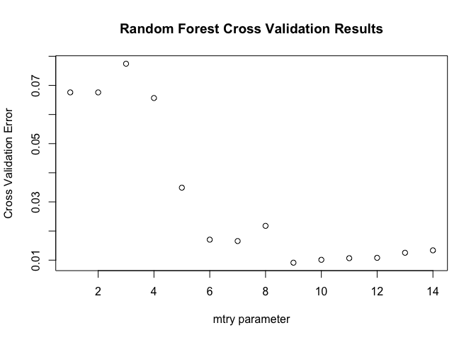

Sarah Gets a Diamond
================
Dang Trinh
2018-04-11

-   [Environment Setup](#environment-setup)
-   [Data Wrangling](#data-wrangling)
-   [Data Visualization](#data-visualization)
-   [Building Predictive Models](#building-predictive-models)
    -   [Tree-based models](#tree-based-models)
        -   [Single Tuned Tree](#single-tuned-tree)
        -   [Bagged Tree](#bagged-tree)
        -   [Random Forest](#random-forest)
        -   [Boosted Trees](#boosted-trees)
    -   [Regression Models](#regression-models)
        -   [Backward Step-Wise Linear Regression](#backward-step-wise-linear-regression)
        -   [Lasso Regression](#lasso-regression)
    -   [Ensemble Forecasts](#ensemble-forecasts)
-   [Summary of Analysis & Areas for Further Research](#summary-of-analysis-areas-for-further-research)

Environment Setup
=================

R is an open source programming language that allows users to extend R by writing "packages". These packages usually perform a very complex and specific set of functions that we would like to utilize in our script. For example, the **gbm** package allows us to fit boosted tree predictive models.

You can load a package by using the `library()` function as shown below, but you must first install the package. You can install a package by using the `install.packages()` function like so:

``` r
install.packages("gbm")
```

After installing all of the packages listed below, then load them up by running this block of code. It is always a good idea to load all the required packages at the beginning of your script so that others can know what packages they need to replicate your analysis.

``` r
options(scipen=999, digits=6)
library(here)
library(Lahman)
library(lubridate)
library(forecast)
library(dplyr)
library(tidyr)
library(zoo)
library(glmnet)
library(tseries)
library(rpart)
library(rpart.plot)
library(glmnet)
library(forecast)
library(MASS)
library(randomForest)
library(gbm)
#library(prophet)
#library(vars)
#library(tree)
```

``` r
# create a folder to save our analyses, underlying data
todays_date_formatted <- format(Sys.Date(), '%Y%m%d')
dir.create(here::here('output', todays_date_formatted), showWarnings = FALSE)
```

Data Wrangling
==============

Data is usually not in a format that is ready for analysis, so we go through a number of steps that shape the data into a format that R can use for running analysis. We first read in the data and explore the various variables. The dataset contains several key attributes of diamond: carat, cut, color, clarity, polish, and symmetry. The `summary()` gives a quick idea of what they data entails.

``` r
# read the data from github
data_url <- 'https://raw.githubusercontent.com/DardenDSC/sarah-gets-a-diamond/master/data/sarah-gets-a-diamond-raw-data.csv'
raw_diamond_dat <- read.csv(data_url)

# get a sense for what the data entails
summary(raw_diamond_dat)
```

    ##        ID        Carat.Weight               Cut       Color    Clarity    
    ##  Min.   :   1   Min.   :0.75   Fair           : 199   D:1007   FL  :   4  
    ##  1st Qu.:2286   1st Qu.:1.01   Good           :1081   E:1189   IF  : 311  
    ##  Median :4572   Median :1.13   Ideal          :3783   F:1535   SI1 :3110  
    ##  Mean   :4572   Mean   :1.34   Signature-Ideal: 375   G:2253   VS1 :1826  
    ##  3rd Qu.:6857   3rd Qu.:1.59   Very Good      :3704   H:1710   VS2 :2396  
    ##  Max.   :9142   Max.   :2.91                          I:1448   VVS1: 451  
    ##                                                                VVS2:1044  
    ##  Polish    Symmetry   Report         Price         Dataset    
    ##  EX:3704   EX:3146   AGSL:1119   Min.   :  2184   Test :3142  
    ##  G : 894   G :1404   GIA :8023   1st Qu.:  5195   Train:6000  
    ##  ID: 900   ID: 925               Median :  7868               
    ##  VG:3644   VG:3667               Mean   : 11799               
    ##                                  3rd Qu.: 15098               
    ##                                  Max.   :101561               
    ## 

To facilitate subsequent regressions, we will do a minor cleaning of the `cut` variable to remove the space and the hyphen in its values ("Signature-Ideal" and "Very Good"). We will also create a log transformation and a reciprocal of Carat Weight and several bins variables for Carat Weight. These bin values were determined based on a subsequent scatter plot between price and carat weight.

``` r
# create a new variable to keep the raw data separate
diamond <- raw_diamond_dat

diamond <- diamond %>%
  mutate(Clarity = as.factor(Clarity), 
         Dataset = as.factor(Dataset), 
         Cut = as.factor(ifelse(Cut == "Signature-Ideal",
                                "SignatureIdeal", 
                                as.character(Cut))),
         Cut = as.factor(ifelse(Cut == "Very Good", 
                                "VeryGood", 
                                as.character(Cut))),
         LPrice = log(Price),
         LCarat = log(Carat.Weight),
         recipCarat = 1 / Carat.Weight,
         Caratbelow1 = as.numeric(Carat.Weight < 1),
         Caratequal1 = as.numeric(Carat.Weight == 1),
         Caratbelow1.5 = as.numeric((Carat.Weight > 1) & (Carat.Weight < 1.5)),
         Caratequal1.5 = as.numeric(Carat.Weight == 1.5),
         Caratbelow2 = as.numeric((Carat.Weight > 1.5) & (Carat.Weight < 2)),
         Caratabove2 = as.numeric(Carat.Weight >= 2))

summary(diamond)
```

    ##        ID        Carat.Weight              Cut       Color    Clarity    
    ##  Min.   :   1   Min.   :0.75   Fair          : 199   D:1007   FL  :   4  
    ##  1st Qu.:2286   1st Qu.:1.01   Good          :1081   E:1189   IF  : 311  
    ##  Median :4572   Median :1.13   Ideal         :3783   F:1535   SI1 :3110  
    ##  Mean   :4572   Mean   :1.34   SignatureIdeal: 375   G:2253   VS1 :1826  
    ##  3rd Qu.:6857   3rd Qu.:1.59   VeryGood      :3704   H:1710   VS2 :2396  
    ##  Max.   :9142   Max.   :2.91                         I:1448   VVS1: 451  
    ##                                                               VVS2:1044  
    ##  Polish    Symmetry   Report         Price         Dataset    
    ##  EX:3704   EX:3146   AGSL:1119   Min.   :  2184   Test :3142  
    ##  G : 894   G :1404   GIA :8023   1st Qu.:  5195   Train:6000  
    ##  ID: 900   ID: 925               Median :  7868               
    ##  VG:3644   VG:3667               Mean   : 11799               
    ##                                  3rd Qu.: 15098               
    ##                                  Max.   :101561               
    ##                                                               
    ##      LPrice          LCarat           recipCarat     Caratbelow1   
    ##  Min.   : 7.69   Min.   :-0.28768   Min.   :0.344   Min.   :0.000  
    ##  1st Qu.: 8.56   1st Qu.: 0.00995   1st Qu.:0.629   1st Qu.:0.000  
    ##  Median : 8.97   Median : 0.12222   Median :0.885   Median :0.000  
    ##  Mean   : 9.10   Mean   : 0.23232   Mean   :0.834   Mean   :0.199  
    ##  3rd Qu.: 9.62   3rd Qu.: 0.46373   3rd Qu.:0.990   3rd Qu.:0.000  
    ##  Max.   :11.53   Max.   : 1.06815   Max.   :1.333   Max.   :1.000  
    ##                                                                    
    ##   Caratequal1    Caratbelow1.5   Caratequal1.5     Caratbelow2   
    ##  Min.   :0.000   Min.   :0.000   Min.   :0.0000   Min.   :0.000  
    ##  1st Qu.:0.000   1st Qu.:0.000   1st Qu.:0.0000   1st Qu.:0.000  
    ##  Median :0.000   Median :0.000   Median :0.0000   Median :0.000  
    ##  Mean   :0.049   Mean   :0.411   Mean   :0.0237   Mean   :0.103  
    ##  3rd Qu.:0.000   3rd Qu.:1.000   3rd Qu.:0.0000   3rd Qu.:0.000  
    ##  Max.   :1.000   Max.   :1.000   Max.   :1.0000   Max.   :1.000  
    ##                                                                  
    ##   Caratabove2   
    ##  Min.   :0.000  
    ##  1st Qu.:0.000  
    ##  Median :0.000  
    ##  Mean   :0.214  
    ##  3rd Qu.:0.000  
    ##  Max.   :1.000  
    ## 

Here we will create several dummy variables, interaction terms, and split the data into the training and test set. The process of creating additional variables for analysis is typically referred to as "feature engineering". Feature engineering helps to find more nuanced relationships and usually leads to improved accuracy in predictive models

``` r
dummies <- model.matrix(~ 0 + Cut + Color + Clarity + Polish + Symmetry + Report + 
                              Cut:Color + Cut:Clarity + Cut:Polish + Cut:Symmetry + Cut:Report +
                              Color:Clarity + Color:Polish + Color:Symmetry + Color:Report+
                              Polish:Symmetry + Polish:Report + Symmetry:Report, 
                        data = diamond)

diamond.full <- as.data.frame(cbind(diamond, dummies))

diamond.train <- diamond[diamond$Dataset == "Train",]
diamond.test <- diamond[diamond$Dataset == "Test",]

diamond.full.train <- diamond.full[diamond.full$Dataset == "Train",]
diamond.full.test <- diamond.full[diamond.full$Dataset == "Test",]
```

We will also split the data into a smaller training set and a validation set.

``` r
nTrain <- dim(diamond.train)[1]
(nSmallTrain <- round(nrow(diamond.train) * 0.75))
```

    ## [1] 4500

``` r
(nValid <- nTrain - nSmallTrain)
```

    ## [1] 1500

``` r
rowIndicesSmallerTrain <- sample(1:nTrain, size = nSmallTrain, replace = FALSE)

diamond.smaller.train <- diamond.train[rowIndicesSmallerTrain, ]
diamond.validation <- diamond.train[-rowIndicesSmallerTrain, ]

diamond.full.smaller.train <- diamond.full.train[rowIndicesSmallerTrain, ]
diamond.full.validation <- diamond.full.train[-rowIndicesSmallerTrain, ]
```

Data Visualization
==================

An initial scatterplot of the Price vs. Carat Weight shows that Carat Weight typically falls into distinct buckets, and that there are significant heteroskedasticity in the relationship.

``` r
plot(x=diamond$Carat.Weight, y=diamond$Price, 
     main="Price vs. Carat", 
     ylab="Price", xlab="Carat")
```


Our second scatterplot of the Log Price vs. Carat Weight shows a quadratic relationship. Furthermore, the heteroskedasticity issue is now fixed.

``` r
plot(x=diamond$Carat.Weight, y=diamond$LPrice, 
     main="Log Price vs. Carat", 
     ylab="Log Price", xlab="Carat")
```


Finally, our last scatterplot of Log Price vs. Log Carat Weight shows a linear relationship with little heteroskedasticity. We will adopt this equation for our model. For more visualization, see the posted Tableau file.

Note that I currently encounter the IOPub data rate exceeded error below so the chart does not show up in the output. The tableau file does have the chart though.

``` r
plot(x=diamond$LCarat, y=diamond$LPrice, 
     main="Log Price vs. Log Carat", 
     ylab="Log Price", xlab="Log Carat")
```


Building Predictive Models
==========================

Tree-based models
-----------------

Here we utilize several tree-based model to predict log price of the diamonds based on several characteristics present in the data.

### Single Tuned Tree

Our initial tuned tree (best cp is around 0.00000151859) yields a MAPE of 7.0% when applied to the validation set. The importance variable list shows that log carat size, inverse of carat size, as well as the bins of carat size are all quite significant variables in predicting price.

Note that throughout our modeling analysis we will utilize a common model specification that each process with start with when fitting.

``` r
model_formula <- "LPrice ~ LCarat +  recipCarat + Cut + Color + Clarity + Polish + Symmetry + 
                           Report + Caratbelow1 + Caratequal1 + Caratbelow1.5 +
                           Caratequal1.5 + Caratbelow2 + Caratabove2"
```

``` r
rt.auto.cv <- rpart(model_formula, data = diamond.train, 
                    control = rpart.control(cp = 0.000001, xval = 10))  # xval is number of folds in the K-fold cross-validation.
printcp(rt.auto.cv)  # Print out the cp table of cross-validation errors. 
```

    ## 
    ## Regression tree:
    ## rpart(formula = model_formula, data = diamond.train, control = rpart.control(cp = 0.000001, 
    ##     xval = 10))
    ## 
    ## Variables actually used in tree construction:
    ## [1] Caratequal1.5 Clarity       Color         Cut           LCarat       
    ## [6] Polish        recipCarat    Symmetry     
    ## 
    ## Root node error: 3028/6000 = 0.5046
    ## 
    ## n= 6000 
    ## 
    ##              CP nsplit rel error  xerror      xstd
    ## 1   0.659851831      0   1.00000 1.00029 0.0157772
    ## 2   0.096420733      1   0.34015 0.34111 0.0058882
    ## 3   0.077950579      2   0.24373 0.24546 0.0051191
    ## 4   0.032540064      3   0.16578 0.16686 0.0035197
    ## 5   0.016507093      4   0.13324 0.13439 0.0031571
    ## 6   0.011401101      5   0.11673 0.12016 0.0026874
    ## 7   0.007470219      6   0.10533 0.11060 0.0023629
    ## 8   0.007080095      7   0.09786 0.10115 0.0022088
    ## 9   0.006152841      8   0.09078 0.09228 0.0020838
    ## 10  0.006076183      9   0.08463 0.08770 0.0020247
    ## 11  0.004852487     10   0.07855 0.08013 0.0018472
    ## 12  0.003943772     11   0.07370 0.07446 0.0017812
    ## 13  0.003765359     12   0.06975 0.07212 0.0017533
    ## 14  0.002738983     13   0.06599 0.06739 0.0016047
    ## 15  0.002118698     14   0.06325 0.06491 0.0015780
    ## 16  0.002014056     15   0.06113 0.06375 0.0015564
    ## 17  0.001900443     16   0.05912 0.06302 0.0015482
    ## 18  0.001734638     17   0.05722 0.06099 0.0015052
    ## 19  0.001393381     18   0.05548 0.05865 0.0014224
    ## 20  0.001373417     19   0.05409 0.05597 0.0013584
    ## 21  0.001363448     20   0.05271 0.05550 0.0013511
    ## 22  0.001319788     21   0.05135 0.05498 0.0013426
    ## 23  0.001297114     22   0.05003 0.05409 0.0013205
    ## 24  0.001289224     23   0.04873 0.05400 0.0013200
    ## 25  0.001118103     24   0.04744 0.05137 0.0012201
    ## 26  0.001097613     25   0.04633 0.04988 0.0011955
    ## 27  0.001051373     26   0.04523 0.04961 0.0011636
    ## 28  0.000953268     27   0.04418 0.04791 0.0011297
    ## 29  0.000907822     28   0.04322 0.04720 0.0011236
    ## 30  0.000831068     29   0.04232 0.04615 0.0010669
    ## 31  0.000813594     30   0.04149 0.04534 0.0010531
    ## 32  0.000806518     31   0.04067 0.04534 0.0010531
    ## 33  0.000692542     32   0.03987 0.04345 0.0010170
    ## 34  0.000687392     33   0.03917 0.04251 0.0009809
    ## 35  0.000674226     34   0.03849 0.04240 0.0009795
    ## 36  0.000620835     35   0.03781 0.04157 0.0009564
    ## 37  0.000613225     36   0.03719 0.04124 0.0009526
    ## 38  0.000586010     37   0.03658 0.04105 0.0009507
    ## 39  0.000541789     38   0.03599 0.04040 0.0009358
    ## 40  0.000524693     39   0.03545 0.03953 0.0009262
    ## 41  0.000507850     40   0.03492 0.03884 0.0009163
    ## 42  0.000502688     41   0.03442 0.03875 0.0009146
    ## 43  0.000489059     42   0.03391 0.03827 0.0009015
    ## 44  0.000454872     43   0.03342 0.03792 0.0008976
    ## 45  0.000454581     44   0.03297 0.03756 0.0008844
    ## 46  0.000424434     45   0.03252 0.03716 0.0008753
    ## 47  0.000417381     46   0.03209 0.03652 0.0008611
    ## 48  0.000408124     47   0.03167 0.03643 0.0008604
    ## 49  0.000394701     48   0.03127 0.03601 0.0008461
    ## 50  0.000348733     49   0.03087 0.03513 0.0008151
    ## 51  0.000336490     50   0.03052 0.03419 0.0007910
    ## 52  0.000334405     51   0.03019 0.03382 0.0007812
    ## 53  0.000333519     52   0.02985 0.03374 0.0007790
    ## 54  0.000326078     53   0.02952 0.03362 0.0007769
    ## 55  0.000322447     54   0.02919 0.03329 0.0007731
    ## 56  0.000309310     55   0.02887 0.03314 0.0007708
    ## 57  0.000302217     56   0.02856 0.03271 0.0007556
    ## 58  0.000299413     57   0.02826 0.03258 0.0007547
    ## 59  0.000281524     58   0.02796 0.03232 0.0007475
    ## 60  0.000279841     59   0.02768 0.03180 0.0007349
    ## 61  0.000278707     60   0.02740 0.03178 0.0007341
    ## 62  0.000254192     61   0.02712 0.03130 0.0007256
    ## 63  0.000245513     62   0.02686 0.03083 0.0007188
    ## 64  0.000244824     63   0.02662 0.03065 0.0007157
    ## 65  0.000238641     64   0.02637 0.03052 0.0007147
    ## 66  0.000233808     65   0.02613 0.03010 0.0007089
    ## 67  0.000231046     66   0.02590 0.02987 0.0007053
    ## 68  0.000226000     67   0.02567 0.02973 0.0007027
    ## 69  0.000222661     68   0.02544 0.02941 0.0006977
    ## 70  0.000212486     69   0.02522 0.02898 0.0006958
    ## 71  0.000212324     70   0.02501 0.02867 0.0006877
    ## 72  0.000205160     71   0.02480 0.02862 0.0006868
    ## 73  0.000201310     72   0.02459 0.02833 0.0006697
    ## 74  0.000199039     73   0.02439 0.02814 0.0006687
    ## 75  0.000191214     74   0.02419 0.02794 0.0006649
    ## 76  0.000191014     75   0.02400 0.02787 0.0006645
    ## 77  0.000188997     76   0.02381 0.02777 0.0006632
    ## 78  0.000187430     77   0.02362 0.02772 0.0006616
    ## 79  0.000187422     78   0.02343 0.02768 0.0006613
    ## 80  0.000185203     79   0.02324 0.02762 0.0006611
    ## 81  0.000182813     80   0.02306 0.02755 0.0006611
    ## 82  0.000181121     82   0.02269 0.02729 0.0006568
    ## 83  0.000179114     83   0.02251 0.02725 0.0006559
    ## 84  0.000174171     84   0.02233 0.02703 0.0006453
    ## 85  0.000171167     85   0.02216 0.02688 0.0006434
    ## 86  0.000170848     86   0.02199 0.02683 0.0006417
    ## 87  0.000167101     87   0.02182 0.02676 0.0006420
    ## 88  0.000164903     88   0.02165 0.02661 0.0006403
    ## 89  0.000159470     89   0.02149 0.02643 0.0006406
    ## 90  0.000152630     90   0.02133 0.02627 0.0006374
    ## 91  0.000136316     91   0.02117 0.02566 0.0006230
    ## 92  0.000134844     92   0.02104 0.02519 0.0006162
    ## 93  0.000133792     93   0.02090 0.02518 0.0006164
    ## 94  0.000130249     94   0.02077 0.02516 0.0006164
    ## 95  0.000125664     95   0.02064 0.02493 0.0006138
    ## 96  0.000122236     96   0.02051 0.02478 0.0006117
    ## 97  0.000121723     97   0.02039 0.02464 0.0006056
    ## 98  0.000120843     98   0.02027 0.02467 0.0006058
    ## 99  0.000120381     99   0.02015 0.02462 0.0006053
    ## 100 0.000119542    100   0.02003 0.02456 0.0006050
    ## 101 0.000112099    101   0.01991 0.02435 0.0006040
    ## 102 0.000111374    102   0.01980 0.02426 0.0006059
    ## 103 0.000110673    103   0.01968 0.02427 0.0006058
    ## 104 0.000109741    104   0.01957 0.02417 0.0006039
    ## 105 0.000109019    105   0.01946 0.02417 0.0006039
    ## 106 0.000108598    106   0.01936 0.02419 0.0006041
    ## 107 0.000107441    107   0.01925 0.02417 0.0006039
    ## 108 0.000105977    108   0.01914 0.02408 0.0006038
    ## 109 0.000105111    109   0.01903 0.02406 0.0006039
    ## 110 0.000104915    110   0.01893 0.02404 0.0006042
    ## 111 0.000103458    111   0.01882 0.02389 0.0006026
    ## 112 0.000101831    112   0.01872 0.02377 0.0005996
    ## 113 0.000096090    113   0.01862 0.02372 0.0006004
    ## 114 0.000095925    114   0.01852 0.02355 0.0005975
    ## 115 0.000095607    115   0.01843 0.02355 0.0005975
    ## 116 0.000095109    116   0.01833 0.02355 0.0005975
    ## 117 0.000092241    117   0.01824 0.02344 0.0005957
    ## 118 0.000091971    118   0.01814 0.02347 0.0005953
    ## 119 0.000090367    119   0.01805 0.02340 0.0005944
    ## 120 0.000089399    120   0.01796 0.02332 0.0005934
    ## 121 0.000087143    121   0.01787 0.02316 0.0005922
    ## 122 0.000085416    122   0.01778 0.02298 0.0005876
    ## 123 0.000085042    123   0.01770 0.02292 0.0005870
    ## 124 0.000082370    124   0.01761 0.02286 0.0005848
    ## 125 0.000082270    125   0.01753 0.02279 0.0005849
    ## 126 0.000081821    126   0.01745 0.02278 0.0005848
    ## 127 0.000080937    127   0.01737 0.02275 0.0005836
    ## 128 0.000078169    128   0.01729 0.02258 0.0005702
    ## 129 0.000077616    129   0.01721 0.02255 0.0005684
    ## 130 0.000077562    130   0.01713 0.02249 0.0005682
    ## 131 0.000076808    131   0.01705 0.02242 0.0005668
    ## 132 0.000076399    132   0.01698 0.02234 0.0005640
    ## 133 0.000074043    133   0.01690 0.02225 0.0005621
    ## 134 0.000072681    134   0.01683 0.02211 0.0005587
    ## 135 0.000071722    135   0.01675 0.02203 0.0005558
    ## 136 0.000071560    136   0.01668 0.02196 0.0005550
    ## 137 0.000070737    137   0.01661 0.02191 0.0005547
    ## 138 0.000068648    138   0.01654 0.02179 0.0005539
    ## 139 0.000067832    139   0.01647 0.02170 0.0005547
    ## 140 0.000067354    140   0.01640 0.02166 0.0005535
    ## 141 0.000066934    141   0.01633 0.02165 0.0005534
    ## 142 0.000065344    142   0.01627 0.02161 0.0005526
    ## 143 0.000064142    143   0.01620 0.02146 0.0005483
    ## 144 0.000063585    144   0.01614 0.02139 0.0005467
    ## 145 0.000063289    145   0.01607 0.02137 0.0005444
    ## 146 0.000062359    146   0.01601 0.02136 0.0005445
    ## 147 0.000062181    147   0.01595 0.02124 0.0005341
    ## 148 0.000059987    148   0.01589 0.02112 0.0005322
    ## 149 0.000059733    149   0.01583 0.02107 0.0005312
    ## 150 0.000058855    150   0.01577 0.02101 0.0005300
    ## 151 0.000057749    151   0.01571 0.02095 0.0005288
    ## 152 0.000057590    152   0.01565 0.02089 0.0005283
    ## 153 0.000056903    153   0.01559 0.02083 0.0005280
    ## 154 0.000056450    154   0.01554 0.02071 0.0005257
    ## 155 0.000055689    155   0.01548 0.02063 0.0005229
    ## 156 0.000054980    156   0.01542 0.02061 0.0005232
    ## 157 0.000054937    157   0.01537 0.02057 0.0005228
    ## 158 0.000054252    158   0.01531 0.02056 0.0005228
    ## 159 0.000054113    159   0.01526 0.02054 0.0005226
    ## 160 0.000053364    160   0.01521 0.02047 0.0005218
    ## 161 0.000052965    161   0.01515 0.02044 0.0005220
    ## 162 0.000050052    162   0.01510 0.02029 0.0005121
    ## 163 0.000048051    163   0.01505 0.02009 0.0005100
    ## 164 0.000047931    164   0.01500 0.02003 0.0005093
    ## 165 0.000047481    165   0.01495 0.02002 0.0005092
    ## 166 0.000047000    167   0.01486 0.01998 0.0005083
    ## 167 0.000046766    168   0.01481 0.01994 0.0005066
    ## 168 0.000046509    169   0.01476 0.01991 0.0005062
    ## 169 0.000046400    171   0.01467 0.01989 0.0005062
    ## 170 0.000046183    172   0.01463 0.01991 0.0005061
    ## 171 0.000046143    173   0.01458 0.01991 0.0005061
    ## 172 0.000045726    174   0.01453 0.01988 0.0005059
    ## 173 0.000045290    175   0.01449 0.01985 0.0005058
    ## 174 0.000044812    176   0.01444 0.01981 0.0005039
    ## 175 0.000044777    177   0.01440 0.01977 0.0005035
    ## 176 0.000044331    178   0.01435 0.01977 0.0005035
    ## 177 0.000043821    179   0.01431 0.01975 0.0005022
    ## 178 0.000043704    180   0.01426 0.01968 0.0005020
    ## 179 0.000042514    181   0.01422 0.01964 0.0005008
    ## 180 0.000042477    182   0.01418 0.01963 0.0005007
    ## 181 0.000040738    183   0.01414 0.01956 0.0005007
    ## 182 0.000039522    184   0.01409 0.01947 0.0004998
    ## 183 0.000039345    185   0.01406 0.01945 0.0005004
    ## 184 0.000039095    186   0.01402 0.01946 0.0005007
    ## 185 0.000038657    187   0.01398 0.01942 0.0005006
    ## 186 0.000038338    188   0.01394 0.01935 0.0005000
    ## 187 0.000038257    189   0.01390 0.01933 0.0004999
    ## 188 0.000037795    190   0.01386 0.01929 0.0004996
    ## 189 0.000037318    191   0.01382 0.01926 0.0004996
    ## 190 0.000037066    192   0.01379 0.01926 0.0004996
    ## 191 0.000036938    193   0.01375 0.01925 0.0004996
    ## 192 0.000036703    194   0.01371 0.01924 0.0005004
    ## 193 0.000036341    195   0.01368 0.01922 0.0004998
    ## 194 0.000036265    196   0.01364 0.01921 0.0004998
    ## 195 0.000035778    197   0.01360 0.01921 0.0004999
    ## 196 0.000035706    198   0.01357 0.01920 0.0005001
    ## 197 0.000034342    199   0.01353 0.01907 0.0004973
    ## 198 0.000034250    200   0.01350 0.01901 0.0004949
    ## 199 0.000033810    201   0.01346 0.01901 0.0004949
    ## 200 0.000033788    202   0.01343 0.01899 0.0004948
    ## 201 0.000033342    203   0.01340 0.01896 0.0004946
    ## 202 0.000033265    204   0.01336 0.01895 0.0004945
    ## 203 0.000033240    205   0.01333 0.01895 0.0004945
    ## 204 0.000032398    206   0.01330 0.01892 0.0004945
    ## 205 0.000032363    207   0.01326 0.01887 0.0004939
    ## 206 0.000032006    208   0.01323 0.01889 0.0004940
    ## 207 0.000031644    209   0.01320 0.01886 0.0004938
    ## 208 0.000031475    210   0.01317 0.01882 0.0004933
    ## 209 0.000031371    211   0.01314 0.01883 0.0004934
    ## 210 0.000031237    212   0.01310 0.01881 0.0004933
    ## 211 0.000031092    213   0.01307 0.01879 0.0004932
    ## 212 0.000030836    214   0.01304 0.01878 0.0004932
    ## 213 0.000029674    215   0.01301 0.01873 0.0004937
    ## 214 0.000029006    216   0.01298 0.01864 0.0004925
    ## 215 0.000028843    217   0.01295 0.01861 0.0004921
    ## 216 0.000028628    218   0.01292 0.01858 0.0004918
    ## 217 0.000028431    219   0.01290 0.01857 0.0004917
    ## 218 0.000028065    220   0.01287 0.01851 0.0004904
    ## 219 0.000027917    221   0.01284 0.01851 0.0004906
    ## 220 0.000027794    222   0.01281 0.01849 0.0004906
    ## 221 0.000027403    223   0.01278 0.01848 0.0004902
    ## 222 0.000027312    224   0.01276 0.01843 0.0004901
    ## 223 0.000027133    225   0.01273 0.01842 0.0004900
    ## 224 0.000027091    226   0.01270 0.01842 0.0004901
    ## 225 0.000026577    227   0.01267 0.01842 0.0004902
    ## 226 0.000026206    228   0.01265 0.01843 0.0004900
    ## 227 0.000025823    229   0.01262 0.01839 0.0004892
    ## 228 0.000025779    231   0.01257 0.01836 0.0004892
    ## 229 0.000025721    232   0.01254 0.01836 0.0004890
    ## 230 0.000025463    233   0.01252 0.01835 0.0004890
    ## 231 0.000025081    234   0.01249 0.01834 0.0004897
    ## 232 0.000024390    235   0.01247 0.01832 0.0004898
    ## 233 0.000024291    236   0.01244 0.01832 0.0004898
    ## 234 0.000024233    237   0.01242 0.01832 0.0004898
    ## 235 0.000024157    238   0.01239 0.01832 0.0004898
    ## 236 0.000024052    239   0.01237 0.01830 0.0004898
    ## 237 0.000023723    240   0.01235 0.01828 0.0004895
    ## 238 0.000022845    241   0.01232 0.01823 0.0004880
    ## 239 0.000022801    242   0.01230 0.01823 0.0004880
    ## 240 0.000022748    243   0.01228 0.01823 0.0004880
    ## 241 0.000022524    244   0.01225 0.01820 0.0004878
    ## 242 0.000022500    245   0.01223 0.01819 0.0004878
    ## 243 0.000022462    246   0.01221 0.01819 0.0004878
    ## 244 0.000022355    247   0.01219 0.01819 0.0004879
    ## 245 0.000022294    248   0.01216 0.01819 0.0004880
    ## 246 0.000022214    249   0.01214 0.01818 0.0004879
    ## 247 0.000021051    250   0.01212 0.01810 0.0004884
    ## 248 0.000021000    251   0.01210 0.01809 0.0004888
    ## 249 0.000020402    252   0.01208 0.01807 0.0004884
    ## 250 0.000020070    253   0.01206 0.01801 0.0004877
    ## 251 0.000019652    254   0.01204 0.01798 0.0004876
    ## 252 0.000019593    255   0.01202 0.01798 0.0004889
    ## 253 0.000019553    256   0.01200 0.01798 0.0004889
    ## 254 0.000018957    257   0.01198 0.01795 0.0004884
    ## 255 0.000018668    258   0.01196 0.01789 0.0004878
    ## 256 0.000018479    259   0.01194 0.01792 0.0004879
    ## 257 0.000018441    260   0.01192 0.01791 0.0004879
    ## 258 0.000018358    261   0.01190 0.01791 0.0004880
    ## 259 0.000018267    262   0.01189 0.01789 0.0004880
    ## 260 0.000017741    263   0.01187 0.01790 0.0004882
    ## 261 0.000017674    264   0.01185 0.01789 0.0004882
    ## 262 0.000017647    265   0.01183 0.01789 0.0004882
    ## 263 0.000017588    266   0.01181 0.01786 0.0004876
    ## 264 0.000017567    267   0.01180 0.01785 0.0004873
    ## 265 0.000017182    268   0.01178 0.01786 0.0004873
    ## 266 0.000017040    269   0.01176 0.01786 0.0004879
    ## 267 0.000016629    270   0.01174 0.01783 0.0004875
    ## 268 0.000016574    271   0.01173 0.01783 0.0004876
    ## 269 0.000016343    272   0.01171 0.01782 0.0004875
    ## 270 0.000016233    273   0.01170 0.01779 0.0004869
    ## 271 0.000016199    274   0.01168 0.01776 0.0004865
    ## 272 0.000015934    275   0.01166 0.01774 0.0004862
    ## 273 0.000015856    276   0.01165 0.01776 0.0004865
    ## 274 0.000015776    277   0.01163 0.01776 0.0004865
    ## 275 0.000015668    278   0.01162 0.01775 0.0004863
    ## 276 0.000015644    279   0.01160 0.01776 0.0004868
    ## 277 0.000015631    280   0.01158 0.01776 0.0004868
    ## 278 0.000015535    281   0.01157 0.01775 0.0004868
    ## 279 0.000015503    282   0.01155 0.01776 0.0004869
    ## 280 0.000015450    283   0.01154 0.01776 0.0004868
    ## 281 0.000015200    284   0.01152 0.01776 0.0004869
    ## 282 0.000014990    286   0.01149 0.01771 0.0004866
    ## 283 0.000014936    287   0.01148 0.01768 0.0004858
    ## 284 0.000014919    288   0.01146 0.01766 0.0004856
    ## 285 0.000014857    289   0.01145 0.01766 0.0004856
    ## 286 0.000014818    290   0.01143 0.01766 0.0004854
    ## 287 0.000014676    291   0.01142 0.01766 0.0004854
    ## 288 0.000014658    292   0.01140 0.01765 0.0004854
    ## 289 0.000014477    294   0.01137 0.01765 0.0004855
    ## 290 0.000014314    295   0.01136 0.01761 0.0004845
    ## 291 0.000014314    297   0.01133 0.01761 0.0004845
    ## 292 0.000014301    298   0.01132 0.01761 0.0004845
    ## 293 0.000014045    299   0.01130 0.01761 0.0004842
    ## 294 0.000013947    300   0.01129 0.01761 0.0004856
    ## 295 0.000013797    301   0.01127 0.01760 0.0004857
    ## 296 0.000013657    302   0.01126 0.01758 0.0004856
    ## 297 0.000013575    303   0.01125 0.01759 0.0004859
    ## 298 0.000013493    304   0.01123 0.01758 0.0004858
    ## 299 0.000013454    305   0.01122 0.01758 0.0004858
    ## 300 0.000013395    306   0.01121 0.01757 0.0004858
    ## 301 0.000013343    307   0.01119 0.01758 0.0004862
    ## 302 0.000013269    308   0.01118 0.01755 0.0004862
    ## 303 0.000013244    309   0.01117 0.01755 0.0004862
    ## 304 0.000013230    310   0.01115 0.01755 0.0004862
    ## 305 0.000013023    311   0.01114 0.01754 0.0004859
    ## 306 0.000012870    312   0.01113 0.01752 0.0004857
    ## 307 0.000012685    313   0.01111 0.01750 0.0004854
    ## 308 0.000012596    314   0.01110 0.01751 0.0004854
    ## 309 0.000012445    315   0.01109 0.01752 0.0004857
    ## 310 0.000012245    316   0.01108 0.01750 0.0004855
    ## 311 0.000011987    317   0.01106 0.01749 0.0004855
    ## 312 0.000011914    318   0.01105 0.01748 0.0004853
    ## 313 0.000011900    319   0.01104 0.01748 0.0004853
    ## 314 0.000011578    320   0.01103 0.01746 0.0004852
    ## 315 0.000011482    321   0.01102 0.01746 0.0004851
    ## 316 0.000011436    322   0.01100 0.01746 0.0004851
    ## 317 0.000011259    323   0.01099 0.01746 0.0004850
    ## 318 0.000011249    324   0.01098 0.01745 0.0004851
    ## 319 0.000011172    325   0.01097 0.01745 0.0004851
    ## 320 0.000010781    327   0.01095 0.01744 0.0004850
    ## 321 0.000010738    328   0.01094 0.01745 0.0004844
    ## 322 0.000010641    329   0.01093 0.01745 0.0004844
    ## 323 0.000010493    330   0.01092 0.01741 0.0004840
    ## 324 0.000010450    331   0.01091 0.01741 0.0004838
    ## 325 0.000010442    332   0.01089 0.01741 0.0004838
    ## 326 0.000010272    333   0.01088 0.01741 0.0004838
    ## 327 0.000010156    334   0.01087 0.01738 0.0004837
    ## 328 0.000009976    335   0.01086 0.01736 0.0004836
    ## 329 0.000009938    336   0.01085 0.01736 0.0004838
    ## 330 0.000009478    337   0.01084 0.01733 0.0004830
    ## 331 0.000009448    338   0.01083 0.01734 0.0004831
    ## 332 0.000009433    339   0.01083 0.01734 0.0004831
    ## 333 0.000009424    340   0.01082 0.01734 0.0004831
    ## 334 0.000009418    341   0.01081 0.01733 0.0004831
    ## 335 0.000009415    342   0.01080 0.01733 0.0004831
    ## 336 0.000009362    343   0.01079 0.01733 0.0004827
    ## 337 0.000009282    344   0.01078 0.01731 0.0004826
    ## 338 0.000009242    345   0.01077 0.01732 0.0004828
    ## 339 0.000008973    346   0.01076 0.01732 0.0004828
    ## 340 0.000008910    347   0.01075 0.01732 0.0004828
    ## 341 0.000008866    348   0.01074 0.01732 0.0004828
    ## 342 0.000008741    349   0.01073 0.01731 0.0004827
    ## 343 0.000008586    351   0.01072 0.01730 0.0004829
    ## 344 0.000008510    352   0.01071 0.01729 0.0004828
    ## 345 0.000008386    354   0.01069 0.01727 0.0004828
    ## 346 0.000008297    355   0.01068 0.01726 0.0004828
    ## 347 0.000008266    356   0.01067 0.01726 0.0004827
    ## 348 0.000008165    357   0.01066 0.01726 0.0004827
    ## 349 0.000008059    358   0.01066 0.01724 0.0004825
    ## 350 0.000007939    359   0.01065 0.01723 0.0004825
    ## 351 0.000007926    360   0.01064 0.01723 0.0004825
    ## 352 0.000007873    361   0.01063 0.01723 0.0004809
    ## 353 0.000007792    362   0.01062 0.01721 0.0004809
    ## 354 0.000007679    363   0.01062 0.01721 0.0004807
    ## 355 0.000007588    364   0.01061 0.01721 0.0004807
    ## 356 0.000007500    365   0.01060 0.01720 0.0004807
    ## 357 0.000007405    366   0.01059 0.01720 0.0004806
    ## 358 0.000007403    367   0.01059 0.01719 0.0004801
    ## 359 0.000007333    368   0.01058 0.01719 0.0004801
    ## 360 0.000007297    369   0.01057 0.01717 0.0004799
    ## 361 0.000007167    370   0.01056 0.01715 0.0004798
    ## 362 0.000007115    371   0.01056 0.01716 0.0004798
    ## 363 0.000006872    372   0.01055 0.01715 0.0004798
    ## 364 0.000006737    373   0.01054 0.01714 0.0004799
    ## 365 0.000006708    374   0.01054 0.01712 0.0004798
    ## 366 0.000006655    375   0.01053 0.01711 0.0004788
    ## 367 0.000006527    376   0.01052 0.01711 0.0004789
    ## 368 0.000006435    377   0.01052 0.01710 0.0004788
    ## 369 0.000006359    378   0.01051 0.01710 0.0004788
    ## 370 0.000006305    379   0.01050 0.01710 0.0004788
    ## 371 0.000006284    380   0.01050 0.01709 0.0004788
    ## 372 0.000006148    381   0.01049 0.01709 0.0004787
    ## 373 0.000006144    382   0.01049 0.01708 0.0004787
    ## 374 0.000006081    383   0.01048 0.01708 0.0004787
    ## 375 0.000006053    384   0.01047 0.01708 0.0004787
    ## 376 0.000005952    385   0.01047 0.01708 0.0004787
    ## 377 0.000005845    386   0.01046 0.01707 0.0004783
    ## 378 0.000005822    387   0.01046 0.01707 0.0004781
    ## 379 0.000005811    388   0.01045 0.01707 0.0004781
    ## 380 0.000005552    389   0.01044 0.01706 0.0004780
    ## 381 0.000005342    390   0.01044 0.01706 0.0004780
    ## 382 0.000005301    391   0.01043 0.01703 0.0004779
    ## 383 0.000005291    392   0.01043 0.01703 0.0004779
    ## 384 0.000005102    393   0.01042 0.01702 0.0004780
    ## 385 0.000005060    394   0.01042 0.01703 0.0004781
    ## 386 0.000004943    395   0.01041 0.01702 0.0004782
    ## 387 0.000004940    396   0.01041 0.01702 0.0004782
    ## 388 0.000004927    397   0.01040 0.01702 0.0004782
    ## 389 0.000004802    398   0.01040 0.01702 0.0004782
    ## 390 0.000004721    399   0.01039 0.01701 0.0004782
    ## 391 0.000004641    400   0.01039 0.01699 0.0004780
    ## 392 0.000004633    401   0.01038 0.01699 0.0004780
    ## 393 0.000004564    402   0.01038 0.01699 0.0004780
    ## 394 0.000004546    403   0.01037 0.01699 0.0004780
    ## 395 0.000004440    404   0.01037 0.01699 0.0004780
    ## 396 0.000004384    405   0.01036 0.01699 0.0004780
    ## 397 0.000004338    406   0.01036 0.01699 0.0004780
    ## 398 0.000004313    407   0.01036 0.01698 0.0004780
    ## 399 0.000004234    408   0.01035 0.01698 0.0004780
    ## 400 0.000004096    409   0.01035 0.01698 0.0004779
    ## 401 0.000003852    410   0.01034 0.01698 0.0004778
    ## 402 0.000003816    411   0.01034 0.01698 0.0004780
    ## 403 0.000003786    412   0.01034 0.01698 0.0004780
    ## 404 0.000003782    413   0.01033 0.01698 0.0004780
    ## 405 0.000003579    414   0.01033 0.01697 0.0004780
    ## 406 0.000003453    415   0.01032 0.01696 0.0004779
    ## 407 0.000003414    416   0.01032 0.01695 0.0004780
    ## 408 0.000003354    417   0.01032 0.01695 0.0004779
    ## 409 0.000003339    418   0.01031 0.01695 0.0004779
    ## 410 0.000003271    419   0.01031 0.01695 0.0004779
    ## 411 0.000003258    420   0.01031 0.01695 0.0004780
    ## 412 0.000003216    421   0.01030 0.01696 0.0004781
    ## 413 0.000003198    422   0.01030 0.01696 0.0004781
    ## 414 0.000003152    423   0.01030 0.01696 0.0004781
    ## 415 0.000003076    424   0.01030 0.01695 0.0004780
    ## 416 0.000003072    425   0.01029 0.01695 0.0004779
    ## 417 0.000003062    426   0.01029 0.01695 0.0004779
    ## 418 0.000003026    427   0.01029 0.01694 0.0004779
    ## 419 0.000003020    428   0.01028 0.01694 0.0004779
    ## 420 0.000003004    429   0.01028 0.01694 0.0004779
    ## 421 0.000002855    430   0.01028 0.01694 0.0004779
    ## 422 0.000002734    431   0.01027 0.01693 0.0004776
    ## 423 0.000002690    432   0.01027 0.01692 0.0004776
    ## 424 0.000002687    433   0.01027 0.01692 0.0004776
    ## 425 0.000002686    434   0.01027 0.01692 0.0004776
    ## 426 0.000002646    435   0.01026 0.01692 0.0004776
    ## 427 0.000002520    436   0.01026 0.01692 0.0004776
    ## 428 0.000002520    437   0.01026 0.01692 0.0004776
    ## 429 0.000002482    438   0.01026 0.01691 0.0004776
    ## 430 0.000002420    439   0.01025 0.01691 0.0004776
    ## 431 0.000002355    442   0.01025 0.01691 0.0004776
    ## 432 0.000002295    443   0.01024 0.01691 0.0004776
    ## 433 0.000002289    444   0.01024 0.01691 0.0004776
    ## 434 0.000002284    445   0.01024 0.01691 0.0004776
    ## 435 0.000002278    446   0.01024 0.01691 0.0004776
    ## 436 0.000002120    447   0.01023 0.01691 0.0004775
    ## 437 0.000002107    448   0.01023 0.01690 0.0004774
    ## 438 0.000002092    449   0.01023 0.01690 0.0004774
    ## 439 0.000002006    450   0.01023 0.01690 0.0004774
    ## 440 0.000001975    451   0.01023 0.01690 0.0004774
    ## 441 0.000001955    452   0.01022 0.01690 0.0004774
    ## 442 0.000001924    453   0.01022 0.01690 0.0004774
    ## 443 0.000001907    454   0.01022 0.01690 0.0004774
    ## 444 0.000001851    455   0.01022 0.01690 0.0004774
    ## 445 0.000001832    456   0.01022 0.01690 0.0004774
    ## 446 0.000001804    457   0.01021 0.01690 0.0004774
    ## 447 0.000001766    458   0.01021 0.01690 0.0004774
    ## 448 0.000001726    459   0.01021 0.01690 0.0004774
    ## 449 0.000001680    460   0.01021 0.01690 0.0004774
    ## 450 0.000001615    461   0.01021 0.01690 0.0004774
    ## 451 0.000001593    463   0.01020 0.01690 0.0004774
    ## 452 0.000001580    464   0.01020 0.01690 0.0004774
    ## 453 0.000001568    465   0.01020 0.01690 0.0004774
    ## 454 0.000001497    466   0.01020 0.01690 0.0004774
    ## 455 0.000001480    467   0.01020 0.01690 0.0004774
    ## 456 0.000001388    468   0.01020 0.01690 0.0004774
    ## 457 0.000001375    469   0.01020 0.01689 0.0004774
    ## 458 0.000001272    470   0.01019 0.01689 0.0004773
    ## 459 0.000001031    471   0.01019 0.01689 0.0004773
    ## 460 0.000001018    472   0.01019 0.01689 0.0004773
    ## 461 0.000001000    473   0.01019 0.01689 0.0004774

``` r
#The R-squared for a regression tree is 1 minus rel error. 
#xerror (or relative cross-validation error where "x" stands for "cross") is a scaled 
#version of overall average of the 5 out-of-sample MSEs across the 5 folds. 
#For the scaling, the MSE's are divided by the "root node error" of 0.091868, 
#which is the variance in the y's. 
#xstd measures the variation in xerror between the folds. nsplit is the number of terminal nodes minus 1.

plotcp(rt.auto.cv)  # The horizontal line in this plot is one standard deviation above 
```


``` r
# the minimum xerror value in the cp table. Because simpler trees are better, 
# the convention is to choose the cp level to the left of the cp level with the 
# minimum xerror that is first above the line. 

# In this case, the minimum xerror is 0.3972833 at row 35 in the cp table.
rt.auto.cv.table <- as.data.frame(rt.auto.cv$cptable)
min(rt.auto.cv.table$xerror)
```

    ## [1] 0.0168881

``` r
bestcp <- rt.auto.cv.table$CP[rt.auto.cv.table$xerror==min(rt.auto.cv.table$xerror)]

# According to this analysis using 5-fold cross-validation, setting cp = 0.002869198 is best. 
# Take a look at the resulting 18-terminal-node tree.
rt.tuned.opt.cv <- rpart(model_formula, data = diamond.train, 
                         control = rpart.control(cp = bestcp))
prp(rt.tuned.opt.cv, type = 1, extra = 1)
```


``` r
importance <- as.data.frame(rt.tuned.opt.cv$variable.importance)
importance
```

    ##               rt.tuned.opt.cv$variable.importance
    ## LCarat                                 2626.73640
    ## recipCarat                             2626.52899
    ## Caratabove2                            1455.00293
    ## Caratbelow2                             777.97927
    ## Caratbelow1.5                           748.01734
    ## Caratbelow1                             291.91523
    ## Clarity                                 220.10135
    ## Caratequal1.5                           182.81792
    ## Color                                   158.32919
    ## Cut                                      24.26490
    ## Symmetry                                 23.43775
    ## Polish                                   19.70142
    ## Report                                    7.32370
    ## Caratequal1                               1.37345

``` r
rt.tuned.opt.cv.pred <- predict(rt.tuned.opt.cv, diamond.test)
```

``` r
accuracy(exp(rt.tuned.opt.cv.pred), diamond.test$Price)
```

    ##               ME    RMSE     MAE       MPE    MAPE
    ## Test set 21.1532 1666.26 852.728 -0.123713 6.44231

To facilitate some intuition of the variables, here we generate a few simpler trees than the model above. These trees have much larger cp parameters and as such have much fewer layers, which aids with interpretability.

``` r
# fitting four simple trees using different complexity parameters
rt.simple.tree1 <- rpart(model_formula, data = diamond.train, 
                         control = rpart.control(cp = 0.005))
rt.simple.tree2 <- rpart(model_formula, data = diamond.train, 
                         control = rpart.control(cp = 0.001))
rt.simple.tree3 <- rpart(model_formula, data = diamond.train, 
                         control = rpart.control(cp = 0.0005))
rt.simple.tree4 <- rpart(model_formula, data = diamond.train, 
                         control = rpart.control(cp = 0.0001))
```

``` r
write.csv(rt.tuned.opt.cv.pred, 
          file=here::here("output", todays_date_formatted, 
                          sprintf("k-fold-optim-cp-reg-tree_%s.csv", todays_date_formatted)))
write.csv(importance, 
          file=here::here("output", todays_date_formatted, 
                          sprintf("k-fold-optim-cp-reg-tree-var-imp_%s.csv", todays_date_formatted)))

this_filename <- here::here("output", todays_date_formatted, 
                            sprintf("optim-tuned-tree_%s.pdf", todays_date_formatted))
cairo_pdf(file=this_filename, height=8.5, width=11)
prp(rt.tuned.opt.cv, type = 1, extra = 1)
dev.off()

this_filename <- here::here("output", todays_date_formatted, 
                            sprintf("simple-tree-1_%s.pdf", todays_date_formatted))
cairo_pdf(file=this_filename, height=8.5, width=11)
prp(rt.simple.tree1, type = 1, extra = 1)
dev.off()

this_filename <- here::here("output", todays_date_formatted, 
                            sprintf("simple-tree-2_%s.pdf", todays_date_formatted))
cairo_pdf(file=this_filename, height=8.5, width=11)
prp(rt.simple.tree2, type = 1, extra = 1)
dev.off()

this_filename <- here::here("output", todays_date_formatted, 
                            sprintf("simple-tree-3_%s.pdf", todays_date_formatted))
cairo_pdf(file=this_filename, height=8.5, width=11)
prp(rt.simple.tree3, type = 1, extra = 1)
dev.off()

this_filename <- here::here("output", todays_date_formatted, 
                            sprintf("simple-tree-4_%s.pdf", todays_date_formatted))
cairo_pdf(file=this_filename, height=8.5, width=11)
prp(rt.simple.tree4, type = 1, extra = 1)
dev.off()
```

### Bagged Tree

The second tree-based method is a bagged tree, which we implement with the `randomForest()` function and the `mtry` argument set equal to 5 - the number of explanatory variables feed into the model.

``` r
#bag with smaller train dataset#
bag.tree <- randomForest(as.formula(model_formula), 
                         data=diamond.smaller.train, mtry=5, ntree=100,
                         importance=TRUE)
bag.tree.pred.valid <- predict(bag.tree, newdata=diamond.validation)
accuracy(exp(bag.tree.pred.valid), diamond.validation$Price)
```

    ##               ME    RMSE     MAE      MPE    MAPE
    ## Test set 315.977 2815.65 859.495 0.121434 5.80436

This bagged tree yields a MAPE of 5.57% on the validation set, already a great improvement from the 7.0% of the single tuned tree. Given the improvement of the bagged tree, we could estimate the bagged tree on the full training set by feeding that dataset to the `randomForest()` function like so:

``` r
bag.tree <- randomForest(as.formula(model_formula), 
                         data=diamond.train, mtry=5, ntree=100,
                         importance=TRUE)
```

### Random Forest

The third tree-based model we implement is a cross validated random forest, which decorrelates the tree and should provide additional improvements over the bagged tree method.

``` r
# k-folds cross validation automatically using rfcv
trainx <- diamond.smaller.train[,c("LCarat", "recipCarat", "Cut", "Color", "Clarity", "Polish", "Symmetry",
                                  "Report", "Caratbelow1", "Caratequal1", "Caratbelow1.5","Caratequal1.5", 
                                  "Caratbelow2", "Caratabove2")]
trainy <- diamond.smaller.train$LPrice
random.forest.cv <- rfcv(trainx, trainy,
                         cv.folds = 10, scale="unit", step=-1, ntree=100)
```

``` r
plot(x=1:14, y=rev(random.forest.cv$error.cv),
     xlab="mtry parameter", ylab="Cross Validation Error",
     main="Random Forest Cross Validation Results")
```



The cross validation results above shows that the best number of `mtry` for random forest should be 9 (vs. 14). We will use this value when estimating our random forest model.

``` r
random.forest.cv$error.cv[random.forest.cv$error.cv==min(random.forest.cv$error.cv)]
```

    ##           9 
    ## 0.009130098

``` r
random.forest.cv.1 <- randomForest(as.formula(model_formula), 
                                   data=diamond.smaller.train, mtry=9, ntree=100,
                                   importance=TRUE)
random.forest.cv.1.pred.valid <- predict(random.forest.cv.1, newdata=diamond.validation)
accuracy(exp(random.forest.cv.1.pred.valid), diamond.validation$Price)
```

    ##                ME     RMSE      MAE        MPE    MAPE
    ## Test set 227.9566 2766.074 807.2721 0.07937254 5.60365

Finally, we can repeat the same procedures above on the full training set.

``` r
# perform cross validation to tune the model parameters
trainx <- diamond.train[,c("LCarat", "recipCarat", "Cut", "Color", "Clarity", "Polish", "Symmetry",
                           "Report", "Caratbelow1", "Caratequal1", "Caratbelow1.5","Caratequal1.5", 
                           "Caratbelow2", "Caratabove2")]
trainy <- diamond.train$LPrice
random.forest.cv <- rfcv(trainx, 
                         trainy,
                         cv.folds=10, scale="unit", step=-1, ntree=100)

# determine the best fitting model
random.forest.cv$error.cv
length(random.forest.cv$error.cv)
plot(x=1:14, y=rev(random.forest.cv$error.cv),
     xlab="mtry parameter", ylab="Cross Validation Error",
     main="Random Forest Cross Validation Results")
random.forest.cv$error.cv[random.forest.cv$error.cv==min(random.forest.cv$error.cv)]

# use the optimal parameters to fit the final model
random.forest.cv.1 <- randomForest(as.formula(model_formula), 
                                   data=diamond.train, mtry=9, ntree=100,
                                   importance=TRUE)
# measure the accuracy
random.forest.cv.1.pred <- predict(random.forest.cv.1, newdata=diamond.test)
accuracy(exp(random.forest.cv.1.pred), diamond.test$Price)
```

### Boosted Trees

The last tree-based model we will be using is a boosted tree model. We use cross validation to identify the best value for the parameter `n.trees`, which turns out to be 5,207.

``` r
boost <- gbm(as.formula(model_formula), data=diamond.smaller.train,
             n.trees=100, interaction.depth=6, cv.folds=10, shrinkage = 0.011)
```

    ## Distribution not specified, assuming gaussian ...

``` r
plot(boost$cv.error)
```


``` r
best_iteration <- which(boost$cv.error==min(boost$cv.error))
```

Using this `n.trees` parameter, we estimate the model on the smaller training set using 100 iterations, which yields a MAPE of 4.46% on the validation set, representing additional improvements over the random forest model. It looks like the model is continually getting better even at the 100th iteration. More iterations might help us find the true optimum number of trees to minimize prediction error.

``` r
boost.cv <- gbm(as.formula(model_formula), data=diamond.smaller.train,
                n.trees=best_iteration, interaction.depth=6, cv.folds=10, shrinkage = 0.011)
```

    ## Distribution not specified, assuming gaussian ...

``` r
boost.cv.pred.valid <- predict(boost.cv, newdata=diamond.validation, n.trees=best_iteration)
accuracy(exp(boost.cv.pred.valid), diamond.validation$Price)
```

    ##                ME     RMSE      MAE       MPE     MAPE
    ## Test set 2079.178 6882.785 3295.322 -3.369506 23.71935

Finally, we repeat the same procedures above using the full dataset, including cross validation. Cross validation shows that 100 is the best value for `n.trees`, and using this parameter yields a MAPE of 4.23808% on the test set.

``` r
boost <- gbm(as.formula(model_formula), data=diamond.train,
             n.trees=100, interaction.depth=6, cv.folds=10, shrinkage = 0.011)
best_iteration <- which(boost$cv.error==min(boost$cv.error))
boost.cv <- gbm(as.formula(model_formula), data=diamond.train,
                n.trees=best_iteration, interaction.depth=6, cv.folds=10, shrinkage = 0.011)
boost.cv.pred <- predict(boost.cv, newdata=diamond.test, n.trees=best_iteration)
accuracy(exp(boost.cv.pred), diamond.test$Price)
```

Regression Models
-----------------

Another class of model we could use is linear regression model. In this section we will use several approaches to calibrate our linear regression model.

### Backward Step-Wise Linear Regression

We start by including all categorical variables & possible interactions in our linear model. This yields a MAPE of 5.34222% on the validation set.

``` r
lm_formula <- "LPrice ~ LCarat+recipCarat+Caratbelow1+Caratequal1+Caratbelow1.5+Caratequal1.5+Caratbelow2+Caratabove2+CutFair+CutGood+CutIdeal+CutSignatureIdeal+CutVeryGood+ColorE+ColorF+ColorG+ColorH+ColorI+ClarityIF+ClaritySI1+ClarityVS1+ClarityVS2+ClarityVVS1+ClarityVVS2+PolishG+PolishID+PolishVG+SymmetryG+SymmetryID+SymmetryVG+ReportGIA+CutGood:ColorE+CutIdeal:ColorE+CutSignatureIdeal:ColorE+CutVeryGood:ColorE+CutGood:ColorF+CutIdeal:ColorF+CutSignatureIdeal:ColorF+CutVeryGood:ColorF+CutGood:ColorG+CutIdeal:ColorG+CutSignatureIdeal:ColorG+CutVeryGood:ColorG+CutGood:ColorH+CutIdeal:ColorH+CutSignatureIdeal:ColorH+CutVeryGood:ColorH+CutGood:ColorI+CutIdeal:ColorI+CutSignatureIdeal:ColorI+CutVeryGood:ColorI+CutGood:ClarityIF+CutIdeal:ClarityIF+CutSignatureIdeal:ClarityIF+CutVeryGood:ClarityIF+CutGood:ClaritySI1+CutIdeal:ClaritySI1+CutSignatureIdeal:ClaritySI1+CutVeryGood:ClaritySI1+CutGood:ClarityVS1+CutIdeal:ClarityVS1+CutSignatureIdeal:ClarityVS1+CutVeryGood:ClarityVS1+CutGood:ClarityVS2+CutIdeal:ClarityVS2+CutSignatureIdeal:ClarityVS2+CutVeryGood:ClarityVS2+CutGood:ClarityVVS1+CutIdeal:ClarityVVS1+CutSignatureIdeal:ClarityVVS1+CutVeryGood:ClarityVVS1+CutGood:ClarityVVS2+CutIdeal:ClarityVVS2+CutSignatureIdeal:ClarityVVS2+CutVeryGood:ClarityVVS2+CutGood:PolishG+CutIdeal:PolishG+CutSignatureIdeal:PolishG+CutVeryGood:PolishG+CutGood:PolishID+CutIdeal:PolishID+CutSignatureIdeal:PolishID+CutVeryGood:PolishID+CutGood:PolishVG+CutIdeal:PolishVG+CutSignatureIdeal:PolishVG+CutVeryGood:PolishVG+CutGood:SymmetryG+CutIdeal:SymmetryG+CutSignatureIdeal:SymmetryG+CutVeryGood:SymmetryG+CutGood:SymmetryID+CutIdeal:SymmetryID+CutSignatureIdeal:SymmetryID+CutVeryGood:SymmetryID+CutGood:SymmetryVG+CutIdeal:SymmetryVG+CutSignatureIdeal:SymmetryVG+CutVeryGood:SymmetryVG+CutGood:ReportGIA+CutIdeal:ReportGIA+CutSignatureIdeal:ReportGIA+CutVeryGood:ReportGIA+ColorE:ClarityIF+ColorF:ClarityIF+ColorG:ClarityIF+ColorH:ClarityIF+ColorI:ClarityIF+ColorE:ClaritySI1+ColorF:ClaritySI1+ColorG:ClaritySI1+ColorH:ClaritySI1+ColorI:ClaritySI1+ColorE:ClarityVS1+ColorF:ClarityVS1+ColorG:ClarityVS1+ColorH:ClarityVS1+ColorI:ClarityVS1+ColorE:ClarityVS2+ColorF:ClarityVS2+ColorG:ClarityVS2+ColorH:ClarityVS2+ColorI:ClarityVS2+ColorE:ClarityVVS1+ColorF:ClarityVVS1+ColorG:ClarityVVS1+ColorH:ClarityVVS1+ColorI:ClarityVVS1+ColorE:ClarityVVS2+ColorF:ClarityVVS2+ColorG:ClarityVVS2+ColorH:ClarityVVS2+ColorI:ClarityVVS2+ColorE:PolishG+ColorF:PolishG+ColorG:PolishG+ColorH:PolishG+ColorI:PolishG+ColorE:PolishID+ColorF:PolishID+ColorG:PolishID+ColorH:PolishID+ColorI:PolishID+ColorE:PolishVG+ColorF:PolishVG+ColorG:PolishVG+ColorH:PolishVG+ColorI:PolishVG+ColorE:SymmetryG+ColorF:SymmetryG+ColorG:SymmetryG+ColorH:SymmetryG+ColorI:SymmetryG+ColorE:SymmetryID+ColorF:SymmetryID+ColorG:SymmetryID+ColorH:SymmetryID+ColorI:SymmetryID+ColorE:SymmetryVG+ColorF:SymmetryVG+ColorG:SymmetryVG+ColorH:SymmetryVG+ColorI:SymmetryVG+ColorE:ReportGIA+ColorF:ReportGIA+ColorG:ReportGIA+ColorH:ReportGIA+ColorI:ReportGIA+PolishG:SymmetryG+PolishID:SymmetryG+PolishVG:SymmetryG+PolishG:SymmetryID+PolishID:SymmetryID+PolishVG:SymmetryID+PolishG:SymmetryVG+PolishID:SymmetryVG+PolishVG:SymmetryVG+PolishG:ReportGIA+PolishID:ReportGIA+PolishVG:ReportGIA+SymmetryG:ReportGIA+SymmetryID:ReportGIA+SymmetryVG:ReportGIA
          + LCarat:Cut + LCarat:Color + LCarat:Calarity + LCarat:Polish + LCarat:Symmetry + LCarat:Report
          + Caratbelow1:Cut + Caratbelow1:Color + Caratbelow1:Calarity + 
            Caratbelow1:Polish + Caratbelow1:Symmetry + Caratbelow1:Report"
```

``` r
lm <- lm(as.formula(lm_formula), data = diamond.full.smaller.train)
summary(lm)
```

    ## 
    ## Call:
    ## lm(formula = as.formula(lm_formula), data = diamond.full.smaller.train)
    ## 
    ## Residuals:
    ##      Min       1Q   Median       3Q      Max 
    ## -0.74763 -0.04360  0.00012  0.04208  0.42253 
    ## 
    ## Coefficients: (28 not defined because of singularities)
    ##                                 Estimate Std. Error t value
    ## (Intercept)                   10.8794721  0.1108003  98.190
    ## LCarat                         0.8119733  0.0509168  15.947
    ## recipCarat                    -1.0512002  0.0587158 -17.903
    ## Caratbelow1                   -0.3543581  0.0137000 -25.866
    ## Caratequal1                   -0.2642458  0.0133873 -19.738
    ## Caratbelow1.5                 -0.3048584  0.0116144 -26.248
    ## Caratequal1.5                 -0.2234974  0.0105853 -21.114
    ## Caratbelow2                   -0.2266810  0.0077210 -29.359
    ## Caratabove2                           NA         NA      NA
    ## CutFair                       -0.0498752  0.0514652  -0.969
    ## CutGood                       -0.0842934  0.0268165  -3.143
    ## CutIdeal                       0.0062387  0.1071959   0.058
    ## CutSignatureIdeal              0.1996958  0.0389091   5.132
    ## CutVeryGood                           NA         NA      NA
    ## ColorE                        -0.0195943  0.0576440  -0.340
    ## ColorF                        -0.1491177  0.0545956  -2.731
    ## ColorG                        -0.2848963  0.0561189  -5.077
    ## ColorH                        -0.4922566  0.0566989  -8.682
    ## ColorI                        -0.5922178  0.0587902 -10.073
    ## ClarityIF                      0.0047882  0.1003358   0.048
    ## ClaritySI1                    -0.9339999  0.0816910 -11.433
    ## ClarityVS1                    -0.6592353  0.0848775  -7.767
    ## ClarityVS2                    -0.8026197  0.0820662  -9.780
    ## ClarityVVS1                   -0.2318823  0.0779495  -2.975
    ## ClarityVVS2                   -0.4061516  0.0760195  -5.343
    ## PolishG                       -0.0564658  0.0460564  -1.226
    ## PolishID                       0.0892046  0.0748382   1.192
    ## PolishVG                      -0.0215431  0.0301964  -0.713
    ## SymmetryG                     -0.0761351  0.0398492  -1.911
    ## SymmetryID                     0.0126556  0.0572223   0.221
    ## SymmetryVG                    -0.0674070  0.0341228  -1.975
    ## ReportGIA                      0.0816085  0.0511209   1.596
    ## CutGood:ColorE                 0.0018758  0.0328706   0.057
    ## CutIdeal:ColorE               -0.0160863  0.0321176  -0.501
    ## CutSignatureIdeal:ColorE      -0.0475624  0.0405961  -1.172
    ## CutVeryGood:ColorE            -0.0035830  0.0312343  -0.115
    ## CutGood:ColorF                -0.0202853  0.0337544  -0.601
    ## CutIdeal:ColorF               -0.0216128  0.0330388  -0.654
    ## CutSignatureIdeal:ColorF      -0.0581246  0.0407754  -1.425
    ## CutVeryGood:ColorF            -0.0206055  0.0321888  -0.640
    ## CutGood:ColorG                 0.0092398  0.0359181   0.257
    ## CutIdeal:ColorG               -0.0159814  0.0353371  -0.452
    ## CutSignatureIdeal:ColorG      -0.0479849  0.0417397  -1.150
    ## CutVeryGood:ColorG             0.0005534  0.0346332   0.016
    ## CutGood:ColorH                 0.0270573  0.0345759   0.783
    ## CutIdeal:ColorH                0.0056305  0.0337872   0.167
    ## CutSignatureIdeal:ColorH      -0.0156759  0.0416928  -0.376
    ## CutVeryGood:ColorH             0.0189011  0.0330758   0.571
    ## CutGood:ColorI                -0.0241399  0.0382449  -0.631
    ## CutIdeal:ColorI               -0.0561287  0.0376398  -1.491
    ## CutSignatureIdeal:ColorI      -0.0654245  0.0440388  -1.486
    ## CutVeryGood:ColorI            -0.0377800  0.0368498  -1.025
    ## CutGood:ClarityIF             -0.0034470  0.0692400  -0.050
    ## CutIdeal:ClarityIF             0.0264573  0.1225897   0.216
    ## CutSignatureIdeal:ClarityIF   -0.0853764  0.0738515  -1.156
    ## CutVeryGood:ClarityIF         -0.0272349  0.0653098  -0.417
    ## CutGood:ClaritySI1             0.0245062  0.0338755   0.723
    ## CutIdeal:ClaritySI1            0.0215471  0.1085328   0.199
    ## CutSignatureIdeal:ClaritySI1  -0.0074699  0.0355408  -0.210
    ## CutVeryGood:ClaritySI1        -0.0144880  0.0312522  -0.464
    ## CutGood:ClarityVS1             0.0645017  0.0413286   1.561
    ## CutIdeal:ClarityVS1            0.0868084  0.1108962   0.783
    ## CutSignatureIdeal:ClarityVS1   0.0262468  0.0417821   0.628
    ## CutVeryGood:ClarityVS1         0.0451037  0.0387289   1.165
    ## CutGood:ClarityVS2             0.0646238  0.0349270   1.850
    ## CutIdeal:ClarityVS2            0.0782112  0.1087716   0.719
    ## CutSignatureIdeal:ClarityVS2   0.0304290  0.0364663   0.834
    ## CutVeryGood:ClarityVS2         0.0333338  0.0321763   1.036
    ## CutGood:ClarityVVS1           -0.0224892  0.0346777  -0.649
    ## CutIdeal:ClarityVVS1           0.0220122  0.1047408   0.210
    ## CutSignatureIdeal:ClarityVVS1 -0.0345526  0.0260685  -1.325
    ## CutVeryGood:ClarityVVS1               NA         NA      NA
    ## CutGood:ClarityVVS2                   NA         NA      NA
    ## CutIdeal:ClarityVVS2           0.0499627  0.1041483   0.480
    ## CutSignatureIdeal:ClarityVVS2         NA         NA      NA
    ## CutVeryGood:ClarityVVS2               NA         NA      NA
    ## CutGood:PolishG                0.0438434  0.0287985   1.522
    ## CutIdeal:PolishG              -0.0103927  0.0307279  -0.338
    ## CutSignatureIdeal:PolishG             NA         NA      NA
    ## CutVeryGood:PolishG            0.0128011  0.0278904   0.459
    ## CutGood:PolishID                      NA         NA      NA
    ## CutIdeal:PolishID              0.0742047  0.0769834   0.964
    ## CutSignatureIdeal:PolishID     0.0083103  0.0350337   0.237
    ## CutVeryGood:PolishID                  NA         NA      NA
    ## CutGood:PolishVG               0.0065842  0.0237398   0.277
    ## CutIdeal:PolishVG             -0.0133223  0.0232305  -0.573
    ## CutSignatureIdeal:PolishVG            NA         NA      NA
    ## CutVeryGood:PolishVG           0.0036520  0.0229121   0.159
    ## CutGood:SymmetryG              0.0042339  0.0319733   0.132
    ## CutIdeal:SymmetryG             0.0358861  0.0319852   1.122
    ## CutSignatureIdeal:SymmetryG           NA         NA      NA
    ## CutVeryGood:SymmetryG          0.0191820  0.0299489   0.640
    ## CutGood:SymmetryID            -0.0126865  0.0833317  -0.152
    ## CutIdeal:SymmetryID           -0.0797938  0.0789616  -1.011
    ## CutSignatureIdeal:SymmetryID          NA         NA      NA
    ## CutVeryGood:SymmetryID                NA         NA      NA
    ## CutGood:SymmetryVG             0.0152676  0.0316076   0.483
    ## CutIdeal:SymmetryVG            0.0311008  0.0298085   1.043
    ## CutSignatureIdeal:SymmetryVG          NA         NA      NA
    ## CutVeryGood:SymmetryVG         0.0376752  0.0297551   1.266
    ## CutGood:ReportGIA              0.0108315  0.0310845   0.348
    ## CutIdeal:ReportGIA             0.0023609  0.0350374   0.067
    ## CutSignatureIdeal:ReportGIA           NA         NA      NA
    ## CutVeryGood:ReportGIA         -0.0071077  0.0292825  -0.243
    ## ColorE:ClarityIF              -0.1345589  0.0265762  -5.063
    ## ColorF:ClarityIF              -0.1693494  0.0222171  -7.622
    ## ColorG:ClarityIF              -0.2818460  0.0199035 -14.161
    ## ColorH:ClarityIF              -0.2748343  0.0265251 -10.361
    ## ColorI:ClarityIF              -0.3297186  0.0266476 -12.373
    ## ColorE:ClaritySI1              0.0576663  0.0147355   3.913
    ## ColorF:ClaritySI1              0.0987724  0.0141451   6.983
    ## ColorG:ClaritySI1              0.1681142  0.0133790  12.566
    ## ColorH:ClaritySI1              0.3262927  0.0148414  21.985
    ## ColorI:ClaritySI1              0.3477935  0.0154246  22.548
    ## ColorE:ClarityVS1              0.0393568  0.0173920   2.263
    ## ColorF:ClarityVS1              0.0807278  0.0163859   4.927
    ## ColorG:ClarityVS1              0.1133021  0.0148650   7.622
    ## ColorH:ClarityVS1              0.1579048  0.0167394   9.433
    ## ColorI:ClarityVS1              0.1371315  0.0172264   7.961
    ## ColorE:ClarityVS2              0.0855892  0.0159697   5.359
    ## ColorF:ClarityVS2              0.1301219  0.0151663   8.580
    ## ColorG:ClarityVS2              0.1927152  0.0139709  13.794
    ## ColorH:ClarityVS2              0.2524191  0.0158701  15.905
    ## ColorI:ClarityVS2              0.2349888  0.0163704  14.355
    ## ColorE:ClarityVVS1            -0.0051087  0.0254811  -0.200
    ## ColorF:ClarityVVS1            -0.0522286  0.0233078  -2.241
    ## ColorG:ClarityVVS1            -0.1073170  0.0220207  -4.873
    ## ColorH:ClarityVVS1            -0.0954508  0.0246556  -3.871
    ## ColorI:ClarityVVS1            -0.1116942  0.0268584  -4.159
    ## ColorE:ClarityVVS2                    NA         NA      NA
    ## ColorF:ClarityVVS2                    NA         NA      NA
    ## ColorG:ClarityVVS2                    NA         NA      NA
    ## ColorH:ClarityVVS2                    NA         NA      NA
    ## ColorI:ClarityVVS2                    NA         NA      NA
    ## ColorE:PolishG                 0.0034359  0.0177691   0.193
    ## ColorF:PolishG                -0.0298645  0.0168885  -1.768
    ## ColorG:PolishG                 0.0056834  0.0164765   0.345
    ## ColorH:PolishG                 0.0157325  0.0174842   0.900
    ## ColorI:PolishG                 0.0196936  0.0172939   1.139
    ## ColorE:PolishID               -0.0891956  0.0560595  -1.591
    ## ColorF:PolishID               -0.0699634  0.0782516  -0.894
    ## ColorG:PolishID               -0.0986542  0.0878963  -1.122
    ## ColorH:PolishID               -0.0678593  0.0778464  -0.872
    ## ColorI:PolishID               -0.0573311  0.0509439  -1.125
    ## ColorE:PolishVG                0.0097100  0.0112868   0.860
    ## ColorF:PolishVG               -0.0139166  0.0106362  -1.308
    ## ColorG:PolishVG                0.0084594  0.0101126   0.837
    ## ColorH:PolishVG                0.0037765  0.0107498   0.351
    ## ColorI:PolishVG                0.0103558  0.0112055   0.924
    ## ColorE:SymmetryG              -0.0231389  0.0162692  -1.422
    ## ColorF:SymmetryG               0.0018730  0.0157493   0.119
    ## ColorG:SymmetryG              -0.0088348  0.0150551  -0.587
    ## ColorH:SymmetryG               0.0035187  0.0157233   0.224
    ## ColorI:SymmetryG              -0.0066792  0.0163719  -0.408
    ## ColorE:SymmetryID                     NA         NA      NA
    ## ColorF:SymmetryID              0.0335826  0.0620292   0.541
    ## ColorG:SymmetryID              0.0457609  0.0733953   0.623
    ## ColorH:SymmetryID             -0.0039206  0.0621315  -0.063
    ## ColorI:SymmetryID                     NA         NA      NA
    ## ColorE:SymmetryVG             -0.0160946  0.0120759  -1.333
    ## ColorF:SymmetryVG              0.0030118  0.0113405   0.266
    ## ColorG:SymmetryVG             -0.0057911  0.0106817  -0.542
    ## ColorH:SymmetryVG              0.0060536  0.0113196   0.535
    ## ColorI:SymmetryVG             -0.0074131  0.0118681  -0.625
    ## ColorE:ReportGIA              -0.0755088  0.0515437  -1.465
    ## ColorF:ReportGIA              -0.0093456  0.0477304  -0.196
    ## ColorG:ReportGIA              -0.0287555  0.0483781  -0.594
    ## ColorH:ReportGIA              -0.0651575  0.0495307  -1.315
    ## ColorI:ReportGIA              -0.0446333  0.0476204  -0.937
    ## PolishG:SymmetryG              0.0345973  0.0191430   1.807
    ## PolishID:SymmetryG                    NA         NA      NA
    ## PolishVG:SymmetryG             0.0205329  0.0117016   1.755
    ## PolishG:SymmetryID                    NA         NA      NA
    ## PolishID:SymmetryID           -0.0237208  0.0462921  -0.512
    ## PolishVG:SymmetryID                   NA         NA      NA
    ## PolishG:SymmetryVG             0.0229125  0.0168438   1.360
    ## PolishID:SymmetryVG                   NA         NA      NA
    ## PolishVG:SymmetryVG            0.0280091  0.0062915   4.452
    ## PolishG:ReportGIA             -0.0119817  0.0324284  -0.369
    ## PolishID:ReportGIA                    NA         NA      NA
    ## PolishVG:ReportGIA            -0.0139024  0.0210933  -0.659
    ## SymmetryG:ReportGIA            0.0228136  0.0262563   0.869
    ## SymmetryID:ReportGIA                  NA         NA      NA
    ## SymmetryVG:ReportGIA           0.0056054  0.0198914   0.282
    ##                                           Pr(>|t|)    
    ## (Intercept)                   < 0.0000000000000002 ***
    ## LCarat                        < 0.0000000000000002 ***
    ## recipCarat                    < 0.0000000000000002 ***
    ## Caratbelow1                   < 0.0000000000000002 ***
    ## Caratequal1                   < 0.0000000000000002 ***
    ## Caratbelow1.5                 < 0.0000000000000002 ***
    ## Caratequal1.5                 < 0.0000000000000002 ***
    ## Caratbelow2                   < 0.0000000000000002 ***
    ## Caratabove2                                     NA    
    ## CutFair                                    0.33255    
    ## CutGood                                    0.00168 ** 
    ## CutIdeal                                   0.95359    
    ## CutSignatureIdeal              0.00000029860947835 ***
    ## CutVeryGood                                     NA    
    ## ColorE                                     0.73393    
    ## ColorF                                     0.00633 ** 
    ## ColorG                         0.00000040020427719 ***
    ## ColorH                        < 0.0000000000000002 ***
    ## ColorI                        < 0.0000000000000002 ***
    ## ClarityIF                                  0.96194    
    ## ClaritySI1                    < 0.0000000000000002 ***
    ## ClarityVS1                     0.00000000000000997 ***
    ## ClarityVS2                    < 0.0000000000000002 ***
    ## ClarityVVS1                                0.00295 ** 
    ## ClarityVVS2                    0.00000009624535920 ***
    ## PolishG                                    0.22026    
    ## PolishID                                   0.23334    
    ## PolishVG                                   0.47562    
    ## SymmetryG                                  0.05612 .  
    ## SymmetryID                                 0.82497    
    ## SymmetryVG                                 0.04828 *  
    ## ReportGIA                                  0.11048    
    ## CutGood:ColorE                             0.95450    
    ## CutIdeal:ColorE                            0.61650    
    ## CutSignatureIdeal:ColorE                   0.24142    
    ## CutVeryGood:ColorE                         0.90868    
    ## CutGood:ColorF                             0.54789    
    ## CutIdeal:ColorF                            0.51304    
    ## CutSignatureIdeal:ColorF                   0.15409    
    ## CutVeryGood:ColorF                         0.52211    
    ## CutGood:ColorG                             0.79700    
    ## CutIdeal:ColorG                            0.65111    
    ## CutSignatureIdeal:ColorG                   0.25036    
    ## CutVeryGood:ColorG                         0.98725    
    ## CutGood:ColorH                             0.43394    
    ## CutIdeal:ColorH                            0.86766    
    ## CutSignatureIdeal:ColorH                   0.70695    
    ## CutVeryGood:ColorH                         0.56773    
    ## CutGood:ColorI                             0.52795    
    ## CutIdeal:ColorI                            0.13598    
    ## CutSignatureIdeal:ColorI                   0.13745    
    ## CutVeryGood:ColorI                         0.30531    
    ## CutGood:ClarityIF                          0.96030    
    ## CutIdeal:ClarityIF                         0.82914    
    ## CutSignatureIdeal:ClarityIF                0.24772    
    ## CutVeryGood:ClarityIF                      0.67669    
    ## CutGood:ClaritySI1                         0.46946    
    ## CutIdeal:ClaritySI1                        0.84264    
    ## CutSignatureIdeal:ClaritySI1               0.83354    
    ## CutVeryGood:ClaritySI1                     0.64297    
    ## CutGood:ClarityVS1                         0.11867    
    ## CutIdeal:ClarityVS1                        0.43379    
    ## CutSignatureIdeal:ClarityVS1               0.52992    
    ## CutVeryGood:ClarityVS1                     0.24425    
    ## CutGood:ClarityVS2                         0.06434 .  
    ## CutIdeal:ClarityVS2                        0.47215    
    ## CutSignatureIdeal:ClarityVS2               0.40408    
    ## CutVeryGood:ClarityVS2                     0.30027    
    ## CutGood:ClarityVVS1                        0.51668    
    ## CutIdeal:ClarityVVS1                       0.83355    
    ## CutSignatureIdeal:ClarityVVS1              0.18509    
    ## CutVeryGood:ClarityVVS1                         NA    
    ## CutGood:ClarityVVS2                             NA    
    ## CutIdeal:ClarityVVS2                       0.63145    
    ## CutSignatureIdeal:ClarityVVS2                   NA    
    ## CutVeryGood:ClarityVVS2                         NA    
    ## CutGood:PolishG                            0.12798    
    ## CutIdeal:PolishG                           0.73522    
    ## CutSignatureIdeal:PolishG                       NA    
    ## CutVeryGood:PolishG                        0.64627    
    ## CutGood:PolishID                                NA    
    ## CutIdeal:PolishID                          0.33515    
    ## CutSignatureIdeal:PolishID                 0.81250    
    ## CutVeryGood:PolishID                            NA    
    ## CutGood:PolishVG                           0.78153    
    ## CutIdeal:PolishVG                          0.56635    
    ## CutSignatureIdeal:PolishVG                      NA    
    ## CutVeryGood:PolishVG                       0.87337    
    ## CutGood:SymmetryG                          0.89466    
    ## CutIdeal:SymmetryG                         0.26194    
    ## CutSignatureIdeal:SymmetryG                     NA    
    ## CutVeryGood:SymmetryG                      0.52189    
    ## CutGood:SymmetryID                         0.87900    
    ## CutIdeal:SymmetryID                        0.31229    
    ## CutSignatureIdeal:SymmetryID                    NA    
    ## CutVeryGood:SymmetryID                          NA    
    ## CutGood:SymmetryVG                         0.62909    
    ## CutIdeal:SymmetryVG                        0.29684    
    ## CutSignatureIdeal:SymmetryVG                    NA    
    ## CutVeryGood:SymmetryVG                     0.20552    
    ## CutGood:ReportGIA                          0.72752    
    ## CutIdeal:ReportGIA                         0.94628    
    ## CutSignatureIdeal:ReportGIA                     NA    
    ## CutVeryGood:ReportGIA                      0.80823    
    ## ColorE:ClarityIF               0.00000042949166750 ***
    ## ColorF:ClarityIF               0.00000000000003037 ***
    ## ColorG:ClarityIF              < 0.0000000000000002 ***
    ## ColorH:ClarityIF              < 0.0000000000000002 ***
    ## ColorI:ClarityIF              < 0.0000000000000002 ***
    ## ColorE:ClaritySI1              0.00009239364482166 ***
    ## ColorF:ClaritySI1              0.00000000000333292 ***
    ## ColorG:ClaritySI1             < 0.0000000000000002 ***
    ## ColorH:ClaritySI1             < 0.0000000000000002 ***
    ## ColorI:ClaritySI1             < 0.0000000000000002 ***
    ## ColorE:ClarityVS1                          0.02369 *  
    ## ColorF:ClarityVS1              0.00000086753497253 ***
    ## ColorG:ClarityVS1              0.00000000000003047 ***
    ## ColorH:ClarityVS1             < 0.0000000000000002 ***
    ## ColorI:ClarityVS1              0.00000000000000217 ***
    ## ColorE:ClarityVS2              0.00000008779664685 ***
    ## ColorF:ClarityVS2             < 0.0000000000000002 ***
    ## ColorG:ClarityVS2             < 0.0000000000000002 ***
    ## ColorH:ClarityVS2             < 0.0000000000000002 ***
    ## ColorI:ClarityVS2             < 0.0000000000000002 ***
    ## ColorE:ClarityVVS1                         0.84111    
    ## ColorF:ClarityVVS1                         0.02509 *  
    ## ColorG:ClarityVVS1             0.00000113565247945 ***
    ## ColorH:ClarityVVS1                         0.00011 ***
    ## ColorI:ClarityVVS1             0.00003263481515835 ***
    ## ColorE:ClarityVVS2                              NA    
    ## ColorF:ClarityVVS2                              NA    
    ## ColorG:ClarityVVS2                              NA    
    ## ColorH:ClarityVVS2                              NA    
    ## ColorI:ClarityVVS2                              NA    
    ## ColorE:PolishG                             0.84668    
    ## ColorF:PolishG                             0.07708 .  
    ## ColorG:PolishG                             0.73016    
    ## ColorH:PolishG                             0.36827    
    ## ColorI:PolishG                             0.25487    
    ## ColorE:PolishID                            0.11166    
    ## ColorF:PolishID                            0.37133    
    ## ColorG:PolishID                            0.26176    
    ## ColorH:PolishID                            0.38342    
    ## ColorI:PolishID                            0.26049    
    ## ColorE:PolishVG                            0.38967    
    ## ColorF:PolishVG                            0.19080    
    ## ColorG:PolishVG                            0.40291    
    ## ColorH:PolishVG                            0.72537    
    ## ColorI:PolishVG                            0.35545    
    ## ColorE:SymmetryG                           0.15503    
    ## ColorF:SymmetryG                           0.90534    
    ## ColorG:SymmetryG                           0.55735    
    ## ColorH:SymmetryG                           0.82293    
    ## ColorI:SymmetryG                           0.68332    
    ## ColorE:SymmetryID                               NA    
    ## ColorF:SymmetryID                          0.58826    
    ## ColorG:SymmetryID                          0.53300    
    ## ColorH:SymmetryID                          0.94969    
    ## ColorI:SymmetryID                               NA    
    ## ColorE:SymmetryVG                          0.18267    
    ## ColorF:SymmetryVG                          0.79057    
    ## ColorG:SymmetryVG                          0.58774    
    ## ColorH:SymmetryVG                          0.59282    
    ## ColorI:SymmetryVG                          0.53225    
    ## ColorE:ReportGIA                           0.14301    
    ## ColorF:ReportGIA                           0.84478    
    ## ColorG:ReportGIA                           0.55228    
    ## ColorH:ReportGIA                           0.18841    
    ## ColorI:ReportGIA                           0.34867    
    ## PolishG:SymmetryG                          0.07078 .  
    ## PolishID:SymmetryG                              NA    
    ## PolishVG:SymmetryG                         0.07938 .  
    ## PolishG:SymmetryID                              NA    
    ## PolishID:SymmetryID                        0.60839    
    ## PolishVG:SymmetryID                             NA    
    ## PolishG:SymmetryVG                         0.17381    
    ## PolishID:SymmetryVG                             NA    
    ## PolishVG:SymmetryVG            0.00000872421708113 ***
    ## PolishG:ReportGIA                          0.71179    
    ## PolishID:ReportGIA                              NA    
    ## PolishVG:ReportGIA                         0.50987    
    ## SymmetryG:ReportGIA                        0.38496    
    ## SymmetryID:ReportGIA                            NA    
    ## SymmetryVG:ReportGIA                       0.77811    
    ## ---
    ## Signif. codes:  0 '***' 0.001 '**' 0.01 '*' 0.05 '.' 0.1 ' ' 1
    ## 
    ## Residual standard error: 0.07163 on 4344 degrees of freedom
    ## Multiple R-squared:  0.9901, Adjusted R-squared:  0.9897 
    ## F-statistic:  2798 on 155 and 4344 DF,  p-value: < 0.00000000000000022

``` r
lm.pred.valid <- predict(lm, diamond.full.validation)
accuracy(exp(lm.pred.valid), diamond.full.validation$Price)
```

    ##              ME    RMSE      MAE         MPE     MAPE
    ## Test set 115.94 1367.79 696.4949 -0.01604711 5.387718

Here we will perform the step-wise backward regression by doing at most 10 steps to weed out the variables that are not considered significant. More steps may be needed to find the optimum model. The argument `trace=0` means that the diagnostics of each step are not printed to the screen.

``` r
lm.step <- step(lm, direction = "backward", trace=0, step=10)
lm.step.pred <- predict(lm.step, diamond.full.test)
```

    ## Warning in predict.lm(lm.step, diamond.full.test): prediction from a rank-
    ## deficient fit may be misleading

``` r
accuracy(exp(lm.step.pred), diamond.full.test$Price)
```

    ##                ME     RMSE      MAE          MPE     MAPE
    ## Test set 97.20161 1241.936 671.6919 -0.005913293 5.365634

### Lasso Regression

Another method we could use to choose which variable to include is the Lasso regression. Here we use cross-validation to determine the best lambda parameter used in Lasso regression to "regularize" the coefficients of the variables included.

``` r
#smaller train dataset
xtrain <- as.matrix(diamond.full.smaller.train[, -c(1:11)])
ytrain <- as.vector(diamond.full.smaller.train$LPrice)
xtest <- as.matrix(diamond.full.validation[, -c(1:11)])
lm.regularized.cv <- cv.glmnet(xtrain, ytrain, 
                               nfolds = 10, family = "gaussian", alpha=1)
```

``` r
lm.regularized.cv$lambda.min
```

    ## [1] 0.0002655336

``` r
(minLogLambda <- log(lm.regularized.cv$lambda.min))
```

    ## [1] -8.233769

``` r
coef(lm.regularized.cv, s = "lambda.min")  
```

    ## 184 x 1 sparse Matrix of class "dgCMatrix"
    ##                                             1
    ## (Intercept)                    9.921713152173
    ## LCarat                         0.924586124872
    ## recipCarat                    -0.942829045743
    ## Caratbelow1                   -0.091735595335
    ## Caratequal1                    .             
    ## Caratbelow1.5                 -0.041071172214
    ## Caratequal1.5                  0.030572041907
    ## Caratbelow2                    0.027860707346
    ## Caratabove2                    0.237973675364
    ## CutFair                       -0.080560864334
    ## CutGood                       -0.038194917365
    ## CutIdeal                       0.046342324098
    ## CutSignatureIdeal              0.215677342430
    ## CutVeryGood                    .             
    ## ColorE                        -0.034769342854
    ## ColorF                        -0.082648811130
    ## ColorG                        -0.149851772271
    ## ColorH                        -0.287679603147
    ## ColorI                        -0.447132021967
    ## ClarityIF                      0.574485209371
    ## ClaritySI1                    -0.310515430929
    ## ClarityVS1                    -0.004222679783
    ## ClarityVS2                    -0.135902274834
    ## ClarityVVS1                    0.309606540251
    ## ClarityVVS2                    0.193238608000
    ## PolishG                       -0.020133240939
    ## PolishID                       .             
    ## PolishVG                      -0.019046333895
    ## SymmetryG                     -0.021779236058
    ## SymmetryID                     0.002196774643
    ## SymmetryVG                    -0.022360484954
    ## ReportGIA                      0.036726658481
    ## CutGood:ColorE                -0.001152177466
    ## CutIdeal:ColorE               -0.008212201810
    ## CutSignatureIdeal:ColorE      -0.050128328360
    ## CutVeryGood:ColorE             .             
    ## CutGood:ColorF                -0.007151546934
    ## CutIdeal:ColorF                .             
    ## CutSignatureIdeal:ColorF      -0.046527623855
    ## CutVeryGood:ColorF             .             
    ## CutGood:ColorG                 .             
    ## CutIdeal:ColorG               -0.012875923039
    ## CutSignatureIdeal:ColorG      -0.053740941241
    ## CutVeryGood:ColorG             .             
    ## CutGood:ColorH                 0.002420487365
    ## CutIdeal:ColorH               -0.011317394003
    ## CutSignatureIdeal:ColorH      -0.040334273703
    ## CutVeryGood:ColorH             0.000852824277
    ## CutGood:ColorI                 0.003409067473
    ## CutIdeal:ColorI               -0.017532850691
    ## CutSignatureIdeal:ColorI      -0.034673207164
    ## CutVeryGood:ColorI            -0.000546200666
    ## CutGood:ClarityIF              .             
    ## CutIdeal:ClarityIF             0.008758700054
    ## CutSignatureIdeal:ClarityIF   -0.043450036585
    ## CutVeryGood:ClarityIF          .             
    ## CutGood:ClaritySI1            -0.002837002923
    ## CutIdeal:ClaritySI1           -0.019664203739
    ## CutSignatureIdeal:ClaritySI1  -0.002108843598
    ## CutVeryGood:ClaritySI1        -0.013386261652
    ## CutGood:ClarityVS1            -0.007221789826
    ## CutIdeal:ClarityVS1            .             
    ## CutSignatureIdeal:ClarityVS1  -0.012967757745
    ## CutVeryGood:ClarityVS1         .             
    ## CutGood:ClarityVS2             0.000502975078
    ## CutIdeal:ClarityVS2            .             
    ## CutSignatureIdeal:ClarityVS2   .             
    ## CutVeryGood:ClarityVS2        -0.000243986727
    ## CutGood:ClarityVVS1           -0.010721010042
    ## CutIdeal:ClarityVVS1           0.008927982027
    ## CutSignatureIdeal:ClarityVVS1  .             
    ## CutVeryGood:ClarityVVS1        0.028429283702
    ## CutGood:ClarityVVS2           -0.023610291739
    ## CutIdeal:ClarityVVS2           0.007288452516
    ## CutSignatureIdeal:ClarityVVS2  0.001462974771
    ## CutVeryGood:ClarityVVS2        .             
    ## CutGood:PolishG                0.017665512762
    ## CutIdeal:PolishG              -0.027444313448
    ## CutSignatureIdeal:PolishG      .             
    ## CutVeryGood:PolishG           -0.007974148971
    ## CutGood:PolishID               .             
    ## CutIdeal:PolishID              .             
    ## CutSignatureIdeal:PolishID     .             
    ## CutVeryGood:PolishID           .             
    ## CutGood:PolishVG               .             
    ## CutIdeal:PolishVG             -0.018283971488
    ## CutSignatureIdeal:PolishVG     .             
    ## CutVeryGood:PolishVG           .             
    ## CutGood:SymmetryG             -0.005021318102
    ## CutIdeal:SymmetryG             0.009874974374
    ## CutSignatureIdeal:SymmetryG    .             
    ## CutVeryGood:SymmetryG         -0.000617904936
    ## CutGood:SymmetryID             .             
    ## CutIdeal:SymmetryID            .             
    ## CutSignatureIdeal:SymmetryID   .             
    ## CutVeryGood:SymmetryID         0.007694120508
    ## CutGood:SymmetryVG            -0.012022560478
    ## CutIdeal:SymmetryVG           -0.005424073528
    ## CutSignatureIdeal:SymmetryVG   .             
    ## CutVeryGood:SymmetryVG         .             
    ## CutGood:ReportGIA              .             
    ## CutIdeal:ReportGIA             0.010395986625
    ## CutSignatureIdeal:ReportGIA    0.001739525427
    ## CutVeryGood:ReportGIA          .             
    ## ColorE:ClarityIF              -0.164780517109
    ## ColorF:ClarityIF              -0.238142249943
    ## ColorG:ClarityIF              -0.419746905451
    ## ColorH:ClarityIF              -0.485763743174
    ## ColorI:ClarityIF              -0.528430440272
    ## ColorE:ClaritySI1              .             
    ## ColorF:ClaritySI1              .             
    ## ColorG:ClaritySI1              .             
    ## ColorH:ClaritySI1              0.081150601787
    ## ColorI:ClaritySI1              0.118825573167
    ## ColorE:ClarityVS1             -0.005534682421
    ## ColorF:ClarityVS1             -0.006505854128
    ## ColorG:ClarityVS1             -0.040931776287
    ## ColorH:ClarityVS1             -0.069730459023
    ## ColorI:ClarityVS1             -0.076045275535
    ## ColorE:ClarityVS2              0.015981504007
    ## ColorF:ClarityVS2              0.020928361830
    ## ColorG:ClarityVS2              0.014874685554
    ## ColorH:ClarityVS2              .             
    ## ColorI:ClarityVS2              .             
    ## ColorE:ClarityVVS1            -0.009437314760
    ## ColorF:ClarityVVS1            -0.097399223246
    ## ColorG:ClarityVVS1            -0.221799477703
    ## ColorH:ClarityVVS1            -0.283692056619
    ## ColorI:ClarityVVS1            -0.283114837351
    ## ColorE:ClarityVVS2            -0.033073966306
    ## ColorF:ClarityVVS2            -0.073372528672
    ## ColorG:ClarityVVS2            -0.143072116361
    ## ColorH:ClarityVVS2            -0.217418125215
    ## ColorI:ClarityVVS2            -0.200471497868
    ## ColorE:PolishG                -0.003028758243
    ## ColorF:PolishG                -0.032100963631
    ## ColorG:PolishG                -0.000204060603
    ## ColorH:PolishG                 0.007980625075
    ## ColorI:PolishG                 0.006781304036
    ## ColorE:PolishID               -0.004151720713
    ## ColorF:PolishID               -0.006792507869
    ## ColorG:PolishID               -0.004587909971
    ## ColorH:PolishID                .             
    ## ColorI:PolishID                .             
    ## ColorE:PolishVG                .             
    ## ColorF:PolishVG               -0.017032470477
    ## ColorG:PolishVG                .             
    ## ColorH:PolishVG               -0.000008573496
    ## ColorI:PolishVG                .             
    ## ColorE:SymmetryG              -0.013695056358
    ## ColorF:SymmetryG               .             
    ## ColorG:SymmetryG              -0.003164348973
    ## ColorH:SymmetryG               0.000051060152
    ## ColorI:SymmetryG               .             
    ## ColorE:SymmetryID             -0.000006014790
    ## ColorF:SymmetryID              .             
    ## ColorG:SymmetryID             -0.000648342843
    ## ColorH:SymmetryID              .             
    ## ColorI:SymmetryID              .             
    ## ColorE:SymmetryVG             -0.010722905254
    ## ColorF:SymmetryVG              .             
    ## ColorG:SymmetryVG             -0.002836576138
    ## ColorH:SymmetryVG              0.001089619501
    ## ColorI:SymmetryVG             -0.003554835418
    ## ColorE:ReportGIA              -0.011331418443
    ## ColorF:ReportGIA               0.000011163821
    ## ColorG:ReportGIA               .             
    ## ColorH:ReportGIA              -0.009289965041
    ## ColorI:ReportGIA              -0.001438127310
    ## PolishG:SymmetryG              .             
    ## PolishID:SymmetryG             .             
    ## PolishVG:SymmetryG             0.000482727474
    ## PolishG:SymmetryID             .             
    ## PolishID:SymmetryID            0.016790771747
    ## PolishVG:SymmetryID            .             
    ## PolishG:SymmetryVG             .             
    ## PolishID:SymmetryVG            .             
    ## PolishVG:SymmetryVG            0.020216250143
    ## PolishG:ReportGIA              .             
    ## PolishID:ReportGIA             .             
    ## PolishVG:ReportGIA             .             
    ## SymmetryG:ReportGIA            .             
    ## SymmetryID:ReportGIA           .             
    ## SymmetryVG:ReportGIA           .

``` r
plot(lm.regularized.cv, label = TRUE)
abline(v = minLogLambda)
```


``` r
lm.regularized <- glmnet(xtrain, ytrain, family = "gaussian", 
                         lambda=lm.regularized.cv$lambda.min)
plot(lm.regularized, xvar = "lambda", label = TRUE)
```


``` r
lm.regularized.cv.pred.valid <- predict(lm.regularized.cv, newx = xtest, s = "lambda.min") 
lm.regularized.pred.valid <- predict(lm.regularized, newx = xtest, s = "lambda.min") 
```

``` r
accuracy(exp(as.ts(lm.regularized.cv.pred.valid)), as.ts(diamond.full.validation$Price))
```

    ##                ME   RMSE      MAE        MPE     MAPE        ACF1
    ## Test set 170.1413 2113.5 749.4042 0.01203856 5.434775 0.004627043
    ##          Theil's U
    ## Test set 0.2114019

``` r
accuracy(exp(as.ts(lm.regularized.pred.valid)), as.ts(diamond.full.validation$Price))
```

    ##                ME     RMSE      MAE         MPE     MAPE        ACF1
    ## Test set 163.9049 1968.308 740.6862 0.008034159 5.417939 0.005766215
    ##          Theil's U
    ## Test set 0.1922731

``` r
#full dataset
xtrain <- as.matrix(diamond.full.train[, -c(1:11)])
ytrain <- as.vector(diamond.full.train$LPrice)
xtest <- as.matrix(diamond.full.test[, -c(1:11)])
lm.regularized.cv <- cv.glmnet(xtrain, ytrain, 
                               nfolds = 10, family = "gaussian", alpha=1)  # Fits the Lasso.
```

``` r
lm.regularized.cv$lambda.min
```

    ## [1] 0.0001841816

``` r
(minLogLambda <- log(lm.regularized.cv$lambda.min))
```

    ## [1] -8.599588

``` r
coef(lm.regularized.cv, s = "lambda.min")  
```

    ## 184 x 1 sparse Matrix of class "dgCMatrix"
    ##                                            1
    ## (Intercept)                   10.08066389489
    ## LCarat                         0.91015526893
    ## recipCarat                    -0.94822345786
    ## Caratbelow1                   -0.08807642000
    ## Caratequal1                    .            
    ## Caratbelow1.5                 -0.03944217611
    ## Caratequal1.5                  0.03735517653
    ## Caratbelow2                    0.03539370248
    ## Caratabove2                    0.24855710962
    ## CutFair                       -0.08679127347
    ## CutGood                       -0.03900247530
    ## CutIdeal                       0.05531216672
    ## CutSignatureIdeal              0.27355867829
    ## CutVeryGood                    .            
    ## ColorE                        -0.02141375722
    ## ColorF                        -0.08837425957
    ## ColorG                        -0.15406020376
    ## ColorH                        -0.27792545187
    ## ColorI                        -0.42287785711
    ## ClarityIF                      0.45214349298
    ## ClaritySI1                    -0.45474460204
    ## ClarityVS1                    -0.16486009820
    ## ClarityVS2                    -0.29943560615
    ## ClarityVVS1                    0.15290069566
    ## ClarityVVS2                    0.04520559315
    ## PolishG                       -0.02670993365
    ## PolishID                       0.00788776815
    ## PolishVG                      -0.02422636667
    ## SymmetryG                     -0.02774864761
    ## SymmetryID                     0.00991602055
    ## SymmetryVG                    -0.02463748592
    ## ReportGIA                      0.04471677075
    ## CutGood:ColorE                -0.00211789916
    ## CutIdeal:ColorE               -0.00410328631
    ## CutSignatureIdeal:ColorE      -0.05251193464
    ## CutVeryGood:ColorE             .            
    ## CutGood:ColorF                -0.01012608789
    ## CutIdeal:ColorF               -0.00220327214
    ## CutSignatureIdeal:ColorF      -0.06266072302
    ## CutVeryGood:ColorF             .            
    ## CutGood:ColorG                 0.00422778394
    ## CutIdeal:ColorG               -0.01275114181
    ## CutSignatureIdeal:ColorG      -0.06336014061
    ## CutVeryGood:ColorG             .            
    ## CutGood:ColorH                 0.00215036009
    ## CutIdeal:ColorH               -0.01067134553
    ## CutSignatureIdeal:ColorH      -0.05690987733
    ## CutVeryGood:ColorH             0.00378991014
    ## CutGood:ColorI                 .            
    ## CutIdeal:ColorI               -0.03338647089
    ## CutSignatureIdeal:ColorI      -0.06451689767
    ## CutVeryGood:ColorI            -0.01085141723
    ## CutGood:ClarityIF              0.00230179850
    ## CutIdeal:ClarityIF             0.00522124610
    ## CutSignatureIdeal:ClarityIF   -0.08624604177
    ## CutVeryGood:ClarityIF          .            
    ## CutGood:ClaritySI1            -0.01355878062
    ## CutIdeal:ClaritySI1           -0.03656309316
    ## CutSignatureIdeal:ClaritySI1  -0.06173143042
    ## CutVeryGood:ClaritySI1        -0.02829588008
    ## CutGood:ClarityVS1            -0.00386437331
    ## CutIdeal:ClarityVS1            .            
    ## CutSignatureIdeal:ClarityVS1  -0.05786051258
    ## CutVeryGood:ClarityVS1         .            
    ## CutGood:ClarityVS2             .            
    ## CutIdeal:ClarityVS2           -0.00067075686
    ## CutSignatureIdeal:ClarityVS2  -0.04659223653
    ## CutVeryGood:ClarityVS2         .            
    ## CutGood:ClarityVVS1           -0.01252555996
    ## CutIdeal:ClarityVVS1           0.01939889243
    ## CutSignatureIdeal:ClarityVVS1 -0.02594085823
    ## CutVeryGood:ClarityVVS1        0.04231406853
    ## CutGood:ClarityVVS2           -0.01446469992
    ## CutIdeal:ClarityVVS2           0.00377571564
    ## CutSignatureIdeal:ClarityVVS2 -0.04391920445
    ## CutVeryGood:ClarityVVS2        .            
    ## CutGood:PolishG                0.02190560825
    ## CutIdeal:PolishG              -0.01189481214
    ## CutSignatureIdeal:PolishG      .            
    ## CutVeryGood:PolishG            .            
    ## CutGood:PolishID               .            
    ## CutIdeal:PolishID              .            
    ## CutSignatureIdeal:PolishID     0.00414014263
    ## CutVeryGood:PolishID           .            
    ## CutGood:PolishVG               0.00009118765
    ## CutIdeal:PolishVG             -0.01246480850
    ## CutSignatureIdeal:PolishVG     .            
    ## CutVeryGood:PolishVG          -0.00021168642
    ## CutGood:SymmetryG             -0.00395659650
    ## CutIdeal:SymmetryG             0.00639519683
    ## CutSignatureIdeal:SymmetryG    .            
    ## CutVeryGood:SymmetryG          .            
    ## CutGood:SymmetryID             .            
    ## CutIdeal:SymmetryID            .            
    ## CutSignatureIdeal:SymmetryID   0.00001295382
    ## CutVeryGood:SymmetryID         0.00305732988
    ## CutGood:SymmetryVG            -0.01219160801
    ## CutIdeal:SymmetryVG           -0.00983352044
    ## CutSignatureIdeal:SymmetryVG   .            
    ## CutVeryGood:SymmetryVG         .            
    ## CutGood:ReportGIA              .            
    ## CutIdeal:ReportGIA             0.00283349126
    ## CutSignatureIdeal:ReportGIA    0.00194456236
    ## CutVeryGood:ReportGIA          .            
    ## ColorE:ClarityIF              -0.21158776400
    ## ColorF:ClarityIF              -0.27511844642
    ## ColorG:ClarityIF              -0.46027667677
    ## ColorH:ClarityIF              -0.53835877125
    ## ColorI:ClarityIF              -0.57102361336
    ## ColorE:ClaritySI1              .            
    ## ColorF:ClaritySI1              .            
    ## ColorG:ClaritySI1              .            
    ## ColorH:ClaritySI1              0.07930112478
    ## ColorI:ClaritySI1              0.11386383893
    ## ColorE:ClarityVS1             -0.00757816196
    ## ColorF:ClarityVS1             -0.00525423636
    ## ColorG:ClarityVS1             -0.04454074337
    ## ColorH:ClarityVS1             -0.07532056264
    ## ColorI:ClarityVS1             -0.08000935242
    ## ColorE:ClarityVS2              0.01701113376
    ## ColorF:ClarityVS2              0.02787051911
    ## ColorG:ClarityVS2              0.01821303238
    ## ColorH:ClarityVS2              .            
    ## ColorI:ClarityVS2              .            
    ## ColorE:ClarityVVS1            -0.03899770009
    ## ColorF:ClarityVVS1            -0.11429710895
    ## ColorG:ClarityVVS1            -0.23629388964
    ## ColorH:ClarityVVS1            -0.30504608629
    ## ColorI:ClarityVVS1            -0.29376944946
    ## ColorE:ClarityVVS2            -0.04268346931
    ## ColorF:ClarityVVS2            -0.07293893203
    ## ColorG:ClarityVVS2            -0.15512091187
    ## ColorH:ClarityVVS2            -0.22785943457
    ## ColorI:ClarityVVS2            -0.21973544691
    ## ColorE:PolishG                -0.01443468780
    ## ColorF:PolishG                -0.02160369975
    ## ColorG:PolishG                 .            
    ## ColorH:PolishG                 0.00367257890
    ## ColorI:PolishG                 0.00402208228
    ## ColorE:PolishID               -0.02271300261
    ## ColorF:PolishID                .            
    ## ColorG:PolishID               -0.00242663918
    ## ColorH:PolishID               -0.00641244167
    ## ColorI:PolishID                .            
    ## ColorE:PolishVG                .            
    ## ColorF:PolishVG               -0.01026717648
    ## ColorG:PolishVG                0.00132859257
    ## ColorH:PolishVG               -0.00012522339
    ## ColorI:PolishVG                0.00050858917
    ## ColorE:SymmetryG              -0.00862510437
    ## ColorF:SymmetryG              -0.00242936000
    ## ColorG:SymmetryG              -0.00214050072
    ## ColorH:SymmetryG               0.00480094563
    ## ColorI:SymmetryG               0.00376470883
    ## ColorE:SymmetryID              .            
    ## ColorF:SymmetryID              .            
    ## ColorG:SymmetryID              .            
    ## ColorH:SymmetryID             -0.00051061498
    ## ColorI:SymmetryID              0.00165161061
    ## ColorE:SymmetryVG             -0.00690627826
    ## ColorF:SymmetryVG              0.00320797352
    ## ColorG:SymmetryVG              .            
    ## ColorH:SymmetryVG              0.00719157808
    ## ColorI:SymmetryVG              .            
    ## ColorE:ReportGIA              -0.02895179771
    ## ColorF:ReportGIA               .            
    ## ColorG:ReportGIA               .            
    ## ColorH:ReportGIA              -0.01957897350
    ## ColorI:ReportGIA              -0.01119205980
    ## PolishG:SymmetryG              .            
    ## PolishID:SymmetryG             .            
    ## PolishVG:SymmetryG             0.00539514107
    ## PolishG:SymmetryID             .            
    ## PolishID:SymmetryID            0.00054907703
    ## PolishVG:SymmetryID            .            
    ## PolishG:SymmetryVG             0.00065701659
    ## PolishID:SymmetryVG            .            
    ## PolishVG:SymmetryVG            0.01931207506
    ## PolishG:ReportGIA              .            
    ## PolishID:ReportGIA             .            
    ## PolishVG:ReportGIA             .            
    ## SymmetryG:ReportGIA            .            
    ## SymmetryID:ReportGIA           .            
    ## SymmetryVG:ReportGIA           .

``` r
plot(lm.regularized.cv, label = TRUE)
abline(v = minLogLambda)
```


``` r
lm.regularized <- glmnet(xtrain, ytrain, family = "gaussian", 
                         lambda=lm.regularized.cv$lambda.min)
plot(lm.regularized, xvar = "lambda", label = TRUE)
```


``` r
lm.regularized.cv.pred <- predict(lm.regularized.cv, newx = xtest, s = "lambda.min") 
lm.regularized.pred <- predict(lm.regularized, newx = xtest, s = "lambda.min") 
head(lm.regularized.cv.pred)
```

    ##              1
    ## 6001  9.834182
    ## 6002 10.704461
    ## 6003  8.193339
    ## 6004 10.102313
    ## 6005  9.631199
    ## 6006  8.982939

``` r
head(lm.regularized.pred)
```

    ##              1
    ## 6001  9.835445
    ## 6002 10.707630
    ## 6003  8.197325
    ## 6004 10.099677
    ## 6005  9.633529
    ## 6006  8.982794

``` r
head(as.numeric(exp(lm.regularized.cv.pred)))
```

    ## [1] 18660.82 44554.17  3616.78 24399.38 15232.70  7966.01

``` r
head(as.numeric(diamond.full.validation$Price))
```

    ## [1] 12791 11004  4238 19756 44121 14839

``` r
accuracy(as.numeric(exp(lm.regularized.cv.pred)), as.numeric(diamond.full.test$Price))
```

    ##                ME     RMSE      MAE         MPE     MAPE
    ## Test set 89.53925 1227.309 665.9497 -0.06052471 5.329252

``` r
accuracy(as.numeric(exp(lm.regularized.pred)), as.numeric(diamond.full.test$Price))
```

    ##                ME     RMSE      MAE         MPE     MAPE
    ## Test set 86.37756 1214.935 662.9225 -0.06109358 5.328492

Ensemble Forecasts
------------------

Among the methods above, we have identified a few models that yield MAPE less than 11% on the validation set.

``` r
accuracy((exp(bag.tree.pred.valid)), diamond.full.validation$Price)
```

    ##                ME     RMSE     MAE       MPE     MAPE
    ## Test set 315.9767 2815.649 859.495 0.1214344 5.804364

``` r
accuracy((exp(random.forest.cv.1.pred.valid)), diamond.full.validation$Price)
```

    ##                ME     RMSE      MAE        MPE    MAPE
    ## Test set 227.9566 2766.074 807.2721 0.07937254 5.60365

``` r
accuracy((exp(boost.cv.pred.valid)), diamond.full.validation$Price)
```

    ##                ME     RMSE      MAE       MPE     MAPE
    ## Test set 2079.178 6882.785 3295.322 -3.369506 23.71935

``` r
accuracy((exp(lm.pred.valid)), diamond.full.validation$Price)
```

    ##              ME    RMSE      MAE         MPE     MAPE
    ## Test set 115.94 1367.79 696.4949 -0.01604711 5.387718

``` r
accuracy((exp(lm.step.pred)), diamond.full.validation$Price)
```

    ##               ME     RMSE      MAE       MPE     MAPE
    ## Test set 311.559 14306.62 9814.425 -63.42144 111.5141

``` r
accuracy(as.numeric((exp(lm.regularized.pred.valid))), diamond.full.validation$Price)
```

    ##                ME     RMSE      MAE         MPE     MAPE
    ## Test set 163.9049 1968.308 740.6862 0.008034159 5.417939

``` r
accuracy(((exp(bag.tree.pred.valid))+exp(random.forest.cv.1.pred.valid))/2, diamond.full.validation$Price)
```

    ##                ME     RMSE      MAE       MPE     MAPE
    ## Test set 271.9666 2763.756 815.4908 0.1004035 5.608198

``` r
accuracy(((exp(bag.tree.pred.valid))+exp(boost.cv.pred.valid))/2, diamond.full.validation$Price)
```

    ##                ME     RMSE      MAE       MPE     MAPE
    ## Test set 1197.577 4507.664 1906.225 -1.624036 13.44141

``` r
accuracy(((exp(bag.tree.pred.valid))+exp(lm.pred.valid))/2, diamond.full.validation$Price)
```

    ##                ME     RMSE      MAE        MPE     MAPE
    ## Test set 215.9584 1902.849 719.5028 0.05269364 5.025339

``` r
accuracy(((exp(bag.tree.pred.valid))+exp(lm.step.pred))/2, diamond.full.validation$Price)
```

    ## Warning in (exp(bag.tree.pred.valid)) + exp(lm.step.pred): longer object
    ## length is not a multiple of shorter object length

    ##                ME     RMSE     MAE    MPE     MAPE
    ## Test set 313.7679 7810.603 5086.81 -31.65 56.40353

``` r
accuracy(((exp(bag.tree.pred.valid))+as.numeric(exp(lm.regularized.pred.valid)))/2, diamond.full.validation$Price)
```

    ##                ME    RMSE      MAE        MPE     MAPE
    ## Test set 239.9408 2316.15 744.0598 0.06473428 5.052583

``` r
accuracy(((exp(random.forest.cv.1.pred.valid))+exp(boost.cv.pred.valid))/2, diamond.full.validation$Price)
```

    ##                ME     RMSE      MAE       MPE     MAPE
    ## Test set 1153.567 4359.718 1844.572 -1.645067 13.09822

``` r
accuracy(((exp(random.forest.cv.1.pred.valid))+exp(lm.pred.valid))/2, diamond.full.validation$Price)
```

    ##                ME     RMSE      MAE        MPE    MAPE
    ## Test set 171.9483 1838.069 684.0803 0.03166271 4.92361

``` r
accuracy(((exp(random.forest.cv.1.pred.valid))+exp(lm.step.pred))/2, diamond.full.validation$Price)
```

    ## Warning in (exp(random.forest.cv.1.pred.valid)) + exp(lm.step.pred): longer
    ## object length is not a multiple of shorter object length

    ##                ME     RMSE      MAE       MPE     MAPE
    ## Test set 269.7578 7705.232 5040.102 -31.67103 56.23541

``` r
accuracy(((exp(random.forest.cv.1.pred.valid))+as.numeric(exp(lm.regularized.pred.valid)))/2, diamond.full.validation$Price)
```

    ##                ME     RMSE      MAE        MPE     MAPE
    ## Test set 195.9307 2279.072 705.2535 0.04370335 4.943533

``` r
accuracy(((exp(boost.cv.pred.valid))+exp(lm.pred.valid))/2, diamond.full.validation$Price)
```

    ##                ME     RMSE      MAE       MPE     MAPE
    ## Test set 1097.559 3886.801 1757.541 -1.692777 12.36147

``` r
accuracy(((exp(boost.cv.pred.valid))+exp(lm.step.pred))/2, diamond.full.validation$Price)
```

    ## Warning in (exp(boost.cv.pred.valid)) + exp(lm.step.pred): longer object
    ## length is not a multiple of shorter object length

    ##                ME     RMSE      MAE       MPE     MAPE
    ## Test set 1195.368 9866.018 6274.419 -33.39547 64.73853

``` r
accuracy(((exp(boost.cv.pred.valid))+as.numeric(exp(lm.regularized.pred.valid)))/2, diamond.full.validation$Price)
```

    ##                ME     RMSE      MAE       MPE     MAPE
    ## Test set 1121.541 4134.896 1782.986 -1.680736 12.41041

``` r
accuracy(((exp(lm.pred.valid))+exp(lm.step.pred))/2, diamond.full.validation$Price)
```

    ## Warning in (exp(lm.pred.valid)) + exp(lm.step.pred): longer object length
    ## is not a multiple of shorter object length

    ##                ME     RMSE      MAE       MPE     MAPE
    ## Test set 213.7495 7420.254 4985.198 -31.71874 55.87096

``` r
accuracy(((exp(lm.pred.valid))+as.numeric(exp(lm.regularized.pred.valid)))/2, diamond.full.validation$Price)
```

    ##                ME     RMSE      MAE          MPE     MAPE
    ## Test set 139.9225 1595.695 716.6634 -0.004006478 5.388044

``` r
accuracy(((exp(lm.step.pred))+as.numeric(exp(lm.regularized.pred.valid)))/2, diamond.full.validation$Price)
```

    ## Warning in (exp(lm.step.pred)) +
    ## as.numeric(exp(lm.regularized.pred.valid)): longer object length is not a
    ## multiple of shorter object length

    ##               ME     RMSE      MAE      MPE     MAPE
    ## Test set 237.732 7575.247 5010.492 -31.7067 55.91224

``` r
accuracy(((exp(bag.tree.pred.valid))+exp(random.forest.cv.1.pred.valid)+exp(boost.cv.pred.valid))/3, diamond.full.validation$Price)
```

    ##                ME     RMSE      MAE       MPE     MAPE
    ## Test set 874.3703 3725.383 1433.573 -1.056233 10.05079

``` r
accuracy(((exp(bag.tree.pred.valid))+exp(random.forest.cv.1.pred.valid)+exp(lm.pred.valid))/3, diamond.full.validation$Price)
```

    ##                ME     RMSE      MAE        MPE     MAPE
    ## Test set 219.9578 2136.998 726.0836 0.06158661 5.069831

``` r
accuracy(((exp(bag.tree.pred.valid))+exp(random.forest.cv.1.pred.valid)+exp(lm.step.pred))/3, diamond.full.validation$Price)
```

    ## Warning in (exp(bag.tree.pred.valid)) + exp(random.forest.cv.1.pred.valid)
    ## + : longer object length is not a multiple of shorter object length

    ##                ME     RMSE      MAE       MPE     MAPE
    ## Test set 285.1641 5694.047 3495.436 -21.07354 38.09718

``` r
accuracy(((exp(bag.tree.pred.valid))+exp(random.forest.cv.1.pred.valid)+as.numeric(exp(lm.regularized.pred.valid)))/3, diamond.full.validation$Price)
```

    ##                ME    RMSE      MAE       MPE     MAPE
    ## Test set 235.9461 2434.36 741.9032 0.0696137 5.089486

``` r
accuracy(((exp(bag.tree.pred.valid))+exp(boost.cv.pred.valid)+exp(lm.pred.valid))/3, diamond.full.validation$Price)
```

    ##                ME     RMSE      MAE      MPE     MAPE
    ## Test set 837.0315 3316.908 1370.452 -1.08804 9.502978

``` r
accuracy(((exp(bag.tree.pred.valid))+exp(boost.cv.pred.valid)+exp(lm.step.pred))/3, diamond.full.validation$Price)
```

    ## Warning in (exp(bag.tree.pred.valid)) + exp(boost.cv.pred.valid) +
    ## exp(lm.step.pred): longer object length is not a multiple of shorter object
    ## length

    ##                ME     RMSE      MAE       MPE     MAPE
    ## Test set 902.2378 7107.676 4315.408 -22.22317 43.75392

``` r
accuracy(((exp(bag.tree.pred.valid))+exp(boost.cv.pred.valid)+as.numeric(exp(lm.regularized.pred.valid)))/3, diamond.full.validation$Price)
```

    ##                ME     RMSE      MAE       MPE     MAPE
    ## Test set 853.0198 3526.864 1387.185 -1.080013 9.532215

``` r
accuracy(((exp(bag.tree.pred.valid))+exp(lm.pred.valid)+exp(lm.step.pred))/3, diamond.full.validation$Price)
```

    ## Warning in (exp(bag.tree.pred.valid)) + exp(lm.pred.valid) +
    ## exp(lm.step.pred): longer object length is not a multiple of shorter object
    ## length

    ##                ME     RMSE      MAE       MPE     MAPE
    ## Test set 247.8253 5418.775 3451.887 -21.10535 37.77086

``` r
accuracy(((exp(bag.tree.pred.valid))+exp(lm.pred.valid)+as.numeric(exp(lm.regularized.pred.valid)))/3, diamond.full.validation$Price)
```

    ##                ME     RMSE      MAE        MPE     MAPE
    ## Test set 198.6072 1898.934 710.8663 0.03780715 5.007489

``` r
accuracy(((exp(bag.tree.pred.valid))+exp(lm.step.pred)+as.numeric(exp(lm.regularized.pred.valid)))/3, diamond.full.validation$Price)
```

    ## Warning in (exp(bag.tree.pred.valid)) + exp(lm.step.pred): longer object
    ## length is not a multiple of shorter object length

    ## Warning in (exp(bag.tree.pred.valid)) + exp(lm.step.pred) +
    ## as.numeric(exp(lm.regularized.pred.valid)): longer object length is not a
    ## multiple of shorter object length

    ##                ME     RMSE      MAE       MPE     MAPE
    ## Test set 263.8135 5563.136 3469.038 -21.09732 37.80128

``` r
accuracy(((exp(random.forest.cv.1.pred.valid))+exp(boost.cv.pred.valid)+exp(lm.pred.valid))/3, diamond.full.validation$Price)
```

    ##                ME     RMSE      MAE      MPE     MAPE
    ## Test set 807.6915 3215.875 1328.951 -1.10206 9.273904

``` r
accuracy(((exp(random.forest.cv.1.pred.valid))+exp(boost.cv.pred.valid)+exp(lm.step.pred))/3, diamond.full.validation$Price)
```

    ## Warning in (exp(random.forest.cv.1.pred.valid)) + exp(boost.cv.pred.valid)
    ## + : longer object length is not a multiple of shorter object length

    ##                ME     RMSE      MAE       MPE     MAPE
    ## Test set 872.8978 7017.129 4280.462 -22.23719 43.59841

``` r
accuracy(((exp(random.forest.cv.1.pred.valid))+exp(boost.cv.pred.valid)+as.numeric(exp(lm.regularized.pred.valid)))/3, diamond.full.validation$Price)
```

    ##                ME     RMSE      MAE       MPE     MAPE
    ## Test set 823.6797 3436.674 1345.417 -1.094033 9.302872

``` r
accuracy(((exp(random.forest.cv.1.pred.valid))+exp(lm.pred.valid)+exp(lm.step.pred))/3, diamond.full.validation$Price)
```

    ## Warning in (exp(random.forest.cv.1.pred.valid)) + exp(lm.pred.valid) +
    ## exp(lm.step.pred): longer object length is not a multiple of shorter object
    ## length

    ##                ME     RMSE      MAE       MPE     MAPE
    ## Test set 218.4852 5344.111 3419.923 -21.11937 37.65379

``` r
accuracy(((exp(random.forest.cv.1.pred.valid))+exp(lm.pred.valid)+as.numeric(exp(lm.regularized.pred.valid)))/3, diamond.full.validation$Price)
```

    ##                ME     RMSE      MAE        MPE    MAPE
    ## Test set 169.2672 1858.296 683.0238 0.02378653 4.93716

``` r
accuracy(((exp(random.forest.cv.1.pred.valid))+exp(lm.step.pred)+as.numeric(exp(lm.regularized.pred.valid)))/3, diamond.full.validation$Price)
```

    ## Warning in (exp(random.forest.cv.1.pred.valid)) + exp(lm.step.pred): longer
    ## object length is not a multiple of shorter object length

    ## Warning in (exp(random.forest.cv.1.pred.valid)) + exp(lm.step.pred) +
    ## as.numeric(exp(lm.regularized.pred.valid)): longer object length is not a
    ## multiple of shorter object length

    ##                ME     RMSE      MAE       MPE     MAPE
    ## Test set 234.4735 5493.347 3436.844 -21.11134 37.68338

``` r
accuracy(((exp(boost.cv.pred.valid))+exp(lm.pred.valid)+exp(lm.step.pred))/3, diamond.full.validation$Price)
```

    ## Warning in (exp(boost.cv.pred.valid)) + exp(lm.pred.valid) +
    ## exp(lm.step.pred): longer object length is not a multiple of shorter object
    ## length

    ##                ME     RMSE      MAE     MPE     MAPE
    ## Test set 835.5589 6799.509 4236.468 -22.269 43.27091

``` r
accuracy(((exp(boost.cv.pred.valid))+exp(lm.pred.valid)+as.numeric(exp(lm.regularized.pred.valid)))/3, diamond.full.validation$Price)
```

    ##                ME     RMSE      MAE      MPE    MAPE
    ## Test set 786.3409 3089.148 1304.801 -1.12584 8.98737

``` r
accuracy(((exp(boost.cv.pred.valid))+exp(lm.step.pred)+as.numeric(exp(lm.regularized.pred.valid)))/3, diamond.full.validation$Price)
```

    ## Warning in (exp(boost.cv.pred.valid)) + exp(lm.step.pred): longer object
    ## length is not a multiple of shorter object length

    ## Warning in (exp(boost.cv.pred.valid)) + exp(lm.step.pred) +
    ## as.numeric(exp(lm.regularized.pred.valid)): longer object length is not a
    ## multiple of shorter object length

    ##                ME    RMSE     MAE       MPE     MAPE
    ## Test set 851.5472 6923.02 4253.26 -22.26097 43.30005

``` r
accuracy(((exp(lm.pred.valid))+exp(lm.step.pred)+as.numeric(exp(lm.regularized.pred.valid)))/3, diamond.full.validation$Price)
```

    ## Warning in (exp(lm.pred.valid)) + exp(lm.step.pred): longer object length
    ## is not a multiple of shorter object length

    ## Warning in (exp(lm.pred.valid)) + exp(lm.step.pred) +
    ## as.numeric(exp(lm.regularized.pred.valid)): longer object length is not a
    ## multiple of shorter object length

    ##                ME     RMSE      MAE       MPE     MAPE
    ## Test set 197.1347 5265.598 3403.321 -21.14315 37.47633

``` r
head(((exp(random.forest.cv.1.pred.valid))+exp(boost.cv.pred.valid)+exp(lm.pred.valid))/3)
```

    ##         6        15        19        24        25        27 
    ## 11833.752 11101.126  4819.041 18760.992 36116.048 15455.406

``` r
head((exp(random.forest.cv.1.pred.valid)))
```

    ##         6        15        19        24        25        27 
    ## 11621.005 10974.266  4072.366 20488.710 44418.570 15041.844

``` r
accuracy(((exp(bag.tree.pred.valid))+exp(random.forest.cv.1.pred.valid)+exp(boost.cv.pred.valid)+exp(lm.pred.valid))/4, diamond.full.validation$Price)
```

    ##                ME     RMSE      MAE        MPE     MAPE
    ## Test set 684.7628 3027.365 1166.565 -0.7961866 8.079876

``` r
accuracy(((exp(bag.tree.pred.valid))+exp(random.forest.cv.1.pred.valid)+exp(boost.cv.pred.valid)+exp(lm.step.pred))/4, diamond.full.validation$Price)
```

    ## Warning in (exp(bag.tree.pred.valid)) + exp(random.forest.cv.1.pred.valid)
    ## + : longer object length is not a multiple of shorter object length

    ##                ME     RMSE      MAE       MPE     MAPE
    ## Test set 733.6675 5719.777 3318.578 -16.64753 33.25101

``` r
accuracy(((exp(bag.tree.pred.valid))+exp(random.forest.cv.1.pred.valid)+exp(boost.cv.pred.valid)+as.numeric(exp(lm.regularized.pred.valid)))/4, diamond.full.validation$Price)
```

    ##               ME     RMSE      MAE        MPE     MAPE
    ## Test set 696.754 3209.657 1179.132 -0.7901663 8.100469

``` r
accuracy(((exp(bag.tree.pred.valid))+exp(random.forest.cv.1.pred.valid)+exp(lm.pred.valid)+exp(lm.step.pred))/4, diamond.full.validation$Price)
```

    ## Warning in (exp(bag.tree.pred.valid)) + exp(random.forest.cv.1.pred.valid)
    ## + : longer object length is not a multiple of shorter object length

    ##                ME     RMSE      MAE       MPE     MAPE
    ## Test set 242.8581 4444.361 2672.818 -15.80917 28.76184

``` r
accuracy(((exp(bag.tree.pred.valid))+exp(random.forest.cv.1.pred.valid)+exp(lm.pred.valid)+as.numeric(exp(lm.regularized.pred.valid)))/4, diamond.full.validation$Price)
```

    ##                ME     RMSE      MAE       MPE     MAPE
    ## Test set 205.9446 2066.433 708.0577 0.0481985 4.954948

``` r
accuracy(((exp(bag.tree.pred.valid))+exp(random.forest.cv.1.pred.valid)+exp(lm.step.pred)+as.numeric(exp(lm.regularized.pred.valid)))/4, diamond.full.validation$Price)
```

    ## Warning in (exp(bag.tree.pred.valid)) + exp(random.forest.cv.1.pred.valid)
    ## + : longer object length is not a multiple of shorter object length

    ## Warning in (exp(bag.tree.pred.valid)) + exp(random.forest.cv.1.pred.valid)
    ## + : longer object length is not a multiple of shorter object length

    ##                ME     RMSE      MAE       MPE     MAPE
    ## Test set 254.8493 4579.608 2685.985 -15.80315 28.78658

``` r
accuracy(((exp(bag.tree.pred.valid))+exp(boost.cv.pred.valid)+exp(lm.pred.valid)+exp(lm.step.pred))/4, diamond.full.validation$Price)
```

    ## Warning in (exp(bag.tree.pred.valid)) + exp(boost.cv.pred.valid) +
    ## exp(lm.pred.valid) + : longer object length is not a multiple of shorter
    ## object length

    ##                ME     RMSE      MAE       MPE     MAPE
    ## Test set 705.6634 5511.935 3281.241 -16.67139 32.95199

``` r
accuracy(((exp(bag.tree.pred.valid))+exp(boost.cv.pred.valid)+exp(lm.pred.valid)+as.numeric(exp(lm.regularized.pred.valid)))/4, diamond.full.validation$Price)
```

    ##                ME     RMSE      MAE        MPE     MAPE
    ## Test set 668.7499 2895.358 1143.612 -0.8140212 7.809059

``` r
accuracy(((exp(bag.tree.pred.valid))+exp(boost.cv.pred.valid)+exp(lm.step.pred)+as.numeric(exp(lm.regularized.pred.valid)))/4, diamond.full.validation$Price)
```

    ## Warning in (exp(bag.tree.pred.valid)) + exp(boost.cv.pred.valid) +
    ## exp(lm.step.pred): longer object length is not a multiple of shorter object
    ## length

    ## Warning in (exp(bag.tree.pred.valid)) + exp(boost.cv.pred.valid) +
    ## exp(lm.step.pred) + : longer object length is not a multiple of shorter
    ## object length

    ##                ME     RMSE      MAE       MPE    MAPE
    ## Test set 717.6546 5625.435 3294.081 -16.66537 32.9761

``` r
accuracy(((exp(bag.tree.pred.valid))+exp(lm.pred.valid)+exp(lm.step.pred)+as.numeric(exp(lm.regularized.pred.valid)))/4, diamond.full.validation$Price)
```

    ## Warning in (exp(bag.tree.pred.valid)) + exp(lm.pred.valid) +
    ## exp(lm.step.pred): longer object length is not a multiple of shorter object
    ## length

    ## Warning in (exp(bag.tree.pred.valid)) + exp(lm.pred.valid) +
    ## exp(lm.step.pred) + : longer object length is not a multiple of shorter
    ## object length

    ##                ME     RMSE      MAE     MPE     MAPE
    ## Test set 226.8452 4353.319 2656.405 -15.827 28.58192

``` r
accuracy(((exp(random.forest.cv.1.pred.valid))+exp(boost.cv.pred.valid)+exp(lm.pred.valid)+exp(lm.step.pred))/4, diamond.full.validation$Price)
```

    ## Warning in (exp(random.forest.cv.1.pred.valid)) + exp(boost.cv.pred.valid)
    ## + : longer object length is not a multiple of shorter object length

    ##                ME     RMSE      MAE      MPE     MAPE
    ## Test set 683.6583 5442.309 3255.874 -16.6819 32.84234

``` r
accuracy(((exp(random.forest.cv.1.pred.valid))+exp(boost.cv.pred.valid)+exp(lm.pred.valid)+as.numeric(exp(lm.regularized.pred.valid)))/4, diamond.full.validation$Price)
```

    ##                ME     RMSE      MAE        MPE     MAPE
    ## Test set 646.7448 2826.046 1112.298 -0.8245367 7.649217

``` r
accuracy(((exp(random.forest.cv.1.pred.valid))+exp(boost.cv.pred.valid)+exp(lm.step.pred)+as.numeric(exp(lm.regularized.pred.valid)))/4, diamond.full.validation$Price)
```

    ## Warning in (exp(random.forest.cv.1.pred.valid)) + exp(boost.cv.pred.valid)
    ## + : longer object length is not a multiple of shorter object length

    ## Warning in (exp(random.forest.cv.1.pred.valid)) + exp(boost.cv.pred.valid)
    ## + : longer object length is not a multiple of shorter object length

    ##                ME     RMSE      MAE       MPE     MAPE
    ## Test set 695.6496 5558.849 3268.691 -16.67588 32.86609

``` r
accuracy(((exp(random.forest.cv.1.pred.valid))+exp(lm.pred.valid)+exp(lm.step.pred)+as.numeric(exp(lm.regularized.pred.valid)))/4, diamond.full.validation$Price)
```

    ## Warning in (exp(random.forest.cv.1.pred.valid)) + exp(lm.pred.valid) +
    ## exp(lm.step.pred): longer object length is not a multiple of shorter object
    ## length

    ## Warning in (exp(random.forest.cv.1.pred.valid)) + exp(lm.pred.valid) +
    ## exp(lm.step.pred) + : longer object length is not a multiple of shorter
    ## object length

    ##                ME     RMSE     MAE       MPE     MAPE
    ## Test set 204.8401 4298.147 2631.88 -15.83752 28.48906

``` r
accuracy(((exp(boost.cv.pred.valid))+exp(lm.pred.valid)+exp(lm.step.pred)+as.numeric(exp(lm.regularized.pred.valid)))/4, diamond.full.validation$Price)
```

    ## Warning in (exp(boost.cv.pred.valid)) + exp(lm.pred.valid) +
    ## exp(lm.step.pred): longer object length is not a multiple of shorter object
    ## length

    ## Warning in (exp(boost.cv.pred.valid)) + exp(lm.pred.valid) +
    ## exp(lm.step.pred) + : longer object length is not a multiple of shorter
    ## object length

    ##                ME     RMSE      MAE       MPE     MAPE
    ## Test set 667.6454 5376.688 3236.156 -16.69974 32.63106

``` r
accuracy(((exp(bag.tree.pred.valid))+exp(random.forest.cv.1.pred.valid)+exp(boost.cv.pred.valid)+exp(lm.pred.valid)+as.numeric(exp(lm.step.pred)))/5, diamond.full.validation$Price)
```

    ## Warning in (exp(bag.tree.pred.valid)) + exp(random.forest.cv.1.pred.valid)
    ## + : longer object length is not a multiple of shorter object length

    ##               ME     RMSE      MAE       MPE     MAPE
    ## Test set 610.122 4728.115 2694.019 -13.32124 26.74046

``` r
accuracy(((exp(bag.tree.pred.valid))+exp(random.forest.cv.1.pred.valid)+exp(boost.cv.pred.valid)+exp(lm.pred.valid)+as.numeric(exp(lm.regularized.pred.valid)))/5, diamond.full.validation$Price)
```

    ##                ME     RMSE      MAE        MPE     MAPE
    ## Test set 580.5912 2764.077 1032.348 -0.6353425 7.062928

``` r
accuracy(((exp(bag.tree.pred.valid))+exp(random.forest.cv.1.pred.valid)+exp(boost.cv.pred.valid)+exp(lm.step.pred)+as.numeric(exp(lm.regularized.pred.valid)))/5, diamond.full.validation$Price)
```

    ## Warning in (exp(bag.tree.pred.valid)) + exp(random.forest.cv.1.pred.valid)
    ## + : longer object length is not a multiple of shorter object length

    ## Warning in (exp(bag.tree.pred.valid)) + exp(random.forest.cv.1.pred.valid)
    ## + : longer object length is not a multiple of shorter object length

    ##               ME     RMSE      MAE       MPE     MAPE
    ## Test set 619.715 4834.714 2704.247 -13.31642 26.75993

``` r
accuracy(((exp(bag.tree.pred.valid))+exp(random.forest.cv.1.pred.valid)+exp(lm.pred.valid)+exp(lm.step.pred)+as.numeric(exp(lm.regularized.pred.valid)))/5, diamond.full.validation$Price)
```

    ## Warning in (exp(bag.tree.pred.valid)) + exp(random.forest.cv.1.pred.valid)
    ## + : longer object length is not a multiple of shorter object length

    ## Warning in (exp(bag.tree.pred.valid)) + exp(random.forest.cv.1.pred.valid)
    ## + : longer object length is not a multiple of shorter object length

    ##                ME     RMSE      MAE       MPE     MAPE
    ## Test set 227.0674 3817.029 2198.823 -12.64573 23.26819

``` r
accuracy(((exp(bag.tree.pred.valid))+exp(boost.cv.pred.valid)+exp(lm.pred.valid)+exp(lm.step.pred)+as.numeric(exp(lm.regularized.pred.valid)))/5, diamond.full.validation$Price)
```

    ## Warning in (exp(bag.tree.pred.valid)) + exp(boost.cv.pred.valid) +
    ## exp(lm.pred.valid) + : longer object length is not a multiple of shorter
    ## object length

    ## Warning in (exp(bag.tree.pred.valid)) + exp(boost.cv.pred.valid) +
    ## exp(lm.pred.valid) + : longer object length is not a multiple of shorter
    ## object length

    ##                ME     RMSE      MAE      MPE     MAPE
    ## Test set 597.3117 4657.035 2676.332 -13.3355 26.54295

``` r
accuracy(((exp(random.forest.cv.1.pred.valid))+exp(boost.cv.pred.valid)+exp(lm.pred.valid)+exp(lm.step.pred)+as.numeric(exp(lm.regularized.pred.valid)))/5, diamond.full.validation$Price)
```

    ## Warning in (exp(random.forest.cv.1.pred.valid)) + exp(boost.cv.pred.valid)
    ## + : longer object length is not a multiple of shorter object length

    ## Warning in (exp(random.forest.cv.1.pred.valid)) + exp(boost.cv.pred.valid)
    ## + : longer object length is not a multiple of shorter object length

    ##                ME     RMSE      MAE       MPE     MAPE
    ## Test set 579.7077 4602.571 2655.888 -13.34392 26.45459

``` r
accuracy(((exp(bag.tree.pred.valid))+exp(random.forest.cv.1.pred.valid)+exp(boost.cv.pred.valid)+exp(lm.pred.valid)+as.numeric(exp(lm.step.pred))+as.numeric(exp(lm.regularized.pred.valid)))/6, diamond.full.validation$Price)
```

    ## Warning in (exp(bag.tree.pred.valid)) + exp(random.forest.cv.1.pred.valid)
    ## + : longer object length is not a multiple of shorter object length

    ## Warning in (exp(bag.tree.pred.valid)) + exp(random.forest.cv.1.pred.valid)
    ## + : longer object length is not a multiple of shorter object length

    ##                ME     RMSE      MAE       MPE     MAPE
    ## Test set 535.7525 4164.082 2291.457 -11.09969 22.47229

Summary of Analysis & Areas for Further Research
================================================

A few key conclusions are worth noting after our analysis of the data:

1.  Best model for predicting diamond prices is a boosted tree model, which gives MAPE of 4.23%

2.  Given the scatter plot between price and carat weight, the log-log relationship makes the most sense

3.  Although we include log(carat weight) and 1/carat weight as explanatory variables, there seem to be distinct clusters of prices based on ranges of carat weights, as the bin dummies based on carat weight we created were m

4.  Though tree-based models tend to outperform linear regression models, they lose out on model intepretability. In particular, it is a lot easier to get an estimate of the marginal effect of a specific attribute on diamond price with a linear regression model vs. a tree-based model.

5.  That said, using a tree-based model to help determine which variables and interaction terms to include as a start in a linear regression appears to be fruitful.
